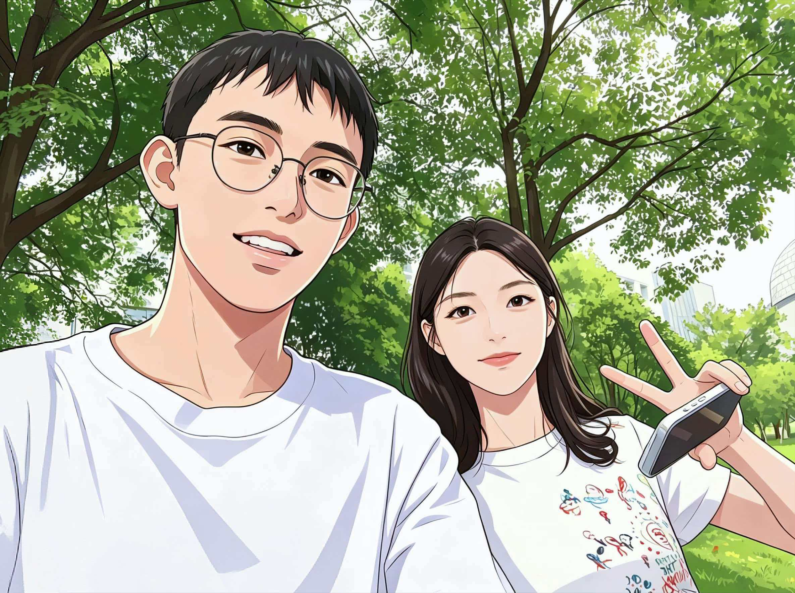

写于1978年

冬去春来，我们的故事还在书写…

> "人生若只如初见，何事秋风悲画扇。" ——纳兰性德《木兰花令》

## 一月

##### 1月26日

新年的钟声还在耳边回响，你的笑容却早已占据了我的心房。

你说你妈那个高中同学群，一人抢到五百，大老板发的红包。我嘞个豆，老板。你说搞好了，到时候运行一下，看我运气了。

你跟我讲，昨天晚上做梦，梦到首考出分，梦到英语一百二十二，一毛一样。突然想到，真的很神奇，早知道昨天多梦几分了。我靠，牛，预言家。

问你是想现在抽奖还是跨年晚上抽，你说到时候吧，要写作业了。我说加油。

你说好像我啊，报纸上的一个人，光明日报。是有点诶。

哈哈，看到什么都能想到对方。熟悉的人眼里，连报纸上的陌生人都能看出三分相似。

> "你站在桥上看风景，看风景的人在楼上看你。" ——卞之琳

可我不想只做看风景的人。我想走到桥上，站在你身边，和你一起看同一片风景。

##### 1月28日

晚上问你抽奖了，在不在。你说嘿嘿，怎么玩。我说你等等，我找下程序。给你看了，你说然后呢。我说开始了，嗯一下就会运营。你嗯嗯噢噢。我说你报个数字，你说随便吗，是的。你说十二，朱伯丞生日。我说等等，它运行十二次后就是你的红包金额。你说好好好，期待一下。

哇哦，最大金额，九十八点五。我说要破产了，真的你看。你哈哈哈哈哈哈哈哈，太给力，朱伯丞我爱他，哈哈哈哈哈哈，我真的要笑死。发出红包，请在手机上查看。我说到啦，你说跪了。

看着你因为意外之财而兴奋的样子，我也跟着开心起来。其实钱不重要，重要的是能让你笑。你笑起来的时候，整个世界都亮了。

##### 1月29日

问你小头给大头准备了啥。你说这样，我问一些问题，答对一个给一个红包，怎么样。我说行，别太刁钻。你说不难，先来的关于我的。

我喜欢哪个薯片口味，A原味B黄瓜味。猜吧。我说能给点提示吧，你说啧，就这两选项我怎么提示。我说b，猜的。你说错。我说啊啊啊，你哈哈哈哈哈哈，再来，送你道题。我最喜欢的电竞选手说两个。我说我嘞个豆，小朱，suk。你说对吗，我说耶。

昨天刚刷到抖音，芜湖还有吗。你说看表情猜词，是你的表情包嘛。我说嗯。你发了几个表情，我说四个字，打草惊蛇。你说简单吧。

然后又发了一组，我说最后那个是什么东西，猪嘛。你说不。我说给点提示吧，你说NO。我说大过年的，孩子不容易啊。你说钱不是那么好赚的，吃了了生活的苦。我说蛇食鲸吞。你说哈哈哈哈，再猜。我说不知道，我太难了。你说再不猜我下线了，你的财路断了。

后来问你还有没有机会发答题，你说喜欢桂花还是茉莉。我说都可以，你说选一个。我说茉莉。你说耶。我说问号。你发了 unsupported message，说微信还能送礼物才发现这个功能。我说版本过低无法查看。

你问我拿啥在看，电脑？我说在更新，破手机怎么这么慢。你说六。我说给你看个好玩的。你问这个能再发一遍链接吗，我这边没了。你说啊啊你看不到吗，没有链接啊。我说我原来那个手机版本低，更新完没了。你说我问问能不能退款，重新发，等等。我说要付钱啊，破费了。你说没事等明天，问题不大。

下午问你怎么样，你说随你啊，你能送就很开心啦。成功了！我说哇哦，谢谢！你说好，记得填地址。我说谢谢汪老板，以后我大哥。你说哈哈哈哈。

几天后，快递到了。打开盒子，是一盏茉莉香薰蜡烛。

白色瓷质的杯身，简洁得像你说话的语气。我凑近闻了闻，清冷的茉莉香里藏着一点甜，像极了你——表面淡淡的，内里却温柔得让人沉溺。

我没有点燃它。不是舍不得，是怕点燃后，香味散得太快。我把它小心地包好，放进了大学寝室的衣柜里。每次打开柜门，那股若有若无的茉莉香就会飘出来，提醒我——在某个遥远的地方，有一个人，记得我喜欢茉莉。

> "轻轻的我走了，正如我轻轻的来；我轻轻的招手，作别西天的云彩。" ——徐志摩《再别康桥》

可我不想走，也不想作别。我想留下来，在这个有茉莉香的房间里，住很久很久。

## 二月

##### 2月1日

你给我发了一道数学题，让我算。我看着那道复杂的方程，忽然觉得，这就像是我们的关系——看似复杂，解开了却很简单。简单到只需要一个条件：我喜欢你。

我给你拍了过程，说不知道对不对。你说不知道。问你礼拜天去图书馆不，你说应该明天去。我问大概几点，你说不知道啊，我爸还要跟我一起去。我说哈哈哈，应该八九点。你说你去吗，我说去啊，我本来打算今天去的，结果要照顾我妹。

你说好的我明天打算去自习室看看，感觉挺不错的。我问什么自习室，你说区政府那边的。我问怎么收费的，你说看你学习时长吧，按小时吧。我说这样，所以你明天图书馆不去了是吗。你说对，可能周日再去。我说那你到时候周天什么时候去跟我说一声行不，你说好。

问你一般几点到啊，我说他好像是八点半开门，所以我大概九点多到。你说嗷嗷。

二月的风还带着寒意，但想到能见到你，心里就暖暖的。图书馆的灯光、自习室的桌椅、窗外的梧桐树，都成了我期待的风景。因为有你在，连学习都变得不那么枯燥了。

> "山川异域，风月同天。" ——长屋王

我们在不同的教室里，看着不同的书，却共享着同一片天空下的月光。

##### 2月22日

你说今年这个海报好帅，可惜去不了，能不能六七月份再安排几场啊。我问在哪里举办啊，你说惨惨，PEL就一个场馆，在成都。我说有点远。你说以后不在那上学就挺麻烦了，机票就费钱。我说确实，可以去成都读书。你说可能看PEL的少，王者全是场馆，服了。

你喜欢的东西，我都想陪你一起。哪怕是在屏幕前，陪你吐槽赛程安排；哪怕是在深夜里，听你兴奋地讲解某个选手的操作。你的热爱，就是我的热爱。

## 三月

##### 3月8日

你说主要浙工商和宁大不开放法学专业，所以专业报得比较杂，报了法学，数字经济，汉语言，心理学。我嘞个，我宁大只有机械，我报了计算机，自动化，机械，电子信息。你说我这也挺杂哈。我说色盲治好了我的选择困难症，哈哈哈哈哈哈哈。你说我这人生态度可以可以。

然后问你网易云这个连续包月怎么关掉，你说会员中心去弄。我说找到了，拴q。

和你在一起，连选专业这种头疼的事都变得有趣了。你说要学法，要研究人性；我说我搞机械，和数据打交道。我们像是两条平行线，在不同的轨道上奔跑，却又在某个交点相遇。

> "两情若是久长时，又岂在朝朝暮暮。" ——秦观《鹊桥仙》

可我还是贪心地想要朝朝暮暮。想要每天醒来都能和你说早安，每晚睡前都能和你说晚安。想要和你分享同一条路，同一盏灯，同一片天空。

##### 3月15日

你说高三了没有必要去花时间跟所有人搞好关系，就隔绝反而是好的。你说人际交往本来就很麻烦，不喜欢的人没必要硬凑。我说没毛病。你还跟你妈说，还不如圆滑一点，不要卷进什么事，就中立态度。我说笑脸相迎，不表明态度。你说有的人某一些东西突出就是会引起争议。我说哲学家。你说。。我说开玩笑，你说的对。

你总是这样，能把很多事情看得很通透。在这个年纪，大多数人还在随波逐流，你却已经学会了筛选，学会了保护自己。这种清醒，让我既心疼又敬佩。

你说昨天买的巧克力饼干，感觉还不错，包的。我说你这几周不能喝牛奶，肠胃有细菌，太惨了。你说不过我的巧克力饼干到家了，好吃爱吃。我问你买的哪种，我上次吃就感觉一般呐。你说给我找找订单，其实你觉得有点太甜了。

和你聊这些日常的小事，都觉得很幸福。幸福是什么？幸福就是知道你今天吃了什么，心情好不好，有没有好好照顾自己。幸福就是，你在世界的某个角落，和我分享着同一片天空下的烟火气。

> "采菊东篱下，悠然见南山。" ——陶渊明《饮酒》

我不需要南山，我只需要知道，你在屏幕的那一端，和我聊着饼干甜不甜。

##### 3月29日

问你明天去嘛所以。简单的几个字，却藏着我的期待。期待明天能见到你，期待能和你一起走过那条熟悉的路，期待在黄昏的路灯下，能偷偷看你一眼。

##### 3月30日

你说大怨种要返校了，然后我妹演唱会进场了，内心极度不平衡。我说哈哈哈哈，加油，写语文快乐。

哼，你就幸灾乐祸吧。不过，一想到回学校就能见到你，好像返校也不是那么难受了。那些让人头疼的试卷、背不完的课文、考不完的试，都因为你而变得可以忍受。

## 四月

##### 4月4日

清明时节雨纷纷，路上行人欲断魂。可我没有断魂，因为我心里装着你。

你问我礼拜天去图书馆不，我说去。问你大概几点，你说应该八九点。你说我爸还要跟我一起去。我说哈哈哈。问你什么自习室，你说区政府那边的，按学习时长收费。你说好的我明天打算去自习室看看，感觉挺不错的。

后来我在书店，问你你能拍一下你看过的悬疑书吗。你说啊我全放奉化了，你直接问我就行。我说那这样，《虚无的十字架》。你说没看过，听起来不错。我说白金数据，沉默的巡游。你说也没，这个有。我说假面游戏，你说这个也看过。

我问那边有岛田庄司的书吗，你说挑吧，我找找。你说有点想看这本，《虚无的十字架》。我说有了。你说诶，太棒了，最近特别迷他，他的你随便挑吧。我给你拍了书架的照片，你说都没看过好像，你随便买，简介看起来有趣就行。我说好的。

问他的你看过哪个，你说Y之构造。我说好的，这个你没看过。你说被诅咒的木乃伊，就看过俩。我说还有吗，你说OK。我给自己买了这个。

四月的阳光温柔地洒下来，就像你说话时的语气，轻轻的，却让人感到安心。我们就这样，隔着屏幕，分享着对书籍的热爱，分享着对悬疑故事的痴迷。你说最近特别迷东野圭吾，我说我也是。原来我们在文字的迷宫里，也是同路人。

> "身无彩凤双飞翼，心有灵犀一点通。" ——李商隐《无题》

##### 4月13日

问你是问你们什么类型的话题啊。你说他就是给你一个材料，是关于马拉松的，然后让你概括材料内容，理解他。然后上午好像是人工智能吧。我说我的妈呀，工商还要自我介绍，然后还要问你报什么专业，理由是什么。你说就无领导小组他要让你达成一个共识，然后再派一个人总结发言是这样子。我说噢噢，有点意思，至少是中文。你说确实，但考场确实很压抑。

加油呀，你一定可以的。每次你面对挑战的时候，我都想变成你的后盾，告诉你——别怕，我在。哪怕我不能替你走上考场，我也能在屏幕这端，给你发一条消息，说一声加油。

##### 4月18日

你说温肯真的，太美，超级大。我说别人家的大学，羡慕了，图书馆好好看。你说太好了，喜欢，现代化。我说我想看看食堂。你说我今天没去，晚饭打算外面吃，明天中午去吃再给你拍。我说刚刚在吃饭没看见，没事没事，期待一波。

你总是这样，什么都愿意分享给我。校园的风景、食堂的饭菜、路边的野花，你都一一拍下来，发给我。这些照片，成了我窥探你生活的窗口。透过它们，我仿佛能看见你走在林荫道上的背影，能看见你对着图书馆拍照时兴奋的表情，能看见你吃饭时满足的样子。

> "红豆生南国，春来发几枝。愿君多采撷，此物最相思。" ——王维《相思》

## 六月

##### 6月23日

今天，毕业典礼。

礼堂里人声鼎沸，到处都是穿着学士服的同学，有人笑，有人哭，有人抱着花束在拍照。我穿着白衬衫，在人群里找你。

你站在走廊的窗边，阳光从背后照进来，给你镀了一层金边。我走过去，心跳得像要冲出胸膛。这是我第一次，也是最后一次，有机会和你说这句话。

"那个……可以合照吗？"

你转过头，愣了一下，然后笑了："可以啊。"

我们站在那扇窗前，肩膀挨着肩膀，中间隔着一个拳头的距离。摄影师是同学，他起哄让我们靠近一点。你往我这边挪了半步，我闻到了你头发上淡淡的洗发水香味。

快门按下的那一刻，我僵住了，连笑都不会了。

照片里的我，表情僵硬得像块木头，可眼睛却亮得吓人。你倒是笑得自然，嘴角微微上扬，和分班合影里的那个表情一模一样。

这是我们的第一张合照，也是唯一一张。我把电子版存进了三个地方，生怕哪天不小心弄丢了。

> "人生到处知何似，应似飞鸿踏雪泥。泥上偶然留指爪，鸿飞那复计东西。" ——苏轼《和子由渑池怀旧》

可我不想做飞鸿，我想做那片雪泥，永远留住你的指爪。

## 七月

##### 7月23日

今天早上醒得特别早，因为知道今天要见你。

我们约在市图书馆见面。我背着电脑包，里面装着C语言的教材；你背着帆布包，里面装着四级词汇书。在二楼靠窗的位置坐下，阳光透过玻璃洒在我们中间的桌子上，灰尘在光柱里跳舞。

你低头背单词，眉头微微皱着，嘴唇无声地开合。我假装在看代码，实际上眼睛一直往你那边飘。你发现了，用笔敲了敲我的笔记本："看什么呢，好好学。"

我说我在思考一个bug。你翻了个白眼，继续背单词。

中午一起去楼下吃了牛肉面。你加了很多香菜，我说你口味好重。你说香菜是灵魂，不懂的人没口福。我挑了一块牛肉放到你碗里，你愣了一下，然后低头继续吃，耳尖有点红。

下午学到四点多，你说要走了，爸妈来接。我送你到门口，看着你的背影消失在公交站的人群中。

那道背影，和高三时我在石子路上追过的那道背影，重叠在了一起。

只是这一次，我没有追上去。

> "此情可待成追忆，只是当时已惘然。" ——李商隐《锦瑟》

我不知道那是我们最后一次见面。如果知道，我一定会在分别的时候，多说几句话，多看几眼，多记住一些细节。可当时的我，只是转身回到图书馆，继续写那段永远跑不通的代码。

## 后记

后来，代码终于跑通了。我们各自上了大学，去了不同的城市。但那份在高三时建立的联系，并没有因为距离而断掉。

直到现在，每隔几天，我们还会打个视频电话。聊聊各自的专业，吐槽食堂的饭菜，分享最近读到的好书。有时候只是开着视频，各自做各自的事，偶尔抬头看一眼，知道对方也在，就够了。

她总说，高三那段时间，她也熬得很辛苦。可我知道，在那些我胃病发作、成绩崩溃、对未来一片迷茫的日子里，是她递来的那包豆浆、手写的明信片、衣柜里的茉莉香，撑住了我。她是我的精神支撑，让我在快要倒下的时候，还能再站起来。

而我，也给了她人生中第一次感受到被人在意的体验。她后来和我说，在那之前，从来没有人把她随口提过的话放在心上，从来没有人在她逞强的时候一眼看穿，从来没有人在她不说的情况下，就知道她需要什么。

我不是一个感性的人。INTJ的理性和克制像是刻在骨子里的本能，我习惯用逻辑拆解世界，用冷静保护自己。可她是我唯一的例外，是唯一的特权。在她面前，所有的理性都可以暂时下线，所有的规则都可以为她让路。

我们熟悉到可以放心地把手机交给对方，任由对方翻看聊天记录、相册、备忘录。那种不设防的信任，不是一天两天能建立起来的。它经过了高三无数个深夜的倾诉，经过了石子路上心照不宣的等待，经过了成绩单下发时互相的打气，才慢慢变成了今天这样——无需解释，无需证明，只要她在，我就安心。

她不是恋人，不是普通朋友。她是那个懂我所有笑点、接得住我所有废话、在我最糟糕的时候也没有离开的人。用"知己"来形容，或许最为贴切。

故事写到这里，似乎已经很长很长了。从三月到七月，从高三到大一，我们走过了很长的一段路。

那条高三的石子路，我现在回去走过，还能想起那包豆浆的温度。那张分班合影，还夹在旧课本里。那张明信片和诗集，还放在书架最显眼的位置，和那盏没点燃的茉莉香薰蜡烛一起，成了我青春里最珍贵的收藏。

谢谢你出现在我的青春里。谢谢你让我知道，原来被一个人真正懂得，是这样的感觉——是看到有趣的事情就想分享，是遇到困难时第一个想到的人，是在深夜听到某句诗，就突然很想拨通那个视频电话。

> "交换余生，是我，非我，苦与乐。" ——林俊杰《交换余生》

