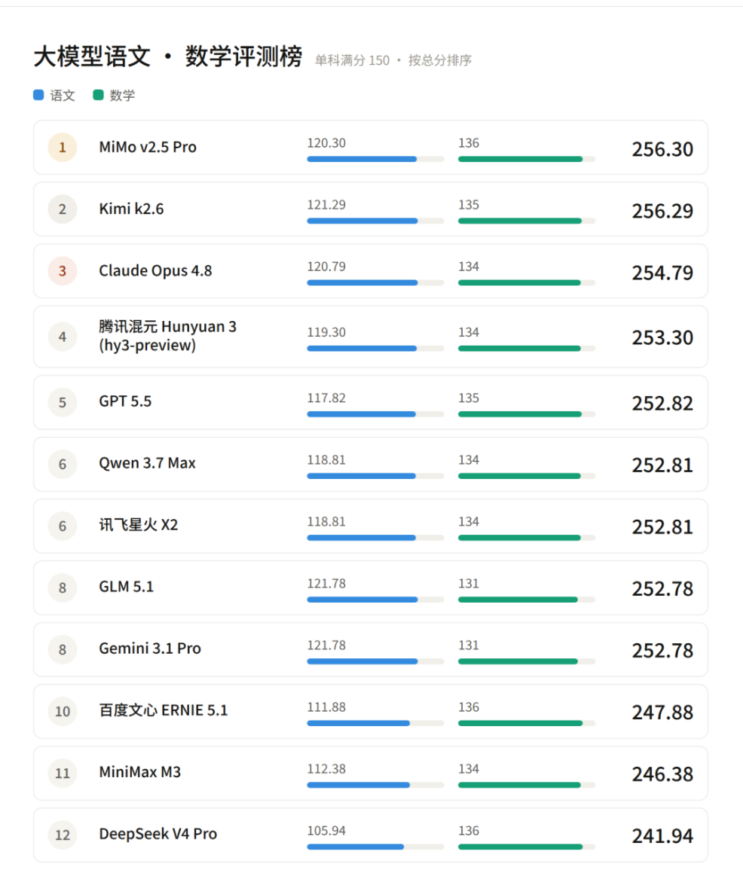
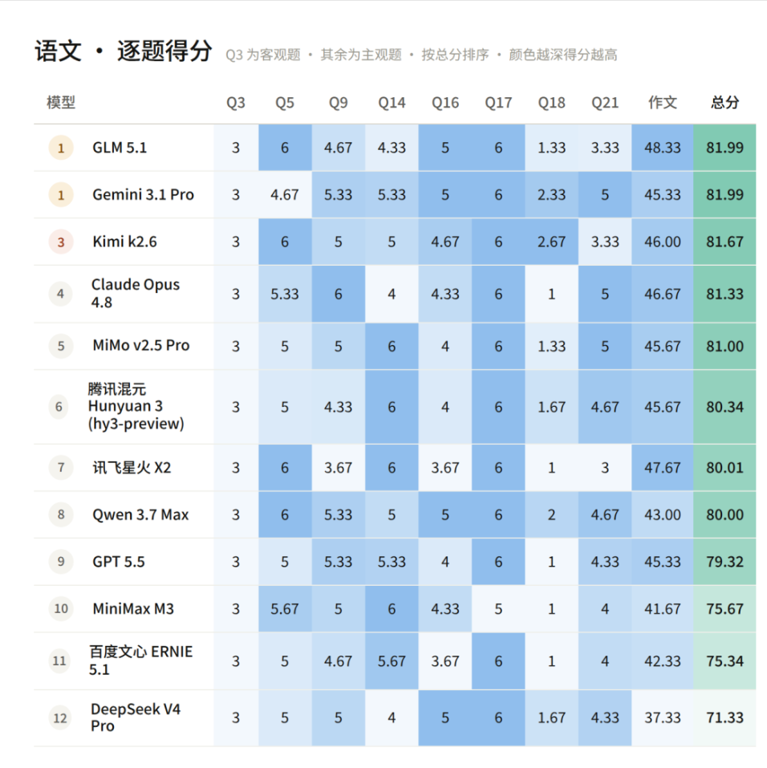
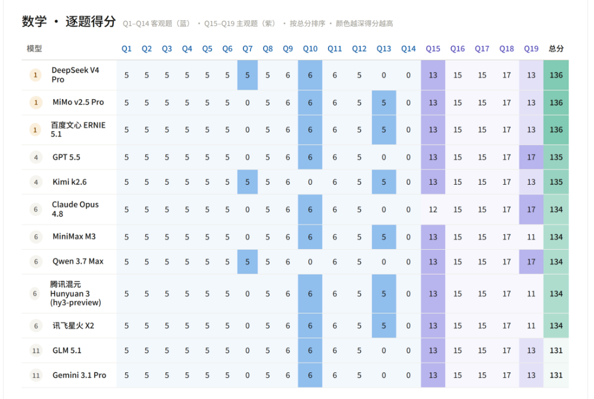

# 我关注的AI博主让12个AI去考了高考

> 本文转载自「数字生命卡兹克」,如有转载一律，请联系我
[原文链接](https://finance.sina.com.cn/cj/2026-06-08/doc-iniasfpu5655196.shtml)

事情是这样的

高考那天，全国上下都在关心作文题目是什么，数学压轴题难不难。博主没去考场，但干了一件更离谱的事。

博主让12个AI去考了同一张卷子。

2026年全国一卷，语文加数学，满分300分。12个模型，从国外的Claude Opus 4.8、GPT-5.5、Gemini 3.1 Pro，到国内的千问3.7 max、文心Ernie 5.1、星火Spark X2、智谱GLM 5.1、Kimi k2.6、MiniMax M3、DeepSeek V4 Pro、小米MiMo v2.5 Pro、混元3，整整12款，一个没落。

而且不是随便测测就完了。

博主找了4位真正的高中老师，3位语文加1位数学，都有阅卷经历。让他们在线盲评，卷面上只有代号，老师们完全不知道哪份卷子是哪个AI写的。API统一调用，全部开启thinking，不限制最长token。代码推理、网页搜索这些工具全部关掉。语文数学都用纯文本输入，数学题全部转成LaTeX格式。

就为了一个结果。

说实话，测之前博主心里大概有个预期。去年也测过，当时国产模型和国外的差距已经很小了。但博主没想到，今年的结果会离谱到这个程度。

你先感受一下这个排名。

总分第一，小米MiMo v2.5 Pro，256.30分。总分第二，Kimi k2.6，256.29分。

差了0.01分。

你敢信？？？在满分300分的考试里，第一名和第二名的差距是0.01分。这是什么概念呢，就是阅卷老师手一抖，多给半分，排名就完全不一样了。

更有意思的是，MiMo语文比Kimi少了1分，但数学比Kimi多了1分。一分定乾坤，这话一点不夸张。

从第三名开始往后看，Claude Opus 4.8、GPT-5.5、千问3.7 max、文心Ernie 5.1、星火Spark X2、MiniMax M3、DeepSeek V4 Pro，这七个模型挤在253到255分这个区间里。

七个模型，分差不到2分。

再往后，智谱GLM 5.1和Gemini 3.1 Pro并列252.78分。

前9名之间的差距不到2分。在高考级别的测试里，这是什么水平呢，就是同位分水平，大家基本站在同一个台阶上。

坦率的讲，博主看到这个数据的时候，第一反应不是哇AI好强，而是这还怎么比。各大模型在知识储备和推理能力上，已经卷到了同一个天花板。你想多拿一分，都难。

但拆开单科来看，还是有一些特别有意思的发现。

语文这边，最高分是智谱GLM 5.1和Google的Gemini 3.1 Pro并列。一个是国产模型，一个是国外模型，在语文这个最本土化的科目上打了个平手。GLM的作文是所有模型里得分最高的，但即便是这样，两位老师还是指出了问题，文章结构不够清晰。

连最高分的作文都没逃过这个评价，你就知道AI作文的共同短板在哪了。

但让博主最意外的不是谁拿了第一，而是DeepSeek V4 Pro的表现。

这哥们数学拿了最高分，和MiMo、文心Ernie 5.1并列第一。但语文直接拉胯了，一位老师只给了49分。阅卷老师的原话是作文拉完了。

你能想象吗，同一个模型，数学最高分，语文直接翻车。文理偏科这件事，不仅存在于人类考生中，AI也逃不过。这跟很多人直觉里的「知识储备多就等于语文好」的想象完全不同。知识储备和语文表达能力，还真不是线性关系。

三位语文老师的评语里，有一些关键词反复出现。

文体不清。文章结构不够清晰。观点不够明确。论证不充分。时代关联不足。

简单说就是八个字，写得规范，但没灵魂。

AI作文的问题是结构性的、系统性的。从2023年大家开始让AI写高考作文到现在，这个问题一直没有被真正解决。AI可以写得好，但做不到写得妙。

数学这边的情况就不太一样了。

数学老师的反馈是，前面几个大题正确率非常高，基本都是满分。多数模型在基础题和中档题上表现出色，分差很小。

但还是要说一个让所有AI都折戟的故事。

填空题最后一题，12个模型，全军覆没。

一个都没做对。

这道题到底有多难，博主没有拿到具体题目不好判断。但12个模型全部答错，说明在真正的压轴题面前，AI和人类学霸之间依然存在一道清晰的分水岭。

还有一个花絮博主觉得值得单独拿出来说。

Claude Opus 4.8在解数学最后一道大题的时候，反复卡死，不断重试。最后的结果是什么呢，博主OpenRouter上的余额被它全部耗尽了。

全部耗尽。

博主在屏幕前看着请求状态一条条跳，心里在想，这哥们是真的在努力做题啊。。。虽然题目最后是做出来了，但钱包也空了。一时间不知道该夸它坚持不懈，还是该心疼余额。

太离谱了。

回到整体结果上，博主想说几个更大层面的判断。

第一个，国产模型已经全面比肩甚至超越了国外模型。总分前两名都是国产的，数学最高分国产独占两席，语文最高分也是国产和国外并列。这在2023年是完全不敢想的。GPT-4独领风骚的时代，已经彻底过去了。

第二个，顶级模型之间的内卷已经严重到可怕的程度。前9名分差不到2分，这就是说在通用的知识和推理能力上，大家已经没有什么秘密武器了。真正的差异化竞争，正在向代码能力、Agent能力、多模态这些方向转移。

第三个，语文依然是AI的阿克琉斯之踵。这个结论从2023年说到2026年，说了四年，依然成立。AI可以写出工整的议论文，可以引经据典，可以在规定时间内完成800字。但它写不出只有经历过真实生活才能写出的那种文字。

那种带着个人体温的文字。

第四个，数学能力趋于成熟，但压轴题仍是分水岭。大多数模型在常规题上接近满分，说明AI的数学推理能力已经相当成熟了。但一道填空题让所有模型折戟，说明真正的难题依然是区分人类学霸和AI的分界线。

第五个，文理偏科现象同样存在于AI中。DeepSeek数学最高分语文翻车，GLM和Gemini语文拔尖但数学偏弱，简直就像中学班级里重现了文理分科。

说到这，你可能觉得，这些跟我也没什么关系，我又不是搞AI的。

博主非常理解这种感觉。每次聊AI评测，总会有人觉得这是圈内人的自嗨。但博主想说的是，如果你今天需要用AI帮你做点什么事，不管是写文案还是算数据，这个结果其实对你有直接的参考价值。前9名差距不到2分，意味着你随手挑一个，都不会差。你不用再纠结哪个模型更聪明了，这个问题已经被卷平了。

顺着上面的再聊聊，其实从2023年开始，每年高考博主都会做一次AI评测。2023年那会还只是让ChatGPT写个作文，2024年是逐模型在官网测，2025年专门搞了数学题，到今年已经是第四年了。

四年时间，从只会写作文到全科应试差距极小，变化真的太夸张了。

你想想看，2023年GPT-4还在独领风骚，国产模型甚至没什么存在感。2024年国产开始卷起来了，但翻车不断。2025年部分模型的数学水平已经够一本线了。到2026年，国产和国外的差距已经基本抹平，而且模型之间的差距小到要靠0.01分来区分胜负。

不知道该怎么形容这个速度。

反正博主写这篇稿子的时候，是有点恍惚的。每一年博主都觉得差不多到顶了吧，但每一年新的结果都告诉博主，还远没到顶。

今年的进步不是说谁又刷新了多少分，而是一个更本质的信号，在知识获取和逻辑推理这个层面，AI已经全面进入了存量竞争的时代。大家都差不多，谁也别想轻松甩开谁。真正的战场，已经转移到了应用层、Agent层、以及那些无法被标准化衡量的维度上。

这可能才是今年高考评测最大的价值。

不是告诉你哪个模型最强，而是让你看到，这个赛道已经卷到了什么程度。

博主的感受是，这种趋同本身就是一个里程碑。当所有模型在基础能力上趋于一致，真正比拼的就是谁能在真实场景中创造更大的价值。这对用户来说是好事，你不用纠结选哪个模型了，随便挑一个，都不会差。

但对行业来说，这意味着新的竞赛才刚刚开始。

博主有时候在想，也许语文这个短板，不是AI的缺陷，而是人类最后的护城河。当AI在所有标准化考试中都能拿到接近满分的成绩时，真正能区分人和机器的，可能就是那一篇不那么完美、但充满个人痕迹的作文。

那些只有在真实生活里摔过跤、流过泪、笑到岔气的人，才能写出的文字。

时间会给出答案的。

祝愿AGI会早点到来！

