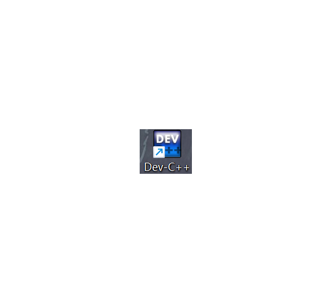
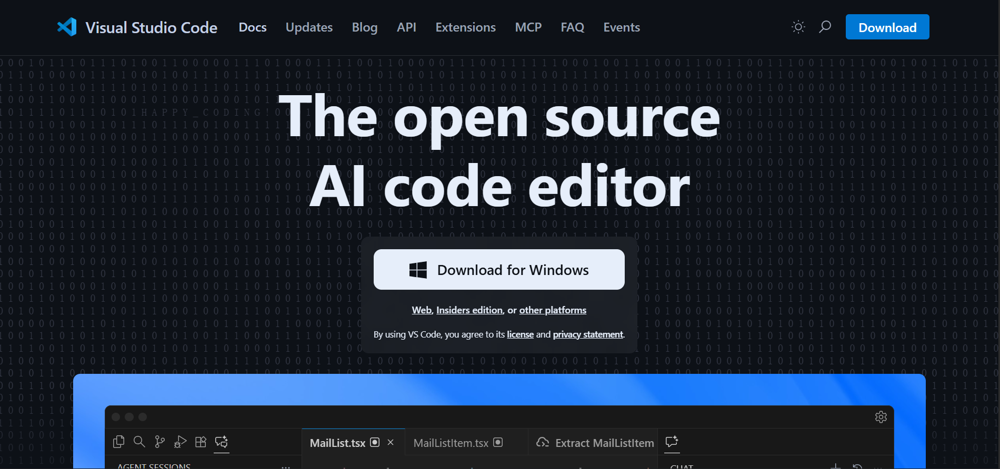
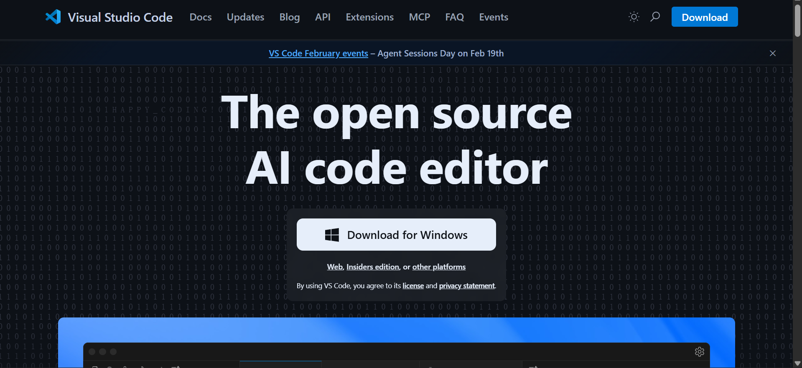

我使用过的一些IDE推荐(纯主观，勿喷）

C/C++ :

初学者直接无脑选择dev c++,轻量且不用配置环境，对新手非常友好。

Python:

可以直接使用Python自带的编译环境，或者你下载一个IDE,至于怎么选IDE,见下文。

VScode:非常强大的编码功能，微软生态互联非常方便，唯一的问题就是配置环境比较麻烦，本人失败好几次了.......

Clion:本人在用的IDE,环境配置比vscode简单很多，推荐！

本次推荐没有包含ai IDE,这个请见下一篇博客。
