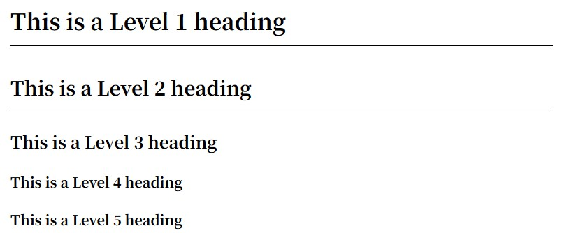

## Headings

Typically, use 1-6 hash symbols `#` to denote headings, for example:

```markdown
# This is a Level 1 heading

## This is a Level 2 heading

### This is a Level 3 heading

#### This is a Level 4 heading

#### This is a Level 5 heading
```

Displayed as:


## Paragraphs

### Paragraph

Separate paragraphs with blank lines. Do not use spaces or indentation before paragraphs.

```markdown
This is the first paragraph

This is the second paragraph
```

### Line Breaks

Add two or more spaces at the end of a line to force a line break.

```markdown
This is the first line  
This is the second line
```

## Emphasis

### Bold

Enclose words or phrases with two asterisks `**` or underscores `__` to make them bold.

```markdown
I like **listening to music**, **traveling**...
```

Displays as:  
I like **listening to music**, **traveling**...

### Italics

Enclose words or phrases with one asterisk `*` or underscore `_` for italics.

```markdown
I like *listening to music*, _traveling_...
```

Displays as:  
I like *listening to music*, _traveling_...

### Bold and Italic

Enclose words or phrases with three asterisks `***` or three underscores `___` to apply both bold and italic formatting.

```markdown
I love **_listening to music_**, **_traveling_**...
```

Displayed as:  
I love **_listening to music_**, **_traveling_**...

## Block Quotes

### Block Quotes

Precede words or phrases with a right arrow `>` to create block quotes, ensuring they are separated by spaces.

```markdown
> What you dwell on will echo back!
```

Displays as:

> What you dwell on will echo back!

### Nested Block Quotes

Precede paragraphs with double right arrows `>>` to create nested quotes.

```markdown
> What you dwell on
>
> > will resonate
```

Displays as:

> What you dwell on
>
> > will resonate

## Code

### Code

Enclose words or phrases with backticks ` to denote code.

```
In C++, use `cout` to print Hello World!
```

Displays as:  
In C++, use `cout` to print Hello World!

### Code Blocks

Enclose code blocks with three backticks (``) or three tilde symbols (~~~) on both sides, and specify the language type after the first line for syntax highlighting.

````
```c++
#include <iostream>
using namespace std;

int main() {
  cout<<“Hello World!”<<endl;
  return 0;
}
```
````

Result as shown below

```cpp
#include <iostream>
using namespace std;

int main() {
  cout<<“Hello World!”<<endl;
  return 0;
}
```

## Lists

### Ordered Lists

Precede paragraphs with a number followed by a period `.` to create an ordered list. Numbers don't need to be sequential, but the list will display with numbers at the beginning.

```markdown
1. First item
1. Second item
1. Third item
```

Displayed as:

1. First item
2. Second item
3. Third item

### Unordered Lists

Precede a paragraph with an asterisk `*`, hyphen `-`, or period `.` to create an unordered list.

```markdown
- First item

* Second item
  . Third item
```

Displays as:

- First item
- Second item
- Third item

### Nesting List Items

To nest another element (paragraph, blockquote, etc.) within a list item, indent it by four spaces or one tab.

```markdown
1. First item
   > Early to bed, early to rise
2. Second item
```

Displays as:

1. First item
   > Early to bed, early to rise
2. Second item

## Links

### Linking

Enclose text in square brackets (e.g., [Motues]), then add the URL in parentheses to create a link.

```markdown
Welcome to Motues' [Blog](https://motues.top)!
```

Displays as:  
Welcome to Motues' [Blog](https://motues.top)!

### Link Titles

Add a title in the brackets after the URL. This will display as a tooltip when users hover over the link.

```markdown
Welcome to Motues' [Blog](https://motues.top “Motues' Blog”)!
```

Displayed as:  
Welcome to Motues' [Blog](https://motues.top “Motues' Blog”)!

## Images

Start with an exclamation mark (!), then add alternative text in parentheses. Include the image resource path or URL within the parentheses. Optionally, add a title after the URL in the parentheses.The title will be displayed below the image.

```markdown

```

Displayed as:  

<!--  -->

## Tables

### Table

To add a table, use three or more hyphens (`---`) to create each column header, and separate columns with vertical bars (`|`) (rows and columns do not need to be aligned).

```markdown
| Fruit      | Color    | Taste      |
| ------ | ---- | ---- |
| Watermelon🍉 | Green | Sweet  |
| Grapes🍇 | Purple | Tart  |
```

Displayed as:
| Fruit      | Color      | Taste      |
| ---------- | ---------| ----|
| Watermelon🍉 | Green | Sweet |
| Grapes🍇 | Purple | Tart |

### Alignment

You can align text within a column to the left, right, or center by adding a colon `:` to the left, right, or both sides of the hyphen in the header row.

```markdown
| Fruit   | Color | Taste |
| :----- | :--: | ---: |
| Watermelon🍉 | Green | Sweet |
| Grapes🍇 | Purple | Tart |
```

Displayed as:
| Fruit | Color | Taste |
| :------ | :-----:| ----:|
| Watermelon🍉 | Green | Sweet |
| Grapes🍇 | Purple | Tart |

### Escape Characters

Use the HTML character code `&#124;` to display the vertical bar `|` character in tables.

## Task Lists

Precede each task item with a hyphen `-` and square brackets `[]`, inserting a space between them. To mark a task as completed, add an `x` inside the brackets.

```markdown
- [x] Eat
- [ ] Sleep
- [ ] Play Beans
```

- [x] Eat
- [ ] Sleep
- [ ] Play Beans

## Other Features

### Strikethrough

Enclose words or phrases with two tildes `~~` to create a strikethrough.

```markdown
I don't like eating ~~grapes~~
```

Displays as:  
I don't like eating ~~grapes~~

### Horizontal Lines

Use three or more asterisks (`***`), hyphens (`---`), or underscores (`___`) on a line to create a horizontal line.

```markdown
---
---

---
```

Displays as:

---

---

---


Translated with DeepL.com (free version)