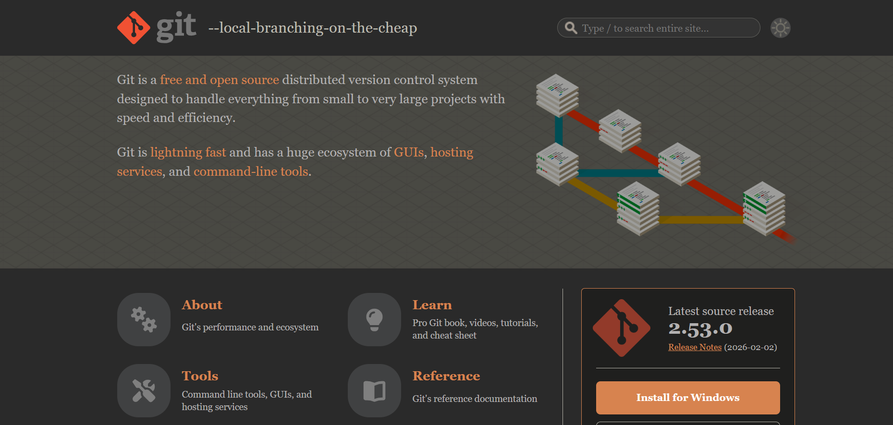

* 1. [github](https://github.com/)，毫无疑问，非常好用的代码托管仓库，开源社区，里面有非常多的免费软件。网络不是很稳定，有时候需要梯子或者加速器。国内平替[gitee](https://gitee.com/)。

* 2.[朱雀ai检测助手](https://matrix.tencent.com/ai-detect/ai_gen_txt )，免费的ai查重网站

* 3.[CDSN](https://www.csdn.net/)，电子人的百科全书，
但是这个网站的广告实在是太多了，建议转到知乎。

* 4.[git](https://git-scm.com/),非常好用的代码伴侣，
可以远程拉取提交克隆代码，搭配github和trae十分好用。

* 5.[watt tookit](https://steampp.net/),免费的加速器，可以解决github登录不了的问题。同时也是一个游戏加速器。

* 6.[snipaste](https://zh.snipaste.com/),免费好用截图软件，
画图必备。

* 7.[ngrok](https://ngrok.com/),实现公网穿透网站，可以将你的代码部署到公网上，免费版每个月都有一定的额度。

* 8.[node.js](https://nodejs.cn/download/),运行于服务端的JavaScript解释器，本地部署网页必备。
