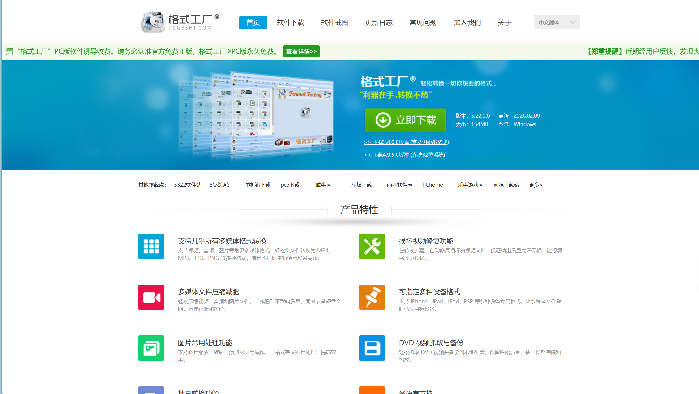
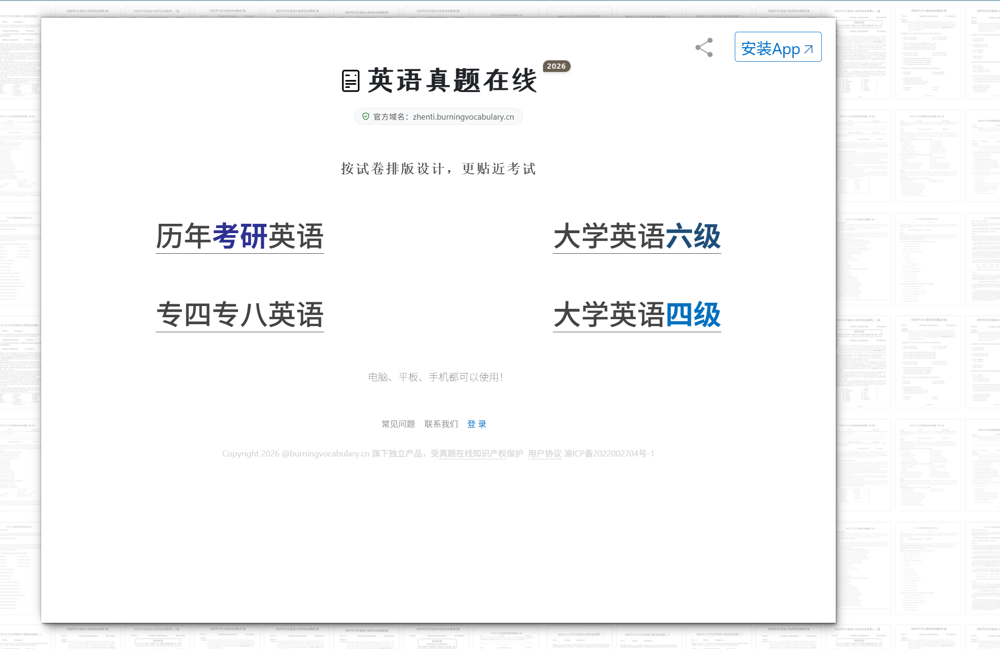
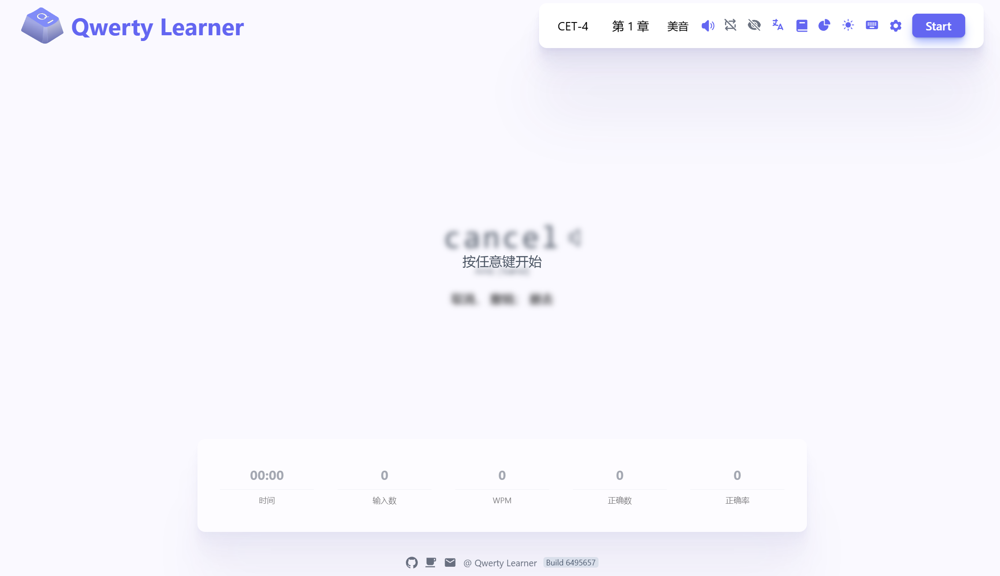

没想到这个系列还有第二期，主包换了新电脑，可以尝试一些之前旧电脑无法实现的事情，在探索过程中又找到了一些好用的东西，来分享给大家。

1.[格式工厂](https://www.pcgeshi.com/)，功能非常强大的格式转换软件，支持图片视频音频的常用格式转换，最重要的是免费！！！

2.[英语真题网站](https://zhenti.burningvocabulary.cn/)，免费的试卷下载网站，免费版同时还支持答案校对，但是没有解析，够用就行。

3，[Lmarena](https://arena.ai/),ai社区，可以免费使用全球主流ai大模型，就是生成速度有点慢，需要梯子。

4.[Qwerty Learner](https://qwerty.liumingye.cn/)，非常好的打字练习网站，同时还可以背背单词，挺好的。

5.[cwo](https://cwo.cc/musicc),音乐解锁网站，可以将音乐软件的特殊格式转换为普通的mp3，这样就不会被锁死了

6.lively wallpaper ,wallpaper engine平替，免费，支持自己导入动态壁纸，在微软商店里搜索就行。

7.[哲风壁纸](https://haowallpaper.com/)免费的壁纸网站，还行吧。

8.translucenttb，可以将任务栏变成透明的软件，加强美观性，微软商店可以搜索。

以上就是近期主包发现的一些好用的网站啦，期待下一期！
