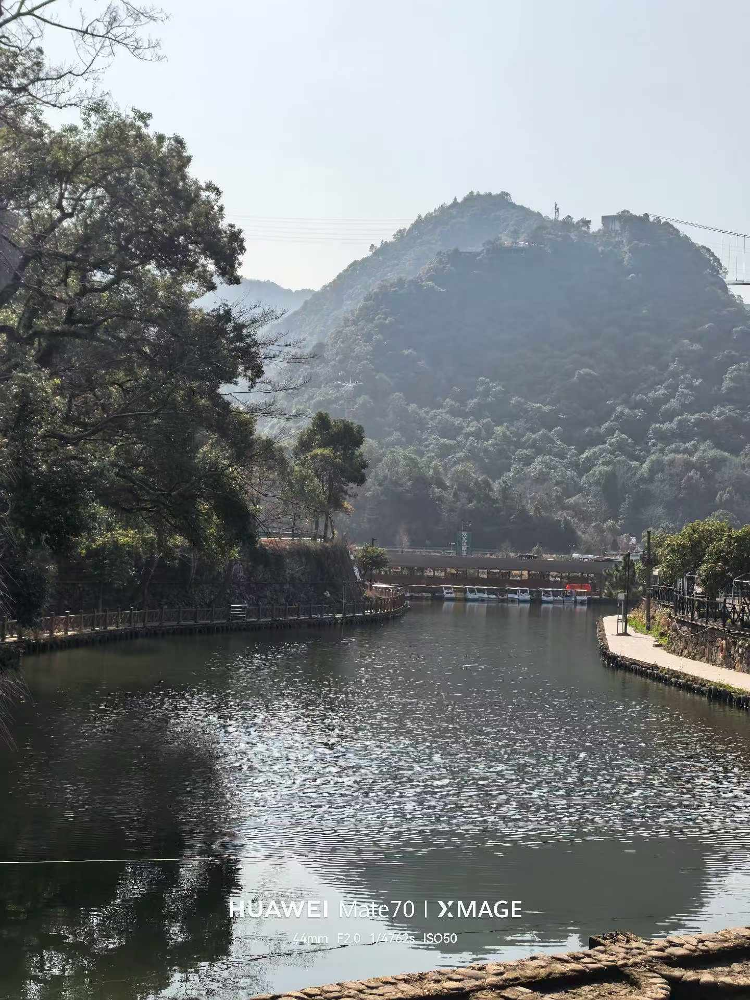
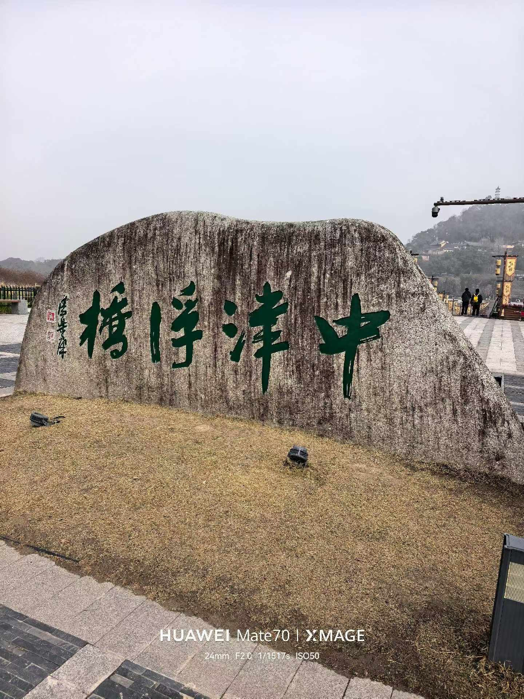
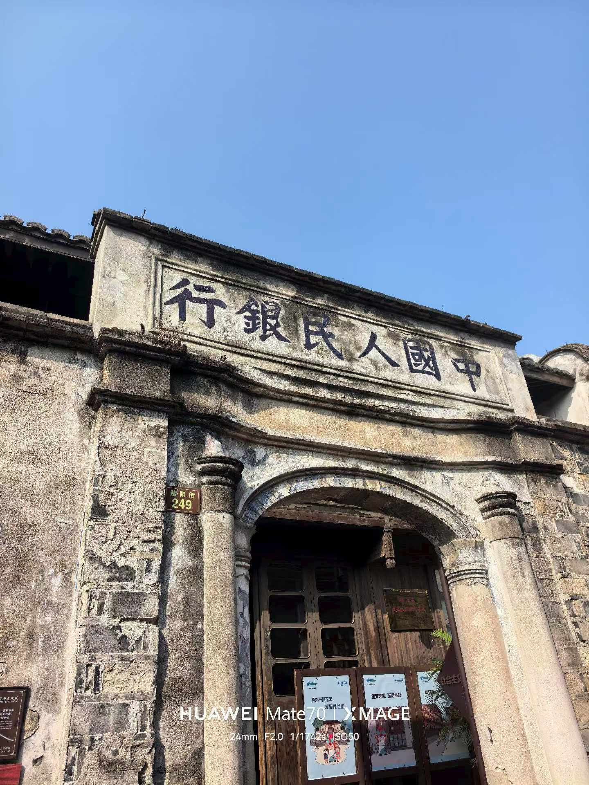
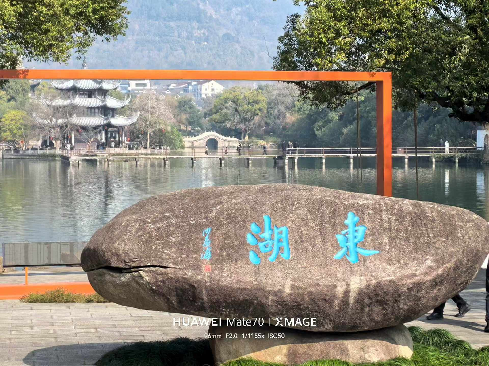
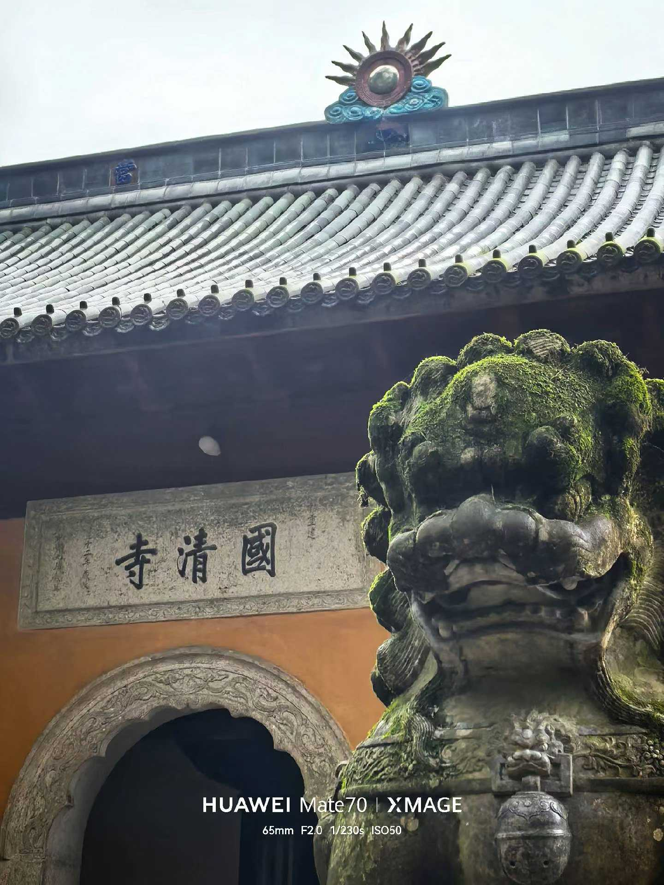
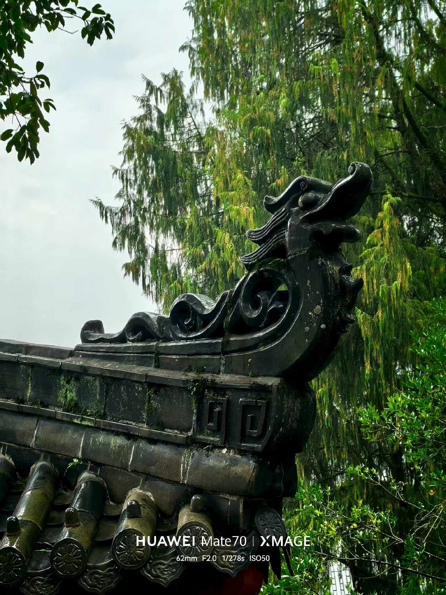
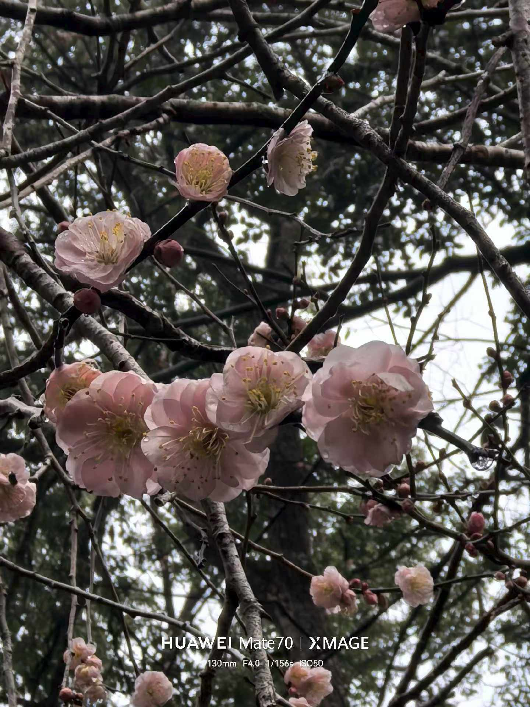

> 这趟旅行，从一开始就不是为了寻找什么喜欢的东西。只是想找个地方，安静地和自己待一会儿。离开城市，让那些被推着走的日子，慢下来。

三门给我的第一印象是海鲜。虽然谈不上多爱吃，但作为宁波人，从小到大饭桌上总少不了这些，所以第一次踏上这片土地时，竟有种莫名的熟悉——像是见到一个素未谋面却有共同记忆的远亲。

第一天住进山里的民宿。房间很简单，谈不上什么装修，床铺也硬，但推开窗，山就在眼前。空气里有树木的味道，潮湿、清冽，是城市里花多少钱也买不到的那种。村子里人很少，偶尔能看见一个老人背着柴从坡上慢慢走下来，脚步声落在石阶上，一下，一下。那种安静，不是没有声音，而是声音都被山吸收了。

饭菜不太合口味。当地好像不常吃肉，碗里多是些叫不出名字的河鲜和野菜。粉丝的做法和我们那边不一样，倒是意外地好吃。我坐在桌边慢慢嚼，想着这就是别人的日常啊——我们习以为常的，在他们这里是陌生；他们熟悉的，在我这里成了新鲜。

白天去了台州古城。城墙旧得发黑，缝隙里长满青苔，摸上去是湿的。沿着石阶慢慢走上去，风一下子大了，吹得人清醒。站在城墙上往下看，是层层叠叠的屋顶和弯弯曲曲的巷子，有人在晾衣服，有人在院里择菜，日子就这样摊在阳光下，不遮不掩。下了城墙，在古城里随便逛，街不宽，两边是老房子，木门斑驳，偶尔飘出小吃店的烟火气。

接着到了东湖。湖面很宽，水清得能看见底。岸边有块大石头，刻着“东湖”两个字，一群人轮流站过去拍照。我没凑热闹，沿着湖边小路慢慢走。有个亭子里坐着两个人，不知在聊什么；远处树下，几个老人围着棋盘，偶尔传来棋子落下的脆响。对岸有座小石桥，柳枝垂到水面上，风一吹，就轻轻扫过水面。很静。那种静不是死寂，是有呼吸的。

后来去了括苍，一个靠山的小镇。这里完全是另一种活法。家家户户烧柴做饭，黄昏时分，整个镇子都飘着木头燃烧的香味，暖烘烘的，让人想起小时候外婆家的灶台。路边摊一个挨一个，卖吃的、卖衣服的、卖农具的，吆喝声此起彼伏。没有城管，没有红绿灯，人和车混在一起走，乱哄哄的，却有股野蛮的生命力。和前一天的村子相比，一个像睡着了，一个像刚刚醒来。

最后是国清寺。门口的石狮子蹲了几百年了吧，身上覆满青苔，像穿了一层时间的衣服。寺门上的字是横着写的，屋顶有太阳形状的装饰，圆圆的，透着古拙的暖意。

走进去，檐角翘起，雕着龙，龙身上也长了青苔。

院子里静极了，偶尔一声钟响，沉沉地荡开，脚步就不自觉地放慢了。我在一个角落站了很久，什么都没想，只是站着。

.jpg)

回去的路上，看见几株梅花开了。粉白的，在路边静静开着，也不招摇，就是开得正好。像这趟旅行本身——没什么值得炫耀的风景，没什么非拍不可的照片，只是走了走，停了停，发了几次呆。

这样的节奏，在学校里是找不到的。那里永远是下一件事在等着，永远有进度条要赶。而这几天的我，像一块被扔进水里的石头，慢慢沉到底，然后一动不动，任由水从身上流过。

没有答案。但好像也不需要。

