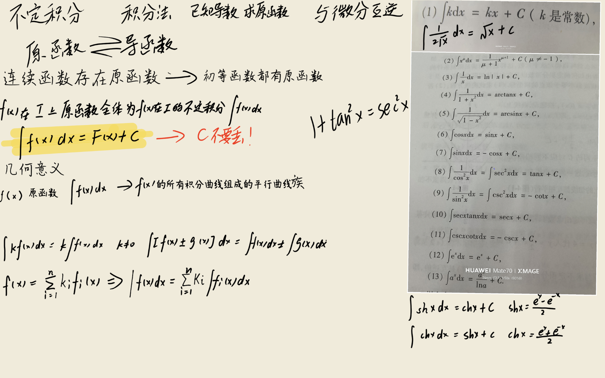
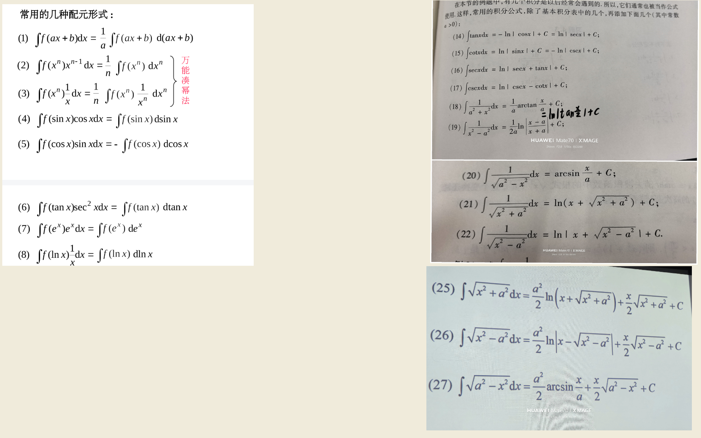
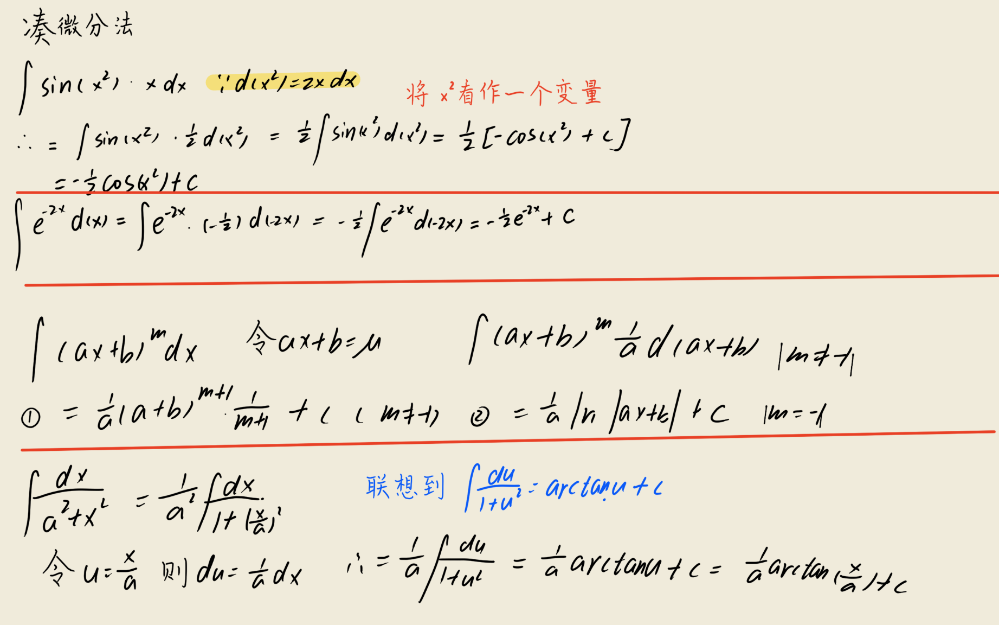
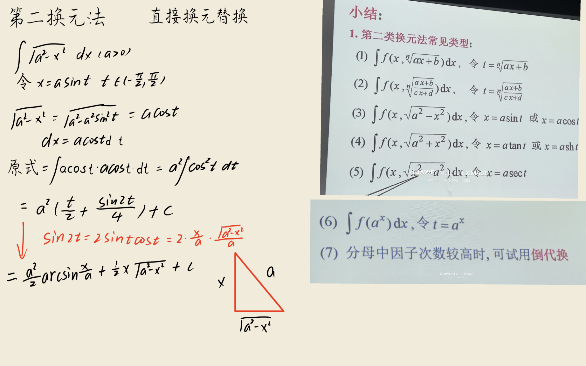
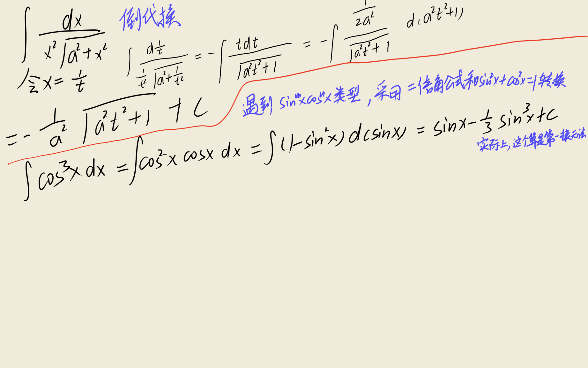
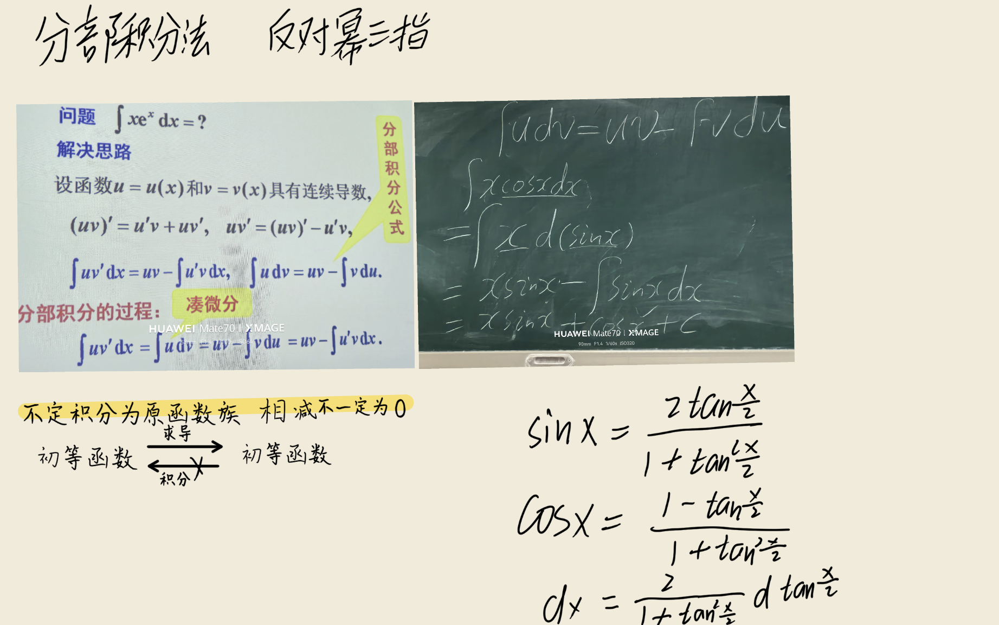

这些公式的推导过程务必非常熟练，我在文章最后附上过程

# 不定积分公式 (14) 到 (27) 的详细推导

## (14) \(\int \tan x \, dx = -\ln |\cos x| + C = \ln |\sec x| + C\)

**推导：**  
\[
\int \tan x \, dx = \int \frac{\sin x}{\cos x} \, dx
\]
令 \(u = \cos x\)，则 \(du = -\sin x \, dx\)，即 \(\sin x \, dx = -du\)。  
代入得：
\[
\int \frac{\sin x}{\cos x} \, dx = \int \frac{1}{u} \cdot (-du) = -\int \frac{1}{u} \, du = -\ln |u| + C = -\ln |\cos x| + C
\]
由对数性质，\(-\ln |\cos x| = \ln |\cos x|^{-1} = \ln |\sec x|\)，所以也可写为 \(\ln |\sec x| + C\)。

---

## (15) \(\int \cot x \, dx = \ln |\sin x| + C = -\ln |\csc x| + C\)

**推导：**  
\[
\int \cot x \, dx = \int \frac{\cos x}{\sin x} \, dx
\]
令 \(u = \sin x\)，则 \(du = \cos x \, dx\)，代入得：
\[
\int \frac{1}{u} \, du = \ln |u| + C = \ln |\sin x| + C
\]
又 \(\ln |\sin x| = -\ln |\csc x|\)，故也可写为 \(-\ln |\csc x| + C\)。

---

## (16) \(\int \sec x \, dx = \ln |\sec x + \tan x| + C\)

**推导：**  
分子分母同乘 \(\sec x + \tan x\)：
\[
\int \sec x \, dx = \int \sec x \cdot \frac{\sec x + \tan x}{\sec x + \tan x} \, dx = \int \frac{\sec^2 x + \sec x \tan x}{\sec x + \tan x} \, dx
\]
令 \(u = \sec x + \tan x\)，则
\[
\frac{du}{dx} = \sec x \tan x + \sec^2 x = \sec x (\tan x + \sec x) = \sec x \cdot u
\]
所以 \(du = \sec x \cdot u \, dx\)，即 \(\sec x \, dx = \frac{du}{u}\)。  
代入得：
\[
\int \sec x \, dx = \int \frac{du}{u} = \ln |u| + C = \ln |\sec x + \tan x| + C
\]

---

## (17) \(\int \csc x \, dx = \ln |\csc x - \cot x| + C\)

**推导：**  
分子分母同乘 \(\csc x - \cot x\)：
\[
\int \csc x \, dx = \int \csc x \cdot \frac{\csc x - \cot x}{\csc x - \cot x} \, dx = \int \frac{\csc^2 x - \csc x \cot x}{\csc x - \cot x} \, dx
\]
令 \(u = \csc x - \cot x\)，则
\[
\frac{du}{dx} = -\csc x \cot x + \csc^2 x = \csc x (-\cot x + \csc x) = \csc x \cdot u
\]
所以 \(du = \csc x \cdot u \, dx\)，即 \(\csc x \, dx = \frac{du}{u}\)。  
代入得：
\[
\int \csc x \, dx = \int \frac{du}{u} = \ln |u| + C = \ln |\csc x - \cot x| + C
\]

---

## (18) \(\int \frac{1}{a^2 + x^2} \, dx = \frac{1}{a} \arctan \frac{x}{a} + C\)

**推导：**  
令 \(x = a \tan \theta\)，其中 \(\theta \in (-\frac{\pi}{2}, \frac{\pi}{2})\)，则 \(dx = a \sec^2 \theta \, d\theta\)，且
\[
a^2 + x^2 = a^2 + a^2 \tan^2 \theta = a^2 (1 + \tan^2 \theta) = a^2 \sec^2 \theta
\]
代入：
\[
\int \frac{1}{a^2 + x^2} \, dx = \int \frac{1}{a^2 \sec^2 \theta} \cdot a \sec^2 \theta \, d\theta = \int \frac{1}{a} \, d\theta = \frac{1}{a} \theta + C
\]
由 \(x = a \tan \theta\) 得 \(\theta = \arctan \frac{x}{a}\)，所以
\[
= \frac{1}{a} \arctan \frac{x}{a} + C
\]

---

## (19) \(\int \frac{1}{x^2 - a^2} \, dx = \frac{1}{2a} \ln \left| \frac{x - a}{x + a} \right| + C\)

**推导：**  
将分式分解为部分分式：
\[
\frac{1}{x^2 - a^2} = \frac{1}{(x - a)(x + a)} = \frac{A}{x - a} + \frac{B}{x + a}
\]
通分得：
\[
\frac{A(x + a) + B(x - a)}{(x - a)(x + a)} = \frac{(A + B)x + (A - B)a}{x^2 - a^2}
\]
比较分子得：
\[
A + B = 0, \quad (A - B)a = 1
\]
解得 \(A = \frac{1}{2a}, B = -\frac{1}{2a}\)。所以
\[
\frac{1}{x^2 - a^2} = \frac{1}{2a} \left( \frac{1}{x - a} - \frac{1}{x + a} \right)
\]
积分：
\[
\int \frac{1}{x^2 - a^2} \, dx = \frac{1}{2a} \left( \int \frac{1}{x - a} \, dx - \int \frac{1}{x + a} \, dx \right) = \frac{1}{2a} \left( \ln |x - a| - \ln |x + a| \right) + C
\]
\[
= \frac{1}{2a} \ln \left| \frac{x - a}{x + a} \right| + C
\]

---

## (20) \(\int \frac{1}{\sqrt{a^2 - x^2}} \, dx = \arcsin \frac{x}{a} + C\)

**推导：**  
令 \(x = a \sin \theta\)，其中 \(\theta \in [-\frac{\pi}{2}, \frac{\pi}{2}]\)，则 \(dx = a \cos \theta \, d\theta\)，且
\[
\sqrt{a^2 - x^2} = \sqrt{a^2 - a^2 \sin^2 \theta} = a \sqrt{\cos^2 \theta} = a |\cos \theta|
\]
在 \(\theta \in [-\frac{\pi}{2}, \frac{\pi}{2}]\) 上，\(\cos \theta \ge 0\)，所以 \(|\cos \theta| = \cos \theta\)，故 \(\sqrt{a^2 - x^2} = a \cos \theta\)。  
代入：
\[
\int \frac{1}{\sqrt{a^2 - x^2}} \, dx = \int \frac{1}{a \cos \theta} \cdot a \cos \theta \, d\theta = \int 1 \, d\theta = \theta + C
\]
由 \(x = a \sin \theta\) 得 \(\theta = \arcsin \frac{x}{a}\)，所以
\[
= \arcsin \frac{x}{a} + C
\]

---

## (21) \(\int \frac{1}{\sqrt{x^2 + a^2}} \, dx = \ln \left( x + \sqrt{x^2 + a^2} \right) + C\)（三角换元 \(x = a \tan \theta\)）

**推导：**  
令 \(x = a \tan \theta\)，\(\theta \in (-\frac{\pi}{2}, \frac{\pi}{2})\)，则 \(dx = a \sec^2 \theta \, d\theta\)，且
\[
\sqrt{x^2 + a^2} = \sqrt{a^2 \tan^2 \theta + a^2} = a \sqrt{\tan^2 \theta + 1} = a \sqrt{\sec^2 \theta} = a |\sec \theta|
\]
在 \(\theta \in (-\frac{\pi}{2}, \frac{\pi}{2})\) 上，\(\sec \theta > 0\)，所以 \(|\sec \theta| = \sec \theta\)，故 \(\sqrt{x^2 + a^2} = a \sec \theta\)。  
代入：
\[
\int \frac{1}{\sqrt{x^2 + a^2}} \, dx = \int \frac{1}{a \sec \theta} \cdot a \sec^2 \theta \, d\theta = \int \sec \theta \, d\theta
\]
由公式 (16)，\(\int \sec \theta \, d\theta = \ln |\sec \theta + \tan \theta| + C\)。  
由 \(x = a \tan \theta\) 得 \(\tan \theta = \frac{x}{a}\)，\(\sec \theta = \sqrt{1 + \tan^2 \theta} = \sqrt{1 + \frac{x^2}{a^2}} = \frac{\sqrt{x^2 + a^2}}{a}\)（正数）。所以
\[
\sec \theta + \tan \theta = \frac{\sqrt{x^2 + a^2}}{a} + \frac{x}{a} = \frac{x + \sqrt{x^2 + a^2}}{a}
\]
于是
\[
\int \frac{1}{\sqrt{x^2 + a^2}} \, dx = \ln \left| \frac{x + \sqrt{x^2 + a^2}}{a} \right| + C = \ln \left( x + \sqrt{x^2 + a^2} \right) - \ln a + C
\]
合并常数得：
\[
\ln \left( x + \sqrt{x^2 + a^2} \right) + C
\]

---

## (22) \(\int \frac{1}{\sqrt{x^2 - a^2}} \, dx = \ln \left| x + \sqrt{x^2 - a^2} \right| + C\)（三角换元 \(x = a \sec \theta\)）

**推导：**  
先考虑 \(x > a\) 的情形。令 \(x = a \sec \theta\)，\(\theta \in (0, \frac{\pi}{2})\)，则 \(dx = a \sec \theta \tan \theta \, d\theta\)，且
\[
\sqrt{x^2 - a^2} = \sqrt{a^2 \sec^2 \theta - a^2} = a \sqrt{\sec^2 \theta - 1} = a \sqrt{\tan^2 \theta} = a |\tan \theta|
\]
在 \(\theta \in (0, \frac{\pi}{2})\) 上，\(\tan \theta > 0\)，所以 \(\sqrt{x^2 - a^2} = a \tan \theta\)。  
代入：
\[
\int \frac{1}{\sqrt{x^2 - a^2}} \, dx = \int \frac{1}{a \tan \theta} \cdot a \sec \theta \tan \theta \, d\theta = \int \sec \theta \, d\theta
\]
由公式 (16)，\(\int \sec \theta \, d\theta = \ln |\sec \theta + \tan \theta| + C\)。  
由 \(x = a \sec \theta\) 得 \(\sec \theta = \frac{x}{a}\)，\(\tan \theta = \sqrt{\sec^2 \theta - 1} = \sqrt{\frac{x^2}{a^2} - 1} = \frac{\sqrt{x^2 - a^2}}{a}\)（正数）。所以
\[
\sec \theta + \tan \theta = \frac{x}{a} + \frac{\sqrt{x^2 - a^2}}{a} = \frac{x + \sqrt{x^2 - a^2}}{a}
\]
于是
\[
\int \frac{1}{\sqrt{x^2 - a^2}} \, dx = \ln \left| \frac{x + \sqrt{x^2 - a^2}}{a} \right| + C = \ln \left| x + \sqrt{x^2 - a^2} \right| - \ln a + C
\]
合并常数得：
\[
\ln \left| x + \sqrt{x^2 - a^2} \right| + C
\]
对于 \(x < -a\) 的情形，可类似处理，结果形式相同，故一般写为绝对值形式。

---

## (25) \(\int \sqrt{x^2 + a^2} \, dx = \frac{a^2}{2} \ln \left( x + \sqrt{x^2 + a^2} \right) + \frac{x}{2} \sqrt{x^2 + a^2} + C\)（三角换元 \(x = a \tan \theta\)）

**推导：**  
令 \(x = a \tan \theta\)，\(\theta \in (-\frac{\pi}{2}, \frac{\pi}{2})\)，则 \(dx = a \sec^2 \theta \, d\theta\)，\(\sqrt{x^2 + a^2} = a \sec \theta\)。  
代入：
\[
\int \sqrt{x^2 + a^2} \, dx = \int a \sec \theta \cdot a \sec^2 \theta \, d\theta = a^2 \int \sec^3 \theta \, d\theta
\]
计算 \(\int \sec^3 \theta \, d\theta\)，用分部积分：
\[
\int \sec^3 \theta \, d\theta = \int \sec \theta \cdot \sec^2 \theta \, d\theta
\]
令 \(u = \sec \theta\)，\(dv = \sec^2 \theta \, d\theta\)，则 \(du = \sec \theta \tan \theta \, d\theta\)，\(v = \tan \theta\)。于是
\[
\int \sec^3 \theta \, d\theta = \sec \theta \tan \theta - \int \tan \theta \cdot \sec \theta \tan \theta \, d\theta = \sec \theta \tan \theta - \int \sec \theta \tan^2 \theta \, d\theta
\]
利用 \(\tan^2 \theta = \sec^2 \theta - 1\)：
\[
= \sec \theta \tan \theta - \int \sec \theta (\sec^2 \theta - 1) \, d\theta = \sec \theta \tan \theta - \int \sec^3 \theta \, d\theta + \int \sec \theta \, d\theta
\]
所以
\[
2 \int \sec^3 \theta \, d\theta = \sec \theta \tan \theta + \int \sec \theta \, d\theta
\]
\[
\int \sec^3 \theta \, d\theta = \frac{1}{2} \sec \theta \tan \theta + \frac{1}{2} \int \sec \theta \, d\theta
\]
而 \(\int \sec \theta \, d\theta = \ln |\sec \theta + \tan \theta| + C\)，故
\[
\int \sec^3 \theta \, d\theta = \frac{1}{2} \sec \theta \tan \theta + \frac{1}{2} \ln |\sec \theta + \tan \theta| + C
\]
代回：
\[
a^2 \int \sec^3 \theta \, d\theta = \frac{a^2}{2} \sec \theta \tan \theta + \frac{a^2}{2} \ln |\sec \theta + \tan \theta| + C
\]
由 \(x = a \tan \theta\) 得 \(\tan \theta = \frac{x}{a}\)，\(\sec \theta = \frac{\sqrt{x^2 + a^2}}{a}\)，所以
\[
\sec \theta \tan \theta = \frac{\sqrt{x^2 + a^2}}{a} \cdot \frac{x}{a} = \frac{x \sqrt{x^2 + a^2}}{a^2}
\]
\[
\frac{a^2}{2} \sec \theta \tan \theta = \frac{a^2}{2} \cdot \frac{x \sqrt{x^2 + a^2}}{a^2} = \frac{x}{2} \sqrt{x^2 + a^2}
\]
又
\[
\sec \theta + \tan \theta = \frac{\sqrt{x^2 + a^2}}{a} + \frac{x}{a} = \frac{x + \sqrt{x^2 + a^2}}{a}
\]
所以
\[
\frac{a^2}{2} \ln |\sec \theta + \tan \theta| = \frac{a^2}{2} \ln \left| \frac{x + \sqrt{x^2 + a^2}}{a} \right| = \frac{a^2}{2} \ln \left( x + \sqrt{x^2 + a^2} \right) - \frac{a^2}{2} \ln a
\]
合并常数得：
\[
\int \sqrt{x^2 + a^2} \, dx = \frac{x}{2} \sqrt{x^2 + a^2} + \frac{a^2}{2} \ln \left( x + \sqrt{x^2 + a^2} \right) + C
\]

---

## (26) \(\int \sqrt{x^2 - a^2} \, dx = \frac{a^2}{2} \ln \left| x - \sqrt{x^2 - a^2} \right| + \frac{x}{2} \sqrt{x^2 - a^2} + C\)（三角换元 \(x = a \sec \theta\)）

**推导：**  
考虑 \(x > a\)，令 \(x = a \sec \theta\)，\(\theta \in (0, \frac{\pi}{2})\)，则 \(dx = a \sec \theta \tan \theta \, d\theta\)，\(\sqrt{x^2 - a^2} = a \tan \theta\)。  
代入：
\[
\int \sqrt{x^2 - a^2} \, dx = \int a \tan \theta \cdot a \sec \theta \tan \theta \, d\theta = a^2 \int \sec \theta \tan^2 \theta \, d\theta
\]
利用 \(\tan^2 \theta = \sec^2 \theta - 1\)：
\[
a^2 \int \sec \theta (\sec^2 \theta - 1) \, d\theta = a^2 \left( \int \sec^3 \theta \, d\theta - \int \sec \theta \, d\theta \right)
\]
由 (25) 中的结果，\(\int \sec^3 \theta \, d\theta = \frac{1}{2} \sec \theta \tan \theta + \frac{1}{2} \ln |\sec \theta + \tan \theta| + C\)，且 \(\int \sec \theta \, d\theta = \ln |\sec \theta + \tan \theta| + C\)，所以
\[
a^2 \left( \int \sec^3 \theta \, d\theta - \int \sec \theta \, d\theta \right) = a^2 \left( \frac{1}{2} \sec \theta \tan \theta + \frac{1}{2} \ln |\sec \theta + \tan \theta| - \ln |\sec \theta + \tan \theta| \right) + C
\]
\[
= a^2 \left( \frac{1}{2} \sec \theta \tan \theta - \frac{1}{2} \ln |\sec \theta + \tan \theta| \right) + C = \frac{a^2}{2} \sec \theta \tan \theta - \frac{a^2}{2} \ln |\sec \theta + \tan \theta| + C
\]
代回 \(x\)：\(\sec \theta = \frac{x}{a}\)，\(\tan \theta = \frac{\sqrt{x^2 - a^2}}{a}\)，所以
\[
\frac{a^2}{2} \sec \theta \tan \theta = \frac{a^2}{2} \cdot \frac{x}{a} \cdot \frac{\sqrt{x^2 - a^2}}{a} = \frac{x}{2} \sqrt{x^2 - a^2}
\]
又
\[
\sec \theta + \tan \theta = \frac{x}{a} + \frac{\sqrt{x^2 - a^2}}{a} = \frac{x + \sqrt{x^2 - a^2}}{a}
\]
所以
\[
\frac{a^2}{2} \ln |\sec \theta + \tan \theta| = \frac{a^2}{2} \ln \left| \frac{x + \sqrt{x^2 - a^2}}{a} \right| = \frac{a^2}{2} \ln \left| x + \sqrt{x^2 - a^2} \right| - \frac{a^2}{2} \ln a
\]
于是
\[
\int \sqrt{x^2 - a^2} \, dx = \frac{x}{2} \sqrt{x^2 - a^2} - \frac{a^2}{2} \ln \left| x + \sqrt{x^2 - a^2} \right| + \frac{a^2}{2} \ln a + C
\]
合并常数得：
\[
= \frac{x}{2} \sqrt{x^2 - a^2} - \frac{a^2}{2} \ln \left| x + \sqrt{x^2 - a^2} \right| + C'
\]
利用恒等式 \((x + \sqrt{x^2 - a^2})(x - \sqrt{x^2 - a^2}) = a^2\)，可得
\[
\ln \left| x - \sqrt{x^2 - a^2} \right| = \ln a^2 - \ln \left| x + \sqrt{x^2 - a^2} \right|
\]
所以
\[
- \frac{a^2}{2} \ln \left| x + \sqrt{x^2 - a^2} \right| = \frac{a^2}{2} \ln \left| x - \sqrt{x^2 - a^2} \right| - \frac{a^2}{2} \ln a^2
\]
代入并合并常数，得另一种等价形式：
\[
\int \sqrt{x^2 - a^2} \, dx = \frac{x}{2} \sqrt{x^2 - a^2} + \frac{a^2}{2} \ln \left| x - \sqrt{x^2 - a^2} \right| + C
\]
这正是原公式。

---

## (27) \(\int \sqrt{a^2 - x^2} \, dx = \frac{a^2}{2} \arcsin \frac{x}{a} + \frac{x}{2} \sqrt{a^2 - x^2} + C\)

**推导：**  
令 \(x = a \sin \theta\)，\(\theta \in [-\frac{\pi}{2}, \frac{\pi}{2}]\)，则 \(dx = a \cos \theta \, d\theta\)，且 \(\sqrt{a^2 - x^2} = a \cos \theta\)（非负）。  
代入：
\[
\int \sqrt{a^2 - x^2} \, dx = \int a \cos \theta \cdot a \cos \theta \, d\theta = a^2 \int \cos^2 \theta \, d\theta
\]
利用 \(\cos^2 \theta = \frac{1 + \cos 2\theta}{2}\)：
\[
a^2 \int \frac{1 + \cos 2\theta}{2} \, d\theta = \frac{a^2}{2} \left( \int 1 \, d\theta + \int \cos 2\theta \, d\theta \right) = \frac{a^2}{2} \left( \theta + \frac{\sin 2\theta}{2} \right) + C
\]
又 \(\sin 2\theta = 2 \sin \theta \cos \theta = 2 \cdot \frac{x}{a} \cdot \frac{\sqrt{a^2 - x^2}}{a} = \frac{2x \sqrt{a^2 - x^2}}{a^2}\)，所以
\[
\frac{a^2}{2} \left( \theta + \frac{1}{2} \cdot \frac{2x \sqrt{a^2 - x^2}}{a^2} \right) = \frac{a^2}{2} \theta + \frac{x}{2} \sqrt{a^2 - x^2}
\]
而 \(\theta = \arcsin \frac{x}{a}\)，故
\[
\int \sqrt{a^2 - x^2} \, dx = \frac{a^2}{2} \arcsin \frac{x}{a} + \frac{x}{2} \sqrt{a^2 - x^2} + C
\]

---
以上推导了避免了双曲函数，因为这是考研要求，后面有空会单独出一期讲解双曲函数。
