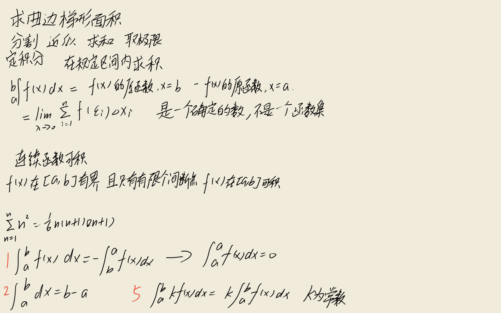
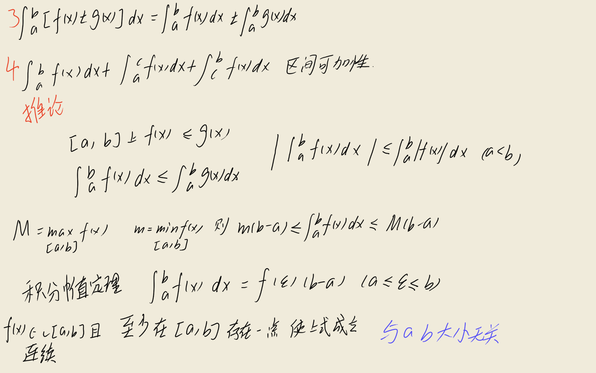
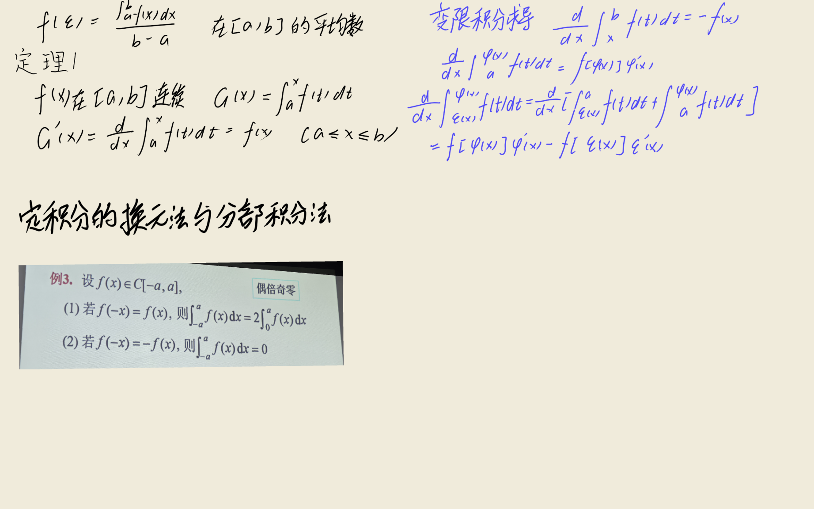
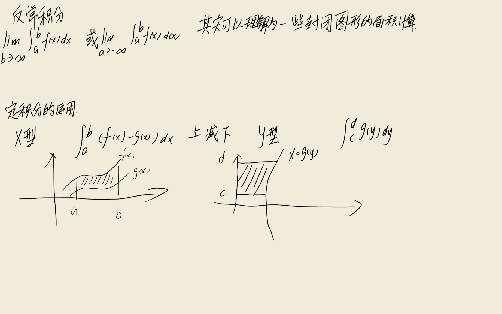
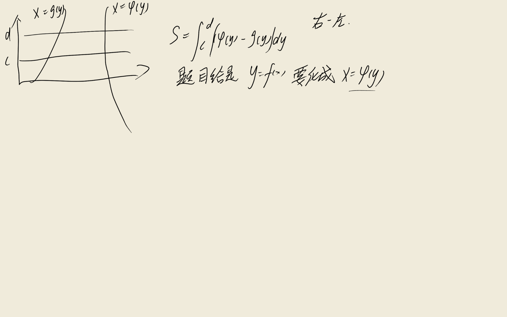
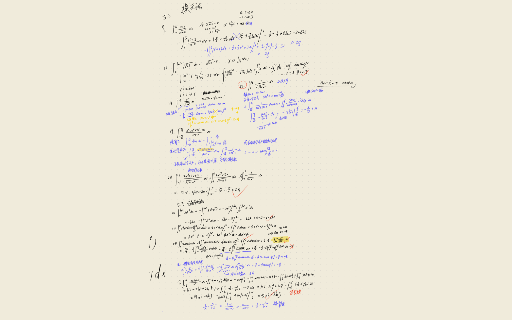
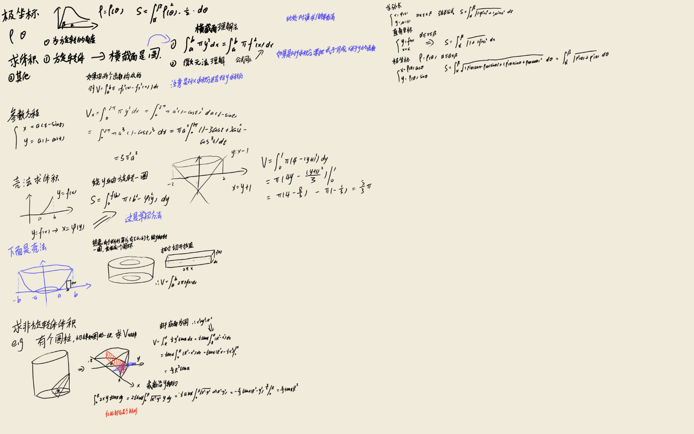

## 关键定理与公式推导

### 1. 定积分的定义

$$
\int_a^b f(x) \, dx = \lim_{\lambda \to 0} \sum_{i=1}^n f(\xi_i) \Delta x_i
$$

:::derivation
定积分的几何背景是求曲边梯形的面积。设 $y = f(x)$ 在 $[a, b]$ 上有界，将区间 $[a, b]$ 任意分割为 $n$ 个小区间，分点为 $a = x_0 < x_1 < \cdots < x_n = b$，第 $i$ 个小区间长度为 $\Delta x_i = x_i - x_{i-1}$，记 $\lambda = \max_{1 \le i \le n} \Delta x_i$。

在每个小区间 $[x_{i-1}, x_i]$ 上任取一点 $\xi_i$，作乘积 $f(\xi_i) \Delta x_i$ 并求和，得到黎曼和：

$$
S_n = \sum_{i=1}^n f(\xi_i) \Delta x_i
$$

当 $\lambda \to 0$（即分割无限加细，此时 $n \to \infty$）时，若该和式极限存在且与区间分割方式及 $\xi_i$ 取法无关，则称此极限为 $f(x)$ 在 $[a, b]$ 上的定积分：

$$
\int_a^b f(x) \, dx = \lim_{\lambda \to 0} \sum_{i=1}^n f(\xi_i) \Delta x_i
$$

其中 $\int$ 称为积分号，$f(x)$ 称为被积函数，$x$ 称为积分变量，$a, b$ 分别称为积分下限与上限，$[a, b]$ 称为积分区间。

**可积的充分条件**：
- 若 $f(x)$ 在 $[a, b]$ 上连续，则可积；
- 若 $f(x)$ 在 $[a, b]$ 上有界且只有有限个间断点，则可积；
- 若 $f(x)$ 在 $[a, b]$ 上单调，则可积。

**几何意义**：当 $f(x) \ge 0$ 时，定积分表示由曲线 $y = f(x)$、直线 $x = a$、$x = b$ 及 $x$ 轴所围曲边梯形的面积。
:::

### 2. 牛顿-莱布尼茨公式（微积分基本定理）

$$
\int_a^b f(x) \, dx = F(b) - F(a)
$$

:::derivation
**牛顿-莱布尼茨公式**是微积分学中最核心的结论，它建立了定积分与不定积分（原函数）之间的桥梁，使定积分的计算大为简化。

**定理**：设 $f(x)$ 在 $[a, b]$ 上连续，$F(x)$ 是 $f(x)$ 在 $[a, b]$ 上的一个原函数（即 $F'(x) = f(x)$），则：

$$
\int_a^b f(x) \, dx = F(b) - F(a)
$$

**证明**：

由于 $f(x)$ 在 $[a, b]$ 上连续，作变上限积分 $\Phi(x) = \int_a^x f(t) \, dt$。先证 $\Phi(x)$ 是 $f(x)$ 的一个原函数。

任取 $x \in [a, b]$，给 $x$ 以增量 $\Delta x$（使 $x + \Delta x \in [a, b]$），则：

$$
\Delta \Phi = \Phi(x + \Delta x) - \Phi(x) = \int_a^{x + \Delta x} f(t) \, dt - \int_a^x f(t) \, dt = \int_x^{x + \Delta x} f(t) \, dt
$$

由积分中值定理（见后续），存在 $\xi$ 介于 $x$ 与 $x + \Delta x$ 之间，使：

$$
\Delta \Phi = f(\xi) \Delta x
$$

故 $\dfrac{\Delta \Phi}{\Delta x} = f(\xi)$。当 $\Delta x \to 0$ 时 $\xi \to x$，由 $f$ 的连续性 $f(\xi) \to f(x)$，故：

$$
\Phi'(x) = \lim_{\Delta x \to 0} \frac{\Delta \Phi}{\Delta x} = f(x)
$$

即 $\Phi(x)$ 是 $f(x)$ 的一个原函数（此即原函数存在定理，也称变上限积分求导公式）。

由于 $F(x)$ 与 $\Phi(x)$ 都是 $f(x)$ 的原函数，它们相差一个常数 $C$：$F(x) = \Phi(x) + C$。

代入 $x = a$：$F(a) = \Phi(a) + C = \int_a^a f(t) \, dt + C = 0 + C = C$，故 $C = F(a)$。

代入 $x = b$：$F(b) = \Phi(b) + C = \int_a^b f(t) \, dt + F(a)$。

移项得：

$$
\int_a^b f(x) \, dx = \int_a^b f(t) \, dt = F(b) - F(a)
$$

通常记作 $\int_a^b f(x) \, dx = \left[ F(x) \right]_a^b = F(b) - F(a)$。

**意义**：将定积分这一复杂极限的求值转化为寻找原函数并代入上下限相减，使定积分的计算变得可行且简便。
:::

### 3. 变上限积分求导公式

$$
\frac{d}{dx} \int_a^x f(t) \, dt = f(x)
$$

:::derivation
**原函数存在定理**：设 $f(x)$ 在 $[a, b]$ 上连续，则变上限积分 $\Phi(x) = \int_a^x f(t) \, dt$ 在 $[a, b]$ 上可导，且 $\Phi'(x) = f(x)$。

**证明**：

任取 $x \in [a, b]$，给 $x$ 以增量 $\Delta x$（使 $x + \Delta x \in [a, b]$），则函数增量：

$$
\Delta \Phi = \Phi(x + \Delta x) - \Phi(x) = \int_a^{x + \Delta x} f(t) \, dt - \int_a^x f(t) \, dt = \int_x^{x + \Delta x} f(t) \, dt
$$

由积分中值定理，存在 $\xi$ 介于 $x$ 与 $x + \Delta x$ 之间，使：

$$
\int_x^{x + \Delta x} f(t) \, dt = f(\xi) \cdot \Delta x
$$

故：

$$
\frac{\Delta \Phi}{\Delta x} = f(\xi)
$$

当 $\Delta x \to 0$ 时，$\xi \to x$（$\xi$ 介于 $x$ 与 $x+\Delta x$ 之间）。由 $f(x)$ 的连续性，$\lim_{\xi \to x} f(\xi) = f(x)$，故：

$$
\Phi'(x) = \lim_{\Delta x \to 0} \frac{\Delta \Phi}{\Delta x} = \lim_{\Delta x \to 0} f(\xi) = f(x)
$$

**重要推论**：若上限是可导函数 $\varphi(x)$，则由复合函数求导法则：

$$
\frac{d}{dx} \int_a^{\varphi(x)} f(t) \, dt = f(\varphi(x)) \cdot \varphi'(x)
$$

更一般地，若上下限都是 $x$ 的函数：

$$
\frac{d}{dx} \int_{\psi(x)}^{\varphi(x)} f(t) \, dt = f(\varphi(x)) \varphi'(x) - f(\psi(x)) \psi'(x)
$$

证明：设 $F(u) = \int_a^u f(t) \, dt$，则 $F'(u) = f(u)$。$\int_{\psi(x)}^{\varphi(x)} f(t) \, dt = F(\varphi(x)) - F(\psi(x))$，对 $x$ 求导并应用链式法则即得上式。

**意义**：该定理揭示了连续函数必有原函数（即变上限积分就是其一个原函数），并给出了一类含积分函数的求导方法。
:::

### 4. 定积分的换元法

$$
\int_a^b f(x) \, dx = \int_\alpha^\beta f(\varphi(t)) \varphi'(t) \, dt
$$

:::derivation
**定积分换元法**：设 $f(x)$ 在 $[a, b]$ 上连续，函数 $x = \varphi(t)$ 满足：
1. $\varphi(\alpha) = a$，$\varphi(\beta) = b$；
2. $\varphi(t)$ 在 $[\alpha, \beta]$（或 $[\beta, \alpha]$）上单调且具有连续导数 $\varphi'(t)$；
3. 当 $t$ 在 $[\alpha, \beta]$ 上变化时，$\varphi(t)$ 的值域不超出 $[a, b]$，

则：

$$
\int_a^b f(x) \, dx = \int_\alpha^\beta f(\varphi(t)) \varphi'(t) \, dt
$$

**证明**：

设 $F(x)$ 是 $f(x)$ 的一个原函数，则由牛顿-莱布尼茨公式：

$$
\int_a^b f(x) \, dx = F(b) - F(a)
$$

另一方面，由复合函数求导法则：

$$
\frac{d}{dt} F(\varphi(t)) = F'(\varphi(t)) \cdot \varphi'(t) = f(\varphi(t)) \varphi'(t)
$$

故 $F(\varphi(t))$ 是 $f(\varphi(t)) \varphi'(t)$ 的一个原函数。再由牛顿-莱布尼茨公式：

$$
\int_\alpha^\beta f(\varphi(t)) \varphi'(t) \, dt = F(\varphi(\beta)) - F(\varphi(\alpha)) = F(b) - F(a)
$$

故两端相等：

$$
\int_a^b f(x) \, dx = \int_\alpha^\beta f(\varphi(t)) \varphi'(t) \, dt
$$

**注**：
- 与不定积分换元法不同，定积分换元时**积分上下限需相应改变**，且不必将新变量换回原变量。
- 换元需满足单调性等条件，以保证一一对应。
- 应用：计算 $\int_0^a \sqrt{a^2 - x^2} \, dx$，令 $x = a\sin t$，$t \in [0, \pi/2]$，则化为 $\int_0^{\pi/2} a^2 \cos^2 t \, dt = \dfrac{\pi a^2}{4}$。
:::

### 5. 定积分的分部积分法

$$
\int_a^b u \, dv = \left[ uv \right]_a^b - \int_a^b v \, du
$$

:::derivation
**定积分分部积分法**：设 $u(x)$ 与 $v(x)$ 在 $[a, b]$ 上具有连续导数，则：

$$
\int_a^b u \, dv = \left[ uv \right]_a^b - \int_a^b v \, du
$$

**证明**：

由不定积分的分部积分公式（由乘积求导法则导出）。回顾乘积求导法则：

$$
(uv)' = u'v + uv'
$$

两端在 $[a, b]$ 上取定积分：

$$
\int_a^b (uv)' \, dx = \int_a^b u'v \, dx + \int_a^b uv' \, dx
$$

左端由牛顿-莱布尼茨公式：$\int_a^b (uv)' \, dx = \left[ uv \right]_a^b = u(b)v(b) - u(a)v(a)$。

代入并移项：

$$
\int_a^b u v' \, dx = \left[ uv \right]_a^b - \int_a^b v u' \, dx
$$

注意到 $v' \, dx = dv$，$u' \, dx = du$，即得：

$$
\int_a^b u \, dv = \left[ uv \right]_a^b - \int_a^b v \, du
$$

**与不定积分分部积分的区别**：定积分分部积分法中，积出的部分 $uv$ 直接代入上下限计算，未积出的部分仍为定积分。

**应用**：计算 $I_n = \int_0^{\pi/2} \sin^n x \, dx$ 的递推公式。设 $u = \sin^{n-1} x$，$dv = \sin x \, dx$，则 $du = (n-1)\sin^{n-2} x \cos x \, dx$，$v = -\cos x$：

$$
I_n = \left[ -\sin^{n-1} x \cos x \right]_0^{\pi/2} + (n-1) \int_0^{\pi/2} \sin^{n-2} x \cos^2 x \, dx
$$

第一项为 0（因 $\sin 0 = 0$，$\cos(\pi/2) = 0$），代入 $\cos^2 x = 1 - \sin^2 x$：

$$
I_n = (n-1) \int_0^{\pi/2} \sin^{n-2} x \, dx - (n-1) \int_0^{\pi/2} \sin^n x \, dx = (n-1) I_{n-2} - (n-1) I_n
$$

移项得 $n I_n = (n-1) I_{n-2}$，即 $I_n = \dfrac{n-1}{n} I_{n-2}$（华里士公式）。
:::

### 6. 积分中值定理

$$
\int_a^b f(x) \, dx = f(\xi)(b - a), \quad \xi \in [a, b]
$$

:::derivation
**积分中值定理**：设 $f(x)$ 在闭区间 $[a, b]$ 上连续，则在 $[a, b]$ 上至少存在一点 $\xi$，使

$$
\int_a^b f(x) \, dx = f(\xi)(b - a)
$$

**证明**：

由于 $f(x)$ 在 $[a, b]$ 上连续，由闭区间上连续函数的性质，$f(x)$ 在 $[a, b]$ 上取得最大值 $M$ 和最小值 $m$，即：

$$
m \le f(x) \le M, \quad \forall x \in [a, b]
$$

由定积分的不等式性质（保号性），两端在 $[a, b]$ 上积分：

$$
\int_a^b m \, dx \le \int_a^b f(x) \, dx \le \int_a^b M \, dx
$$

即：

$$
m(b - a) \le \int_a^b f(x) \, dx \le M(b - a)
$$

（这里用到 $b > a$，若 $a > b$ 不等号反向但结论类似成立。）

两端除以 $b - a$（设 $b > a$）：

$$
m \le \frac{1}{b-a} \int_a^b f(x) \, dx \le M
$$

记 $\mu = \dfrac{1}{b-a} \int_a^b f(x) \, dx$，则 $m \le \mu \le M$，即 $\mu$ 是介于 $f(x)$ 的最小值与最大值之间的一个数。

由闭区间上连续函数的**介值定理**，存在 $\xi \in [a, b]$ 使 $f(\xi) = \mu$，即：

$$
f(\xi) = \frac{1}{b-a} \int_a^b f(x) \, dx
$$

两端乘以 $b - a$ 即得：

$$
\int_a^b f(x) \, dx = f(\xi)(b - a)
$$

**几何意义**：以 $[a, b]$ 为底、$y = f(x)$ 为曲边的曲边梯形的面积，等于以 $[a, b]$ 为底、以某点 $\xi$ 处函数值 $f(\xi)$ 为高的矩形的面积。称 $\dfrac{1}{b-a} \int_a^b f(x) \, dx$ 为 $f(x)$ 在 $[a, b]$ 上的**平均值**。

**推广（广义积分中值定理）**：若 $f(x)$ 与 $g(x)$ 在 $[a, b]$ 上连续，且 $g(x)$ 不变号，则存在 $\xi \in [a, b]$ 使：

$$
\int_a^b f(x) g(x) \, dx = f(\xi) \int_a^b g(x) \, dx
$$
:::

### 7. 奇偶函数在对称区间上的积分

$$
\int_{-a}^a f(x) \, dx = \begin{cases} 0, & f(x) \text{ 为奇函数} \\ 2 \int_0^a f(x) \, dx, & f(x) \text{ 为偶函数} \end{cases}
$$

:::derivation
**性质**：设 $f(x)$ 在 $[-a, a]$ 上连续。

1. 若 $f(x)$ 为奇函数（即 $f(-x) = -f(x)$），则 $\int_{-a}^a f(x) \, dx = 0$；
2. 若 $f(x)$ 为偶函数（即 $f(-x) = f(x)$），则 $\int_{-a}^a f(x) \, dx = 2 \int_0^a f(x) \, dx$。

**证明**：

将积分区间拆分：

$$
\int_{-a}^a f(x) \, dx = \int_{-a}^0 f(x) \, dx + \int_0^a f(x) \, dx
$$

对第一个积分作换元 $x = -t$（即 $t = -x$），则 $dx = -dt$。当 $x = -a$ 时 $t = a$；当 $x = 0$ 时 $t = 0$。由定积分换元法：

$$
\int_{-a}^0 f(x) \, dx = \int_{a}^{0} f(-t) (-dt) = \int_0^a f(-t) \, dt = \int_0^a f(-x) \, dx
$$

（最后一步将积分变量改回 $x$，定积分与变量字母无关。）

代入原式：

$$
\int_{-a}^a f(x) \, dx = \int_0^a f(-x) \, dx + \int_0^a f(x) \, dx = \int_0^a [f(x) + f(-x)] \, dx
$$

**1. 若 $f$ 为奇函数**：$f(-x) = -f(x)$，故 $f(x) + f(-x) = f(x) + (-f(x)) = 0$，从而：

$$
\int_{-a}^a f(x) \, dx = \int_0^a 0 \, dx = 0
$$

**2. 若 $f$ 为偶函数**：$f(-x) = f(x)$，故 $f(x) + f(-x) = 2 f(x)$，从而：

$$
\int_{-a}^a f(x) \, dx = \int_0^a 2 f(x) \, dx = 2 \int_0^a f(x) \, dx
$$

证毕。

**应用**：利用奇偶性可大大简化对称区间上的积分计算。例如 $\int_{-\pi}^{\pi} x^3 \sin^2 x \, dx = 0$（被积函数为奇函数）。
:::

### 8. 周期函数的积分性质

$$
\int_a^{a+T} f(x) \, dx = \int_0^T f(x) \, dx
$$

:::derivation
**性质**：设 $f(x)$ 是以 $T > 0$ 为周期的连续周期函数，则对任意实数 $a$：

$$
\int_a^{a+T} f(x) \, dx = \int_0^T f(x) \, dx
$$

即周期函数在任何长度为一个周期的区间上的积分都相等。

**证明**：

将 $\int_a^{a+T} f(x) \, dx$ 拆分为三部分：

$$
\int_a^{a+T} f(x) \, dx = \int_a^0 f(x) \, dx + \int_0^T f(x) \, dx + \int_T^{a+T} f(x) \, dx
$$

（这里假设 $0 < a < T$，其他情形类似可证。）

对第三个积分作换元 $x = t + T$，则 $dx = dt$。当 $x = T$ 时 $t = 0$；当 $x = a + T$ 时 $t = a$。由 $f(t+T) = f(t)$（周期性）：

$$
\int_T^{a+T} f(x) \, dx = \int_0^a f(t + T) \, dt = \int_0^a f(t) \, dt = \int_0^a f(x) \, dx
$$

对第一个积分作换元 $x = t$（保持不变），但当 $a > 0$ 时 $\int_a^0 f(x) \, dx = -\int_0^a f(x) \, dx$。

代入原式：

$$
\int_a^{a+T} f(x) \, dx = -\int_0^a f(x) \, dx + \int_0^T f(x) \, dx + \int_0^a f(x) \, dx = \int_0^T f(x) \, dx
$$

第一项与第三项相消，得 $\int_a^{a+T} f(x) \, dx = \int_0^T f(x) \, dx$。

**推论**：对任意整数 $n$，$\int_a^{a+nT} f(x) \, dx = n \int_0^T f(x) \, dx$。

**应用**：计算 $\int_0^{2\pi} \sin^3 x \, dx$。$\sin^3 x$ 以 $2\pi$ 为周期，故 $\int_0^{2\pi} \sin^3 x \, dx = \int_{-\pi}^{\pi} \sin^3 x \, dx = 0$（奇函数在对称区间上积分）。
:::

### 9. 定积分的线性性质

$$
\int_a^b [\alpha f(x) + \beta g(x)] \, dx = \alpha \int_a^b f(x) \, dx + \beta \int_a^b g(x) \, dx
$$

:::derivation
**性质**：设 $f(x)$ 与 $g(x)$ 在 $[a, b]$ 上可积，$\alpha, \beta$ 为常数，则：

$$
\int_a^b [\alpha f(x) + \beta g(x)] \, dx = \alpha \int_a^b f(x) \, dx + \beta \int_a^b g(x) \, dx
$$

**证明**：

由定积分的定义，$\int_a^b h(x) \, dx = \lim_{\lambda \to 0} \sum_{i=1}^n h(\xi_i) \Delta x_i$。取 $h(x) = \alpha f(x) + \beta g(x)$：

$$
\int_a^b [\alpha f(x) + \beta g(x)] \, dx = \lim_{\lambda \to 0} \sum_{i=1}^n [\alpha f(\xi_i) + \beta g(\xi_i)] \Delta x_i
$$

利用求和与极限的线性性质（有限和的分配律，极限的线性性）：

$$
= \lim_{\lambda \to 0} \left[ \alpha \sum_{i=1}^n f(\xi_i) \Delta x_i + \beta \sum_{i=1}^n g(\xi_i) \Delta x_i \right]
$$

$$
= \alpha \lim_{\lambda \to 0} \sum_{i=1}^n f(\xi_i) \Delta x_i + \beta \lim_{\lambda \to 0} \sum_{i=1}^n g(\xi_i) \Delta x_i
$$

由于 $f$ 与 $g$ 都可积，上述两个极限都存在，分别为 $\int_a^b f(x) \, dx$ 与 $\int_a^b g(x) \, dx$。故：

$$
\int_a^b [\alpha f(x) + \beta g(x)] \, dx = \alpha \int_a^b f(x) \, dx + \beta \int_a^b g(x) \, dx
$$

**注**：该性质表明定积分是一种线性运算。结合下面的其他性质，构成定积分运算的基础。
:::

### 10. 定积分的保号性与不等式

$$
f(x) \le g(x) \Rightarrow \int_a^b f(x) \, dx \le \int_a^b g(x) \, dx
$$

:::derivation
**性质**（保号性与不等式）：设 $f(x), g(x)$ 在 $[a, b]$ 上可积（设 $a < b$）。

1. 若 $f(x) \ge 0$ 在 $[a, b]$ 上恒成立，则 $\int_a^b f(x) \, dx \ge 0$；
2. 若 $f(x) \le g(x)$ 在 $[a, b]$ 上恒成立，则 $\int_a^b f(x) \, dx \le \int_a^b g(x) \, dx$；
3. $|\int_a^b f(x) \, dx| \le \int_a^b |f(x)| \, dx$。

**证明**：

**1.** 由 $f(x) \ge 0$，对任意分割与任意 $\xi_i$，有 $f(\xi_i) \ge 0$，又 $\Delta x_i > 0$，故黎曼和 $\sum f(\xi_i) \Delta x_i \ge 0$。由极限的保号性（非负数列的极限非负）：

$$
\int_a^b f(x) \, dx = \lim_{\lambda \to 0} \sum f(\xi_i) \Delta x_i \ge 0
$$

**2.** 令 $h(x) = g(x) - f(x)$，则 $h(x) \ge 0$。由 1 知 $\int_a^b h(x) \, dx \ge 0$。由线性性：

$$
\int_a^b g(x) \, dx - \int_a^b f(x) \, dx = \int_a^b [g(x) - f(x)] \, dx \ge 0
$$

即 $\int_a^b f(x) \, dx \le \int_a^b g(x) \, dx$。

**3.** 由 $-|f(x)| \le f(x) \le |f(x)|$，由 2 得：

$$
-\int_a^b |f(x)| \, dx \le \int_a^b f(x) \, dx \le \int_a^b |f(x)| \, dx
$$

即 $|\int_a^b f(x) \, dx| \le \int_a^b |f(x)| \, dx$。

**重要估值不等式**：设 $f(x)$ 在 $[a, b]$ 上连续，$M, m$ 分别为 $f$ 在 $[a, b]$ 上的最大值与最小值，则：

$$
m(b - a) \le \int_a^b f(x) \, dx \le M(b - a)
$$

证明：$m \le f(x) \le M$，由保号性两端积分即得。该不等式给出了定积分的估值范围，也是积分中值定理证明的基础。
:::

### 11. 梯形公式

$$
\int_a^b f(x) \, dx \approx \frac{b - a}{2} [f(a) + f(b)]
$$

:::derivation
**梯形公式**是用梯形面积近似曲边梯形面积的数值积分方法。

将曲边梯形（由 $y = f(x)$、$x = a$、$x = b$、$x$ 轴围成）用直线段 $AB$（$A(a, f(a))$，$B(b, f(b))$）代替曲线弧，得到一个梯形（当 $f(a)$ 与 $f(b)$ 同号时）。

该梯形的两底分别为 $f(a)$ 与 $f(b)$，高为 $b - a$，由梯形面积公式（两底之和乘以高除以二）：

$$
S_{\text{梯形}} = \frac{f(a) + f(b)}{2} \cdot (b - a) = \frac{b - a}{2} [f(a) + f(b)]
$$

以此作为定积分 $\int_a^b f(x) \, dx$ 的近似值：

$$
\int_a^b f(x) \, dx \approx \frac{b - a}{2} [f(a) + f(b)]
$$

**误差分析**（截断误差）：

设 $f(x)$ 在 $[a, b]$ 上具有二阶连续导数。由线性插值的误差公式或泰勒展开可证，梯形公式的截断误差为：

$$
R_T = \int_a^b f(x) \, dx - \frac{b-a}{2}[f(a) + f(b)] = -\frac{(b-a)^3}{12} f''(\eta), \quad \eta \in (a, b)
$$

**证明思路**：将 $f(x)$ 在 $a$ 处展开为泰勒公式：

$$
f(x) = f(a) + f'(a)(x - a) + \frac{f''(\xi_x)}{2} (x - a)^2
$$

两端在 $[a, b]$ 上积分：

$$
\int_a^b f(x) \, dx = f(a)(b-a) + \frac{f'(a)}{2}(b-a)^2 + \frac{1}{2} \int_a^b f''(\xi_x)(x-a)^2 \, dx
$$

类似地展开 $f(b)$ 并整理，利用积分中值定理可证得上述误差公式。

**复合梯形公式**：将 $[a, b]$ 分成 $n$ 等份，分点 $x_i = a + i h$（$h = (b-a)/n$，$i = 0, 1, \ldots, n$），在每个小区间上应用梯形公式：

$$
\int_a^b f(x) \, dx \approx \frac{h}{2} \left[ f(a) + 2 \sum_{i=1}^{n-1} f(x_i) + f(b) \right]
$$

误差为 $-\dfrac{(b-a)^3}{12 n^2} f''(\eta)$，随 $n$ 增大误差以 $O(1/n^2)$ 减小。
:::

### 12. 辛普森（Simpson）公式

$$
\int_a^b f(x) \, dx \approx \frac{b - a}{6} \left[ f(a) + 4 f\left(\frac{a+b}{2}\right) + f(b) \right]
$$

:::derivation
**辛普森公式**（抛物线公式）是用抛物线弧代替曲线弧的数值积分方法，精度比梯形公式更高。

将区间 $[a, b]$ 的中点记为 $c = \dfrac{a+b}{2}$，过三点 $A(a, f(a))$、$C(c, f(c))$、$B(b, f(b))$ 作一条抛物线 $y = P(x)$（二次多项式），用 $P(x)$ 在 $[a, b]$ 上的积分近似 $f(x)$ 的积分。

为简化计算，作变量代换 $x = c + t$（$t \in [-h, h]$，$h = \dfrac{b-a}{2}$），则三点变为 $(-h, f(c-h))$、$(0, f(c))$、$(h, f(c+h))$，即 $(a, f(a))$、$(c, f(c))$、$(b, f(b))$。

设抛物线 $P(t) = \alpha t^2 + \beta t + \gamma$ 满足：

$$
P(-h) = f(a), \quad P(0) = f(c), \quad P(h) = f(b)
$$

由 $P(0) = \gamma = f(c)$ 得 $\gamma = f(c)$。

由 $P(-h) = \alpha h^2 - \beta h + \gamma = f(a)$ 与 $P(h) = \alpha h^2 + \beta h + \gamma = f(b)$，两式相加：

$$
2\alpha h^2 + 2\gamma = f(a) + f(b) \Rightarrow \alpha = \frac{f(a) + f(b) - 2 f(c)}{2 h^2}
$$

抛物线在 $[-h, h]$ 上的积分（利用奇偶函数在对称区间上积分的性质）：

$$
\int_{-h}^h \alpha t^2 \, dt = 2 \int_0^h \alpha t^2 \, dt = \frac{2 \alpha h^3}{3} \quad (\text{偶函数})
$$

$$
\int_{-h}^h \beta t \, dt = 0 \quad (\text{奇函数在对称区间积分})
$$

$$
\int_{-h}^h \gamma \, dt = 2 \gamma h \quad (\text{常数})
$$

故：

$$
\int_{-h}^h P(t) \, dt = \frac{2 \alpha h^3}{3} + 2 \gamma h = \frac{2 h^3}{3} \cdot \frac{f(a) + f(b) - 2 f(c)}{2 h^2} + 2 h f(c)
$$

$$
= \frac{h}{3} [f(a) + f(b) - 2 f(c)] + 2 h f(c) = \frac{h}{3} [f(a) + f(b) - 2 f(c) + 6 f(c)] = \frac{h}{3} [f(a) + 4 f(c) + f(b)]
$$

由 $h = \dfrac{b-a}{2}$，即 $\dfrac{b-a}{6} = \dfrac{h}{3}$：

$$
\int_a^b f(x) \, dx \approx \int_{-h}^h P(t) \, dt = \frac{b - a}{6} [f(a) + 4 f(c) + f(b)] = \frac{b - a}{6} \left[ f(a) + 4 f\left(\frac{a+b}{2}\right) + f(b) \right]
$$

**误差**：若 $f^{(4)}(x)$ 在 $[a, b]$ 上连续，截断误差为 $-\dfrac{(b-a)^5}{2880} f^{(4)}(\eta)$（$\eta \in (a, b)$），精度为 $O((b-a)^5)$，远高于梯形公式。

**复合辛普森公式**：将 $[a,b]$ 分成 $2n$ 等份（$h = (b-a)/(2n)$）：

$$
\int_a^b f(x) \, dx \approx \frac{h}{3} \left[ f(a) + 4 \sum_{i=1}^n f(x_{2i-1}) + 2 \sum_{i=1}^{n-1} f(x_{2i}) + f(b) \right]
$$
:::

### 13. 反常积分的收敛判定（比较判别法）

$$
0 \le f(x) \le g(x), \, x \in [a, +\infty) \Rightarrow \int_a^{+\infty} g \text{ 收敛} \Rightarrow \int_a^{+\infty} f \text{ 收敛}
$$

:::derivation
**比较判别法**：设 $f(x)$ 与 $g(x)$ 在 $[a, +\infty)$ 上连续，且 $0 \le f(x) \le g(x)$。

1. 若 $\int_a^{+\infty} g(x) \, dx$ 收敛，则 $\int_a^{+\infty} f(x) \, dx$ 也收敛；
2. 若 $\int_a^{+\infty} f(x) \, dx$ 发散，则 $\int_a^{+\infty} g(x) \, dx$ 也发散。

**证明**：

设 $F(A) = \int_a^A f(x) \, dx$，$G(A) = \int_a^A g(x) \, dx$。由 $0 \le f(x) \le g(x)$ 及积分保号性，对任意 $A > a$：

$$
F(A) = \int_a^A f(x) \, dx \le \int_a^A g(x) \, dx = G(A)
$$

又 $f(x) \ge 0$，故 $F(A)$ 关于 $A$ 单调递增。

**1.** 若 $\int_a^{+\infty} g(x) \, dx$ 收敛，即 $\lim_{A \to +\infty} G(A) = G(+\infty)$ 存在且有限。则：

$$
F(A) \le G(A) \le G(+\infty)
$$

即 $F(A)$ 有上界。又 $F(A)$ 单调递增，由单调有界原理，$\lim_{A \to +\infty} F(A)$ 存在且有限，故 $\int_a^{+\infty} f(x) \, dx$ 收敛。

**2.** 若 $\int_a^{+\infty} f(x) \, dx$ 发散，由于 $F(A)$ 单调递增，$\lim_{A \to +\infty} F(A) = +\infty$。又 $G(A) \ge F(A) \to +\infty$，故 $G(A) \to +\infty$，即 $\int_a^{+\infty} g(x) \, dx$ 发散。

**极限形式**：若 $\lim_{x \to +\infty} \dfrac{f(x)}{g(x)} = l$（$0 < l < +\infty$），则 $\int_a^{+\infty} f$ 与 $\int_a^{+\infty} g$ 同敛散。

**证明**：由极限定义，存在 $X > a$，使当 $x > X$ 时 $\dfrac{l}{2} < \dfrac{f(x)}{g(x)} < \dfrac{3l}{2}$，即 $\dfrac{l}{2} g(x) < f(x) < \dfrac{3l}{2} g(x)$。由比较判别法即得 $f$ 与 $g$ 的反常积分同敛散。

**柯西判别法**（与 $\dfrac{1}{x^p}$ 比较）：设 $f(x) \ge 0$，若 $\lim_{x \to +\infty} x^p f(x) = l$：

- $p > 1$ 且 $0 \le l < +\infty$：$\int_a^{+\infty} f$ 收敛；
- $p \le 1$ 且 $0 < l \le +\infty$：$\int_a^{+\infty} f$ 发散。
:::

### 14. 无界函数反常积分（瑕积分）

$$
\int_a^b f(x) \, dx = \lim_{\varepsilon \to 0^+} \int_{a+\varepsilon}^b f(x) \, dx, \quad a \text{ 为瑕点}
$$

:::derivation
**瑕积分定义**：设 $f(x)$ 在 $(a, b]$ 上连续，但在点 $a$ 的右邻域内无界（称 $a$ 为瑕点）。若极限 $\lim_{\varepsilon \to 0^+} \int_{a+\varepsilon}^b f(x) \, dx$ 存在且有限，则称此极限为无界函数 $f(x)$ 在 $(a, b]$ 上的反常积分（瑕积分），记作：

$$
\int_a^b f(x) \, dx = \lim_{\varepsilon \to 0^+} \int_{a+\varepsilon}^b f(x) \, dx
$$

此时称该瑕积分收敛；否则称为发散。

**类似定义**：
- 若 $b$ 为瑕点：$\int_a^b f(x) \, dx = \lim_{\varepsilon \to 0^+} \int_a^{b-\varepsilon} f(x) \, dx$；
- 若 $c \in (a, b)$ 为瑕点：$\int_a^b f(x) \, dx = \int_a^c f(x) \, dx + \int_c^b f(x) \, dx$，当且仅当右端两个瑕积分都收敛时原积分收敛。

**判别法**：设 $f(x) \ge 0$ 在 $(a, b]$ 上连续，$a$ 为瑕点。若 $\lim_{x \to a^+} (x-a)^q f(x) = l$：

- $0 < q < 1$ 且 $0 \le l < +\infty$：瑕积分收敛；
- $q \ge 1$ 且 $0 < l \le +\infty$：瑕积分发散。

**例**：讨论 $\int_0^1 \dfrac{dx}{x^p}$（$p > 0$）的敛散性。$x = 0$ 为瑕点。

$$
\int_\varepsilon^1 \frac{dx}{x^p} = \begin{cases} \dfrac{1 - \varepsilon^{1-p}}{1 - p}, & p \neq 1 \\ -\ln \varepsilon, & p = 1 \end{cases}
$$

当 $\varepsilon \to 0^+$ 时：
- $p < 1$：$\varepsilon^{1-p} \to 0$，极限为 $\dfrac{1}{1-p}$，积分收敛；
- $p = 1$：$-\ln \varepsilon \to +\infty$，积分发散；
- $p > 1$：$\varepsilon^{1-p} = \dfrac{1}{\varepsilon^{p-1}} \to +\infty$，积分发散。

故 $\int_0^1 \dfrac{dx}{x^p}$ 当 $p < 1$ 时收敛，$p \ge 1$ 时发散。

**与无穷限反常积分的关系**：通过变量代换 $x = \dfrac{1}{t}$ 可将两种反常积分相互转化。例如 $\int_0^1 \dfrac{dx}{x^p}$ 令 $x = \dfrac{1}{t}$ 化为 $\int_1^{+\infty} \dfrac{dt}{t^{2-p}}$，由 $p < 1 \Leftrightarrow 2 - p > 1$ 即可套用无穷限积分的判别法。
:::

### 15. 华里士（Wallis）公式

$$
\int_0^{\frac{\pi}{2}} \sin^n x \, dx = \int_0^{\frac{\pi}{2}} \cos^n x \, dx = \begin{cases} \dfrac{(n-1)!!}{n!!}, & n \text{ 为奇数} \\ \dfrac{(n-1)!!}{n!!} \cdot \dfrac{\pi}{2}, & n \text{ 为偶数} \end{cases}
$$

:::derivation
**华里士公式**给出了 $\sin^n x$ 与 $\cos^n x$ 在 $[0, \pi/2]$ 上积分的简洁表达，是定积分分部积分法的经典应用。

记 $I_n = \int_0^{\pi/2} \sin^n x \, dx$。先建立递推公式。

**递推公式**：$I_n = \dfrac{n-1}{n} I_{n-2}$（$n \ge 2$）。

设 $u = \sin^{n-1} x$，$dv = \sin x \, dx$，则 $du = (n-1) \sin^{n-2} x \cos x \, dx$，$v = -\cos x$。由分部积分：

$$
I_n = \left[ -\sin^{n-1} x \cos x \right]_0^{\pi/2} + (n-1) \int_0^{\pi/2} \sin^{n-2} x \cos^2 x \, dx
$$

第一项：$x = \pi/2$ 时 $\cos(\pi/2) = 0$；$x = 0$ 时 $\sin 0 = 0$，故第一项为 $0$。代入 $\cos^2 x = 1 - \sin^2 x$：

$$
I_n = (n-1) \int_0^{\pi/2} \sin^{n-2} x (1 - \sin^2 x) \, dx = (n-1) I_{n-2} - (n-1) I_n
$$

移项：$n I_n = (n-1) I_{n-2}$，即 $I_n = \dfrac{n-1}{n} I_{n-2}$。

**初始值**：

$$
I_0 = \int_0^{\pi/2} dx = \frac{\pi}{2}, \quad I_1 = \int_0^{\pi/2} \sin x \, dx = [-\cos x]_0^{\pi/2} = 1
$$

**n 为偶数**（$n = 2m$）：反复使用递推：

$$
I_{2m} = \frac{2m-1}{2m} I_{2m-2} = \frac{2m-1}{2m} \cdot \frac{2m-3}{2m-2} I_{2m-4} = \cdots = \frac{(2m-1)(2m-3) \cdots 3 \cdot 1}{2m (2m-2) \cdots 4 \cdot 2} I_0
$$

$$
= \frac{(2m-1)!!}{(2m)!!} \cdot \frac{\pi}{2}
$$

其中 $k!!$ 表示双阶乘：偶数 $2m$ 的双阶乘为 $2m \cdot (2m-2) \cdots 2$，奇数 $2m-1$ 的双阶乘为 $(2m-1)(2m-3) \cdots 1$。

**n 为奇数**（$n = 2m+1$）：

$$
I_{2m+1} = \frac{2m}{2m+1} I_{2m-1} = \frac{2m}{2m+1} \cdot \frac{2m-2}{2m-1} I_{2m-3} = \cdots = \frac{2m (2m-2) \cdots 4 \cdot 2}{(2m+1)(2m-1) \cdots 3 \cdot 1} I_1
$$

$$
= \frac{(2m)!!}{(2m+1)!!} \cdot 1 = \frac{(2m)!!}{(2m+1)!!}
$$

**关于 $\cos^n x$ 的等式**：由换元 $x = \dfrac{\pi}{2} - t$ 可证 $\int_0^{\pi/2} \cos^n x \, dx = \int_0^{\pi/2} \sin^n x \, dx$。

**推论（Wallis 公式）**：由 $I_{2m} / I_{2m+1}$ 的比值，可推得：

$$
\frac{\pi}{2} = \prod_{n=1}^{\infty} \frac{2n \cdot 2n}{(2n-1)(2n+1)} = \frac{2}{1} \cdot \frac{2}{3} \cdot \frac{4}{3} \cdot \frac{4}{5} \cdot \frac{6}{5} \cdot \frac{6}{7} \cdots
$$

这是 $\pi$ 的一个无穷乘积表示。
:::
