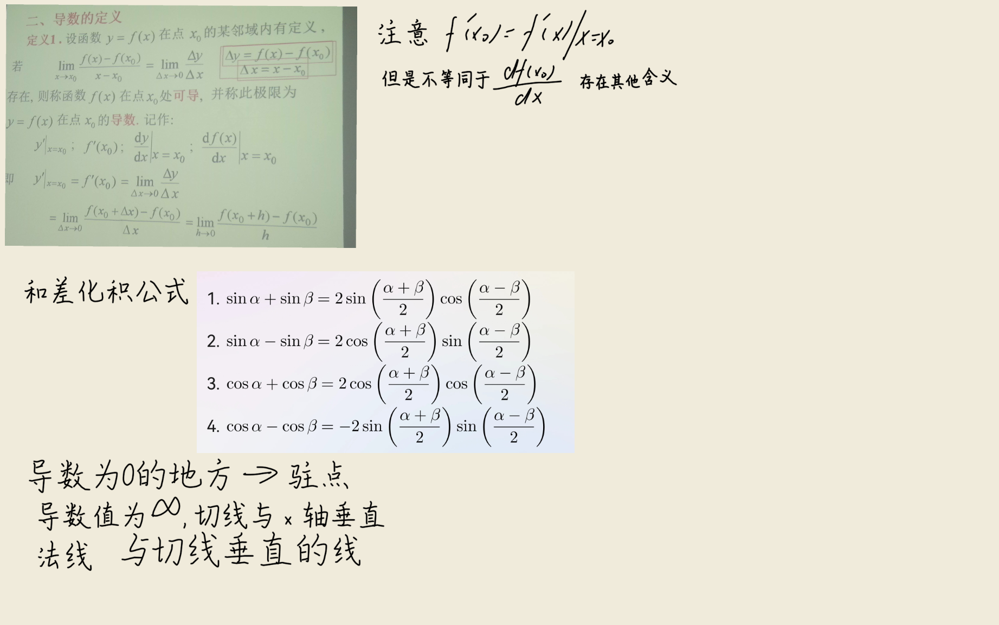
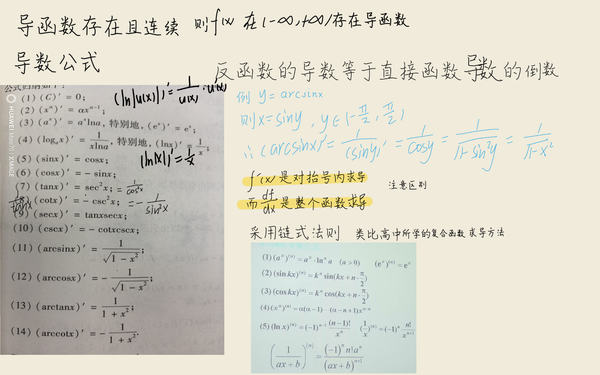
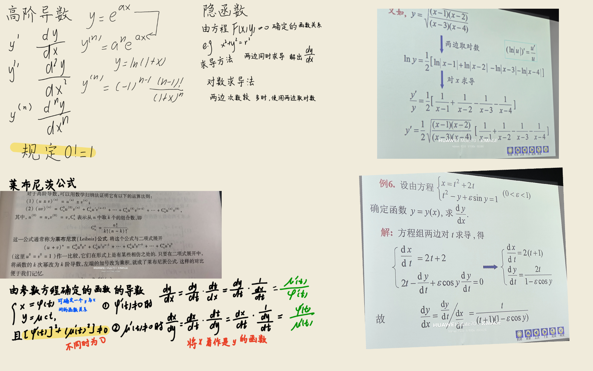
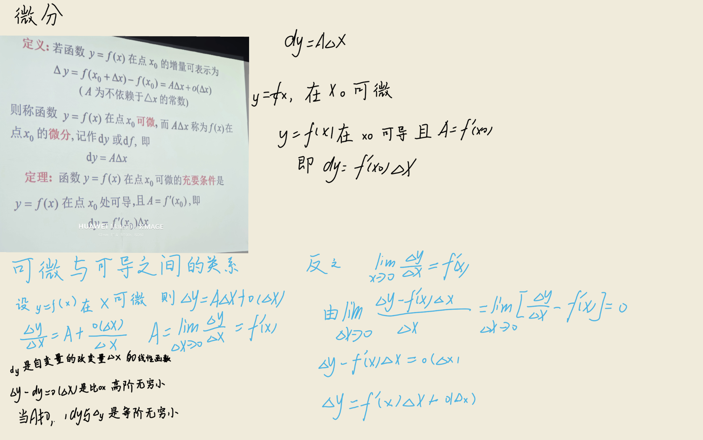
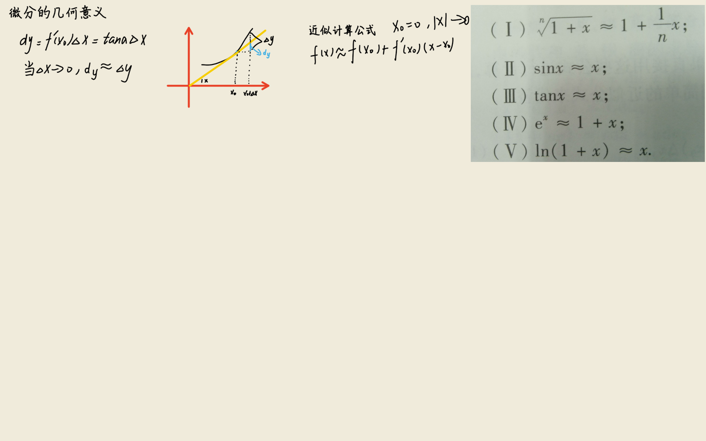

## 关键定理与公式推导

### 1. 导数的定义

$$
f'(x_0) = \lim_{\Delta x \to 0} \frac{f(x_0 + \Delta x) - f(x_0)}{\Delta x}
$$

:::derivation
导数是函数增量与自变量增量之比当自变量增量趋于零时的极限，其几何意义是曲线 $y=f(x)$ 在点 $(x_0, f(x_0))$ 处切线的斜率。

设点 $P(x_0, f(x_0))$ 为曲线上一定点，$Q(x_0+\Delta x, f(x_0+\Delta x))$ 为邻近点。割线 $PQ$ 的斜率为：

$$
k_{PQ} = \frac{f(x_0+\Delta x) - f(x_0)}{(x_0+\Delta x) - x_0} = \frac{\Delta y}{\Delta x}
$$

当 $\Delta x \to 0$ 时，点 $Q$ 沿曲线无限趋近于点 $P$，割线 $PQ$ 的极限位置即为切线。因此切线斜率为：

$$
k = \lim_{\Delta x \to 0} \frac{\Delta y}{\Delta x} = \lim_{\Delta x \to 0} \frac{f(x_0+\Delta x) - f(x_0)}{\Delta x}
$$

记此极限为 $f'(x_0)$，即为函数 $f(x)$ 在 $x_0$ 处的导数。当该极限存在时，称函数在 $x_0$ 处可导。
:::

### 2. 函数和、差的求导法则

$$
(u \pm v)' = u' \pm v'
$$

:::derivation
设 $y = u(x) \pm v(x)$，给自变量 $x$ 以增量 $\Delta x$，则函数增量为：

$$
\Delta y = [u(x+\Delta x) \pm v(x+\Delta x)] - [u(x) \pm v(x)]
$$

$$
= [u(x+\Delta x) - u(x)] \pm [v(x+\Delta x) - v(x)] = \Delta u \pm \Delta v
$$

于是：

$$
\frac{\Delta y}{\Delta x} = \frac{\Delta u}{\Delta x} \pm \frac{\Delta v}{\Delta x}
$$

由于 $u(x)$ 与 $v(x)$ 在 $x$ 处可导，即 $\lim_{\Delta x \to 0} \frac{\Delta u}{\Delta x} = u'(x)$，$\lim_{\Delta x \to 0} \frac{\Delta v}{\Delta x} = v'(x)$ 存在。由极限的四则运算法则：

$$
y' = \lim_{\Delta x \to 0} \frac{\Delta y}{\Delta x} = u'(x) \pm v'(x)
$$

即 $(u \pm v)' = u' \pm v'$。该法则可推广到有限个函数的代数和。
:::

### 3. 函数乘积的求导法则

$$
(uv)' = u'v + uv'
$$

:::derivation
设 $y = u(x) \cdot v(x)$，给 $x$ 以增量 $\Delta x$，相应函数增量为：

$$
\Delta y = u(x+\Delta x) v(x+\Delta x) - u(x) v(x)
$$

为引入 $\Delta u$ 与 $\Delta v$，将上式加减 $u(x+\Delta x) v(x)$：

$$
\Delta y = u(x+\Delta x) v(x+\Delta x) - u(x+\Delta x) v(x) + u(x+\Delta x) v(x) - u(x) v(x)
$$

$$
= u(x+\Delta x) \cdot [v(x+\Delta x) - v(x)] + [u(x+\Delta x) - u(x)] \cdot v(x)
$$

$$
= u(x+\Delta x) \cdot \Delta v + \Delta u \cdot v(x)
$$

两端除以 $\Delta x$：

$$
\frac{\Delta y}{\Delta x} = u(x+\Delta x) \cdot \frac{\Delta v}{\Delta x} + \frac{\Delta u}{\Delta x} \cdot v(x)
$$

由于 $u(x)$ 在 $x$ 处可导，故连续，从而 $\lim_{\Delta x \to 0} u(x+\Delta x) = u(x)$。对上式取极限：

$$
y' = \lim_{\Delta x \to 0} \frac{\Delta y}{\Delta x} = u(x) \cdot v'(x) + u'(x) \cdot v(x) = u'v + uv'
$$

特别地，当 $v = C$（常数）时，$(Cu)' = Cu'$。
:::

### 4. 函数商的求导法则

$$
\left(\frac{u}{v}\right)' = \frac{u'v - uv'}{v^2} \quad (v \neq 0)
$$

:::derivation
设 $y = \dfrac{u(x)}{v(x)}$，给 $x$ 以增量 $\Delta x$，则：

$$
\Delta y = \frac{u(x+\Delta x)}{v(x+\Delta x)} - \frac{u(x)}{v(x)} = \frac{u(x+\Delta x) v(x) - u(x) v(x+\Delta x)}{v(x+\Delta x) \cdot v(x)}
$$

分子加减 $u(x) v(x)$：

$$
\Delta y = \frac{[u(x+\Delta x) - u(x)] v(x) - u(x) [v(x+\Delta x) - v(x)]}{v(x+\Delta x) \cdot v(x)} = \frac{\Delta u \cdot v(x) - u(x) \cdot \Delta v}{v(x+\Delta x) \cdot v(x)}
$$

两端除以 $\Delta x$：

$$
\frac{\Delta y}{\Delta x} = \frac{\dfrac{\Delta u}{\Delta x} \cdot v(x) - u(x) \cdot \dfrac{\Delta v}{\Delta x}}{v(x+\Delta x) \cdot v(x)}
$$

由于 $v(x)$ 在 $x$ 处可导必连续，$\lim_{\Delta x \to 0} v(x+\Delta x) = v(x)$。又 $v(x) \neq 0$，对上式取极限得：

$$
y' = \frac{u'(x) v(x) - u(x) v'(x)}{v^2(x)} = \frac{u'v - uv'}{v^2}
$$

特别地，当 $u = 1$ 时，$\left(\dfrac{1}{v}\right)' = -\dfrac{v'}{v^2}$。
:::

### 5. 复合函数求导法则（链式法则）

$$
\frac{dy}{dx} = \frac{dy}{du} \cdot \frac{du}{dx}, \quad \text{即} \quad y'_x = y'_u \cdot u'_x
$$

:::derivation
设 $y = f(u)$，$u = \varphi(x)$，且 $\varphi(x)$ 在 $x$ 处可导，$f(u)$ 在对应点 $u$ 处可导。

给 $x$ 以增量 $\Delta x$，相应地 $u$ 有增量 $\Delta u$，进而 $y$ 有增量 $\Delta y$。由于 $f(u)$ 在 $u$ 处可导，有：

$$
\lim_{\Delta u \to 0} \frac{\Delta y}{\Delta u} = f'(u)
$$

由极限与无穷小的关系，可设 $\dfrac{\Delta y}{\Delta u} = f'(u) + \alpha$，其中 $\alpha \to 0$（当 $\Delta u \to 0$ 时）。即：

$$
\Delta y = f'(u) \cdot \Delta u + \alpha \cdot \Delta u
$$

注意当 $\Delta u = 0$ 时，可规定 $\alpha = 0$ 使上式仍成立。两端除以 $\Delta x$：

$$
\frac{\Delta y}{\Delta x} = f'(u) \cdot \frac{\Delta u}{\Delta x} + \alpha \cdot \frac{\Delta u}{\Delta x}
$$

由于 $u = \varphi(x)$ 在 $x$ 处可导必连续，故 $\Delta x \to 0$ 时 $\Delta u \to 0$（注意 $\Delta u$ 可能为零，但上述处理已涵盖此情形），从而 $\alpha \to 0$。又 $\lim_{\Delta x \to 0} \dfrac{\Delta u}{\Delta x} = \varphi'(x)$，故：

$$
\frac{dy}{dx} = \lim_{\Delta x \to 0} \frac{\Delta y}{\Delta x} = f'(u) \cdot \varphi'(x) + 0 \cdot \varphi'(x) = f'(u) \cdot \varphi'(x) = \frac{dy}{du} \cdot \frac{du}{dx}
$$

链式法则可推广到有限次复合的情形。
:::

### 6. 反函数求导法则

$$
\frac{dx}{dy} = \frac{1}{\frac{dy}{dx}}, \quad \text{即} \quad \varphi'(y) = \frac{1}{f'(x)}
$$

:::derivation
设 $y = f(x)$ 在某区间内单调、可导且 $f'(x) \neq 0$，则其反函数 $x = \varphi(y)$ 在对应区间内也可导。

给 $y$ 以增量 $\Delta y \neq 0$，由 $x = \varphi(y)$ 的单调性，对应的 $\Delta x \neq 0$，于是：

$$
\frac{\Delta x}{\Delta y} = \frac{1}{\dfrac{\Delta y}{\Delta x}}
$$

由于 $y = f(x)$ 可导必连续，反函数 $x = \varphi(y)$ 也连续。故 $\Delta y \to 0$ 时必有 $\Delta x \to 0$。又 $f'(x) \neq 0$，对上式取极限：

$$
\varphi'(y) = \lim_{\Delta y \to 0} \frac{\Delta x}{\Delta y} = \lim_{\Delta x \to 0} \frac{1}{\dfrac{\Delta y}{\Delta x}} = \frac{1}{\lim_{\Delta x \to 0} \dfrac{\Delta y}{\Delta x}} = \frac{1}{f'(x)}
$$

即反函数的导数等于直接函数导数的倒数。

**例**：$y = \arcsin x$ 是 $x = \sin y$（$-\dfrac{\pi}{2} \le y \le \dfrac{\pi}{2}$）的反函数，故：

$$
(\arcsin x)' = \frac{1}{(\sin y)'} = \frac{1}{\cos y} = \frac{1}{\sqrt{1 - \sin^2 y}} = \frac{1}{\sqrt{1 - x^2}}
$$
:::

### 7. 参数方程确定的函数的求导

$$
\frac{dy}{dx} = \frac{\psi'(t)}{\varphi'(t)}, \quad \text{其中} \quad x = \varphi(t), \, y = \psi(t)
$$

:::derivation
设 $y$ 与 $x$ 之间的函数关系由参数方程 $\begin{cases} x = \varphi(t) \\ y = \psi(t) \end{cases}$ 给定，其中 $\varphi(t)$ 与 $\psi(t)$ 可导，且 $\varphi'(t) \neq 0$。

由 $\varphi'(t) \neq 0$ 及 $\varphi(t)$ 的连续性，可证明 $x = \varphi(t)$ 存在单调连续的反函数 $t = \varphi^{-1}(x)$。于是 $y$ 可视为 $x$ 的复合函数：

$$
y = \psi(t) = \psi(\varphi^{-1}(x))
$$

由复合函数求导法则与反函数求导法则：

$$
\frac{dy}{dx} = \frac{dy}{dt} \cdot \frac{dt}{dx} = \psi'(t) \cdot \frac{1}{\varphi'(t)} = \frac{\psi'(t)}{\varphi'(t)}
$$

二阶导数可通过对一阶导数再次求导得到。设 $\dfrac{dy}{dx} = \dfrac{\psi'(t)}{\varphi'(t)} = G(t)$，则：

$$
\frac{d^2 y}{dx^2} = \frac{d}{dx} G(t) = \frac{G'(t)}{\varphi'(t)} = \frac{\psi''(t)\varphi'(t) - \psi'(t)\varphi''(t)}{[\varphi'(t)]^3}
$$
:::

### 8. 莱布尼茨公式（高阶导数）

$$
(uv)^{(n)} = \sum_{k=0}^{n} \binom{n}{k} u^{(n-k)} v^{(k)}
$$

:::derivation
莱布尼茨公式给出了两个函数乘积的 $n$ 阶导数的计算方法，形式与二项式定理类似。

先用数学归纳法验证低阶情形。当 $n=1$ 时，由乘积求导法则：

$$
(uv)' = u'v + uv' = \binom{1}{0} u' v + \binom{1}{1} u v'
$$

公式成立。当 $n=2$ 时：

$$
(uv)'' = (u'v + uv')' = u''v + u'v' + u'v' + uv'' = u''v + 2u'v' + uv''
$$

即 $(uv)'' = \binom{2}{0} u''v + \binom{2}{1} u'v' + \binom{2}{2} uv''$，公式成立。

假设当 $n = m$ 时公式成立，即：

$$
(uv)^{(m)} = \sum_{k=0}^{m} \binom{m}{k} u^{(m-k)} v^{(k)}
$$

两端对 $x$ 求导，对每一项应用乘积法则 $\left(u^{(m-k)} v^{(k)}\right)' = u^{(m-k+1)} v^{(k)} + u^{(m-k)} v^{(k+1)}$：

$$
(uv)^{(m+1)} = \sum_{k=0}^{m} \binom{m}{k} \left[ u^{(m-k+1)} v^{(k)} + u^{(m-k)} v^{(k+1)} \right]
$$

将两项拆开重新组合：

$$
= \sum_{k=0}^{m} \binom{m}{k} u^{(m-k+1)} v^{(k)} + \sum_{k=0}^{m} \binom{m}{k} u^{(m-k)} v^{(k+1)}
$$

第二个和中令 $j = k+1$：

$$
= \sum_{k=0}^{m} \binom{m}{k} u^{(m+1-k)} v^{(k)} + \sum_{j=1}^{m+1} \binom{m}{j-1} u^{(m+1-j)} v^{(j)}
$$

合并同次项 $u^{(m+1-k)} v^{(k)}$（$k = 0, 1, \ldots, m+1$），系数为 $\binom{m}{k} + \binom{m}{k-1}$。由组合恒等式：

$$
\binom{m}{k} + \binom{m}{k-1} = \binom{m+1}{k}
$$

故：

$$
(uv)^{(m+1)} = \sum_{k=0}^{m+1} \binom{m+1}{k} u^{(m+1-k)} v^{(k)}
$$

由数学归纳法，对一切正整数 $n$，莱布尼茨公式成立。
:::

### 9. 微分的定义

$$
dy = f'(x) \Delta x
$$

:::derivation
设函数 $y = f(x)$ 在 $x$ 处可导，给 $x$ 以增量 $\Delta x$，则函数增量：

$$
\Delta y = f(x + \Delta x) - f(x)
$$

由导数定义 $f'(x) = \lim_{\Delta x \to 0} \dfrac{\Delta y}{\Delta x}$，根据极限与无穷小的关系：

$$
\frac{\Delta y}{\Delta x} = f'(x) + \alpha
$$

其中 $\alpha \to 0$（当 $\Delta x \to 0$ 时）。两端乘以 $\Delta x$：

$$
\Delta y = f'(x) \Delta x + \alpha \cdot \Delta x
$$

可见函数增量 $\Delta y$ 由两部分组成：
- 第一部分 $f'(x) \Delta x$ 是 $\Delta x$ 的线性主部；
- 第二部分 $\alpha \cdot \Delta x$ 当 $\Delta x \to 0$ 时是 $\Delta x$ 的高阶无穷小，记作 $o(\Delta x)$。

于是 $\Delta y = f'(x) \Delta x + o(\Delta x)$。当 $|\Delta x|$ 很小时，可忽略高阶无穷小，得近似公式 $\Delta y \approx f'(x) \Delta x$。称 $f'(x) \Delta x$ 为函数 $y = f(x)$ 在 $x$ 处的微分，记作 $dy = f'(x) \Delta x$。

由于自变量的微分 $dx = \Delta x$，故 $dy = f'(x) dx$，从而 $\dfrac{dy}{dx} = f'(x)$，揭示了导数即微分之商的本质。
:::

### 10. 微分形式的不变性

$$
dy = f'(u) \, du
$$

:::derivation
微分形式的不变性是指：无论 $u$ 是自变量还是中间变量，函数 $y = f(u)$ 的微分形式 $dy = f'(u) du$ 始终成立。

**情形一**：$u$ 是自变量。由微分定义直接得 $dy = f'(u) du$。

**情形二**：$u$ 是中间变量，即 $u = \varphi(x)$，$x$ 为自变量。则 $y = f(\varphi(x))$ 是 $x$ 的复合函数。由链式法则：

$$
\frac{dy}{dx} = f'(u) \cdot \varphi'(x) = f'(u) \cdot \frac{du}{dx}
$$

两端乘以 $dx$：

$$
dy = f'(u) \cdot \frac{du}{dx} \cdot dx = f'(u) \cdot du
$$

其中 $du = \varphi'(x) dx$ 是 $u = \varphi(x)$ 的微分。由此可见，无论 $u$ 是自变量还是中间变量，$y = f(u)$ 的微分均可写为 $dy = f'(u) du$。这一性质称为一阶微分形式的不变性，是复合函数求导法则在微分形式上的体现，为微分运算带来极大便利。
:::

### 11. 隐函数求导法

$$
\frac{dy}{dx} = -\frac{F_x}{F_y}, \quad \text{其中} \quad F(x, y) = 0
$$

:::derivation
设方程 $F(x, y) = 0$ 确定了隐函数 $y = y(x)$，将其代入方程得恒等式：

$$
F(x, y(x)) = 0
$$

两端对 $x$ 求导。注意到 $F$ 既直接依赖于 $x$，又通过 $y$ 间接依赖于 $x$，由多元复合函数求导的链式法则：

$$
\frac{d}{dx} F(x, y(x)) = F_x \cdot \frac{dx}{dx} + F_y \cdot \frac{dy}{dx} = F_x + F_y \cdot y'(x) = 0
$$

解出 $y'(x)$：

$$
y'(x) = -\frac{F_x}{F_y} \quad (F_y \neq 0)
$$

即 $\dfrac{dy}{dx} = -\dfrac{F_x}{F_y}$。

**实际操作中**，也常对方程 $F(x,y) = 0$ 两端直接对 $x$ 求导，遇到 $y$ 时视其为 $x$ 的函数按复合函数处理，最后从所得等式中解出 $y'$。

**例**：求由方程 $x^2 + y^2 = R^2$ 确定的隐函数的导数。两端对 $x$ 求导：$2x + 2y \cdot y' = 0$，解得 $y' = -\dfrac{x}{y}$。
:::

### 12. 对数求导法

$$
y' = y \left( \ln f(x) \right)' = f(x) \cdot (\ln f(x))'
$$

:::derivation
对数求导法适用于幂指函数 $y = u(x)^{v(x)}$ 以及由多个因式乘除、开方构成的函数的求导。

设 $y = f(x)$，且 $f(x) > 0$。两端取自然对数：

$$
\ln y = \ln f(x)
$$

视 $y$ 为 $x$ 的函数，两端对 $x$ 求导（左边按复合函数求导）：

$$
\frac{1}{y} \cdot y' = (\ln f(x))'
$$

两端乘以 $y$：

$$
y' = y \cdot (\ln f(x))' = f(x) \cdot (\ln f(x))'
$$

**应用于幂指函数** $y = u(x)^{v(x)}$（$u(x) > 0$）。取对数得 $\ln y = v(x) \ln u(x)$。两端对 $x$ 求导：

$$
\frac{y'}{y} = v'(x) \ln u(x) + v(x) \cdot \frac{u'(x)}{u(x)}
$$

故：

$$
y' = u(x)^{v(x)} \left[ v'(x) \ln u(x) + \frac{v(x) u'(x)}{u(x)} \right]
$$

**例**：求 $y = x^x$（$x > 0$）的导数。取对数 $\ln y = x \ln x$，求导 $\dfrac{y'}{y} = \ln x + 1$，故 $y' = x^x (\ln x + 1)$。
:::

### 13. 基本初等函数导数公式

$$
(\sin x)' = \cos x, \quad (\cos x)' = -\sin x, \quad (e^x)' = e^x, \quad (\ln x)' = \frac{1}{x}
$$

:::derivation
这些基本公式是导数计算的基石，下面分别推导。

**1. $(\sin x)' = \cos x$**：

$$
(\sin x)' = \lim_{\Delta x \to 0} \frac{\sin(x + \Delta x) - \sin x}{\Delta x}
$$

利用和差化积公式 $\sin A - \sin B = 2 \cos\dfrac{A+B}{2} \sin\dfrac{A-B}{2}$：

$$
= \lim_{\Delta x \to 0} \frac{2 \cos\left(x + \dfrac{\Delta x}{2}\right) \sin\dfrac{\Delta x}{2}}{\Delta x} = \lim_{\Delta x \to 0} \cos\left(x + \frac{\Delta x}{2}\right) \cdot \frac{\sin\dfrac{\Delta x}{2}}{\dfrac{\Delta x}{2}}
$$

由 $\lim_{t \to 0} \dfrac{\sin t}{t} = 1$ 及 $\cos$ 的连续性：

$$
= \cos x \cdot 1 = \cos x
$$

**2. $(\cos x)' = -\sin x$**：类似地利用和差化积 $\cos A - \cos B = -2 \sin\dfrac{A+B}{2} \sin\dfrac{A-B}{2}$，可得 $(\cos x)' = -\sin x$。也可由 $\cos x = \sin\left(\dfrac{\pi}{2} - x\right)$ 复合求导得到。

**3. $(e^x)' = e^x$**：

$$
(e^x)' = \lim_{\Delta x \to 0} \frac{e^{x + \Delta x} - e^x}{\Delta x} = e^x \lim_{\Delta x \to 0} \frac{e^{\Delta x} - 1}{\Delta x}
$$

令 $t = e^{\Delta x} - 1$，则 $\Delta x = \ln(1+t)$，且 $\Delta x \to 0$ 时 $t \to 0$：

$$
\lim_{\Delta x \to 0} \frac{e^{\Delta x} - 1}{\Delta x} = \lim_{t \to 0} \frac{t}{\ln(1+t)} = \lim_{t \to 0} \frac{1}{\ln(1+t)^{1/t}} = \frac{1}{\ln e} = 1
$$

故 $(e^x)' = e^x$。

**4. $(\ln x)' = \dfrac{1}{x}$**（$x > 0$）：$y = \ln x$ 是 $x = e^y$ 的反函数。由反函数求导法则：

$$
(\ln x)' = \frac{1}{(e^y)'} = \frac{1}{e^y} = \frac{1}{x}
$$
:::

### 14. 微分在近似计算中的应用

$$
f(x_0 + \Delta x) \approx f(x_0) + f'(x_0) \Delta x
$$

:::derivation
由微分的定义，当 $f(x)$ 在 $x_0$ 处可导时：

$$
\Delta y = f'(x_0) \Delta x + o(\Delta x)
$$

即：

$$
f(x_0 + \Delta x) - f(x_0) = f'(x_0) \Delta x + o(\Delta x)
$$

移项得：

$$
f(x_0 + \Delta x) = f(x_0) + f'(x_0) \Delta x + o(\Delta x)
$$

当 $|\Delta x|$ 很小时，$o(\Delta x)$ 可忽略，得近似公式：

$$
f(x_0 + \Delta x) \approx f(x_0) + f'(x_0) \Delta x
$$

其几何意义为：在 $x_0$ 附近用切线（线性函数）代替曲线，即"以直代曲"。

**特殊情形**：取 $x_0 = 0$，记 $\Delta x = x$，当 $|x|$ 很小时：

$$
f(x) \approx f(0) + f'(0) x
$$

由此可推得常用近似公式（$|x|$ 很小）：
- $(1 + x)^{\alpha} \approx 1 + \alpha x$
- $\sin x \approx x$
- $\tan x \approx x$
- $e^x \approx 1 + x$
- $\ln(1 + x) \approx x$

例如取 $f(x) = (1+x)^\alpha$，则 $f(0) = 1$，$f'(0) = \alpha(1+0)^{\alpha-1} = \alpha$，代入即得 $(1+x)^\alpha \approx 1 + \alpha x$。
:::

### 15. 高阶导数的运算法则

$$
(u \pm v)^{(n)} = u^{(n)} \pm v^{(n)}, \quad (Cu)^{(n)} = C u^{(n)}
$$

:::derivation
高阶导数的线性性质可由导数的线性性质递推得到。

**和、差的情形**：用数学归纳法。当 $n = 1$ 时，由一阶导数的运算法则 $(u \pm v)' = u' \pm v'$，结论成立。

假设当 $n = k$ 时 $(u \pm v)^{(k)} = u^{(k)} \pm v^{(k)}$ 成立。两端对 $x$ 再求一次导数：

$$
(u \pm v)^{(k+1)} = \left[ (u \pm v)^{(k)} \right]' = \left[ u^{(k)} \pm v^{(k)} \right]' = u^{(k+1)} \pm v^{(k+1)}
$$

由数学归纳法，对一切正整数 $n$ 成立。

**常数倍的情形**：当 $n = 1$ 时 $(Cu)' = Cu'$。假设 $(Cu)^{(k)} = C u^{(k)}$，则：

$$
(Cu)^{(k+1)} = \left[ C u^{(k)} \right]' = C u^{(k+1)}
$$

故 $(Cu)^{(n)} = C u^{(n)}$ 对一切正整数 $n$ 成立。

**几个常用函数的高阶导数公式**：
- $(\sin x)^{(n)} = \sin\left(x + \dfrac{n\pi}{2}\right)$
- $(\cos x)^{(n)} = \cos\left(x + \dfrac{n\pi}{2}\right)$
- $(e^x)^{(n)} = e^x$
- $\left(\dfrac{1}{x}\right)^{(n)} = \dfrac{(-1)^n n!}{x^{n+1}}$
- $(\ln x)^{(n)} = \dfrac{(-1)^{n-1} (n-1)!}{x^n}$

例如验证 $(\sin x)^{(n)} = \sin\left(x + \dfrac{n\pi}{2}\right)$：$n=1$ 时 $(\sin x)' = \cos x = \sin\left(x + \dfrac{\pi}{2}\right)$，成立。设 $n=k$ 成立，则 $(\sin x)^{(k+1)} = \left[\sin\left(x + \dfrac{k\pi}{2}\right)\right]' = \cos\left(x + \dfrac{k\pi}{2}\right) = \sin\left(x + \dfrac{k\pi}{2} + \dfrac{\pi}{2}\right) = \sin\left(x + \dfrac{(k+1)\pi}{2}\right)$，由归纳法即得。
:::
