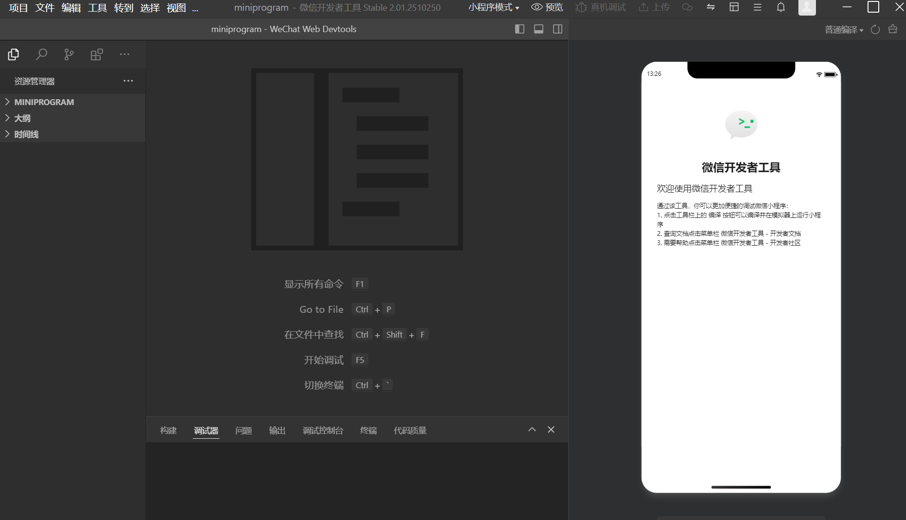
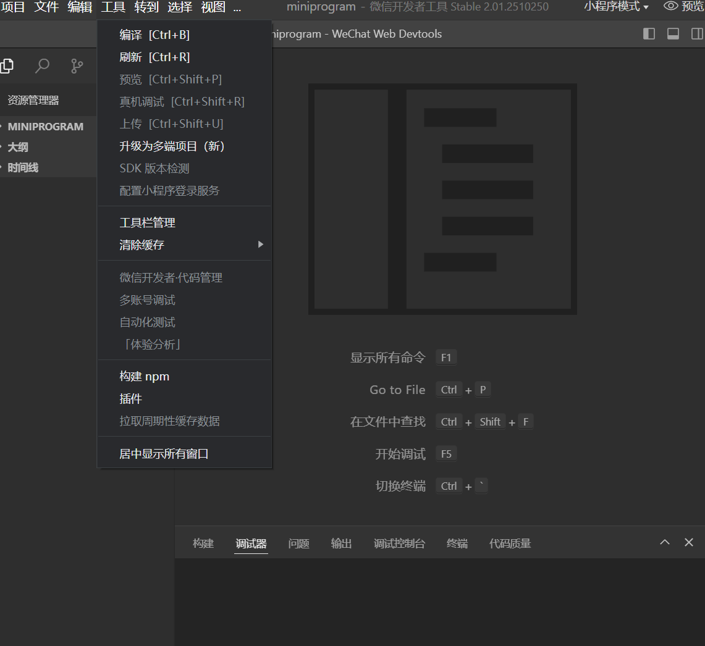

大一上学期自己用obus 4.5开发了一款微信小程序，现在已经上线，今天来谈一谈自己的开发经验。

这是小程序的小程序码，微信扫码即可体验

首先你要在微信公众平台注册和下载微信开发者工具（依据不同的系统下载不同的版本）
打开以后选取一个文件夹作为你小程序的项目文件夹，然后可以将这个软件当编辑器使用（要实现部署环境），或者直接导入你写好的代码。

这个页面的右侧就是你写的代码的预览台，直接可以用鼠标来操作，非常方便测试。

验证没问题后，你需要提交代码，点击工具后会出现这个，然后点击上传（需要些更新日志和版本号，这个随自己写，保证描述清楚即可）。

需要注意的是，这个上传以后默认是测试版，要发布正式的需要平台审核，工信局备案，域名购买等一系列操作（如果是自己用用，微信认证可以不弄）。哦对了，个人备案的小程序是无法申请直接通过微信外端扫码进入小程序（就是你小程序自己生成的二维码，用微信自带扫码是无法识别的）。

申请过程比较麻烦，需要填写好多表格和接听微信客服电话回答一些有关小程序的问题。

最后祝各位开发者好运！
