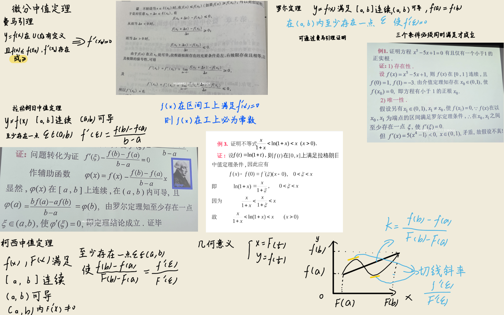
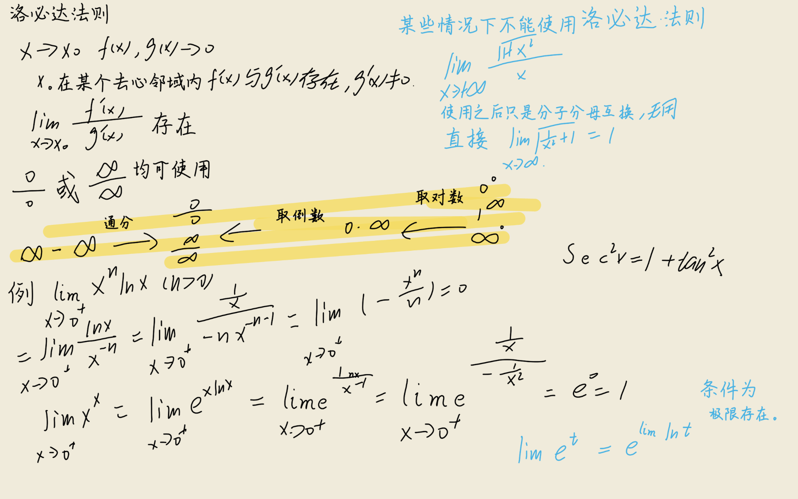
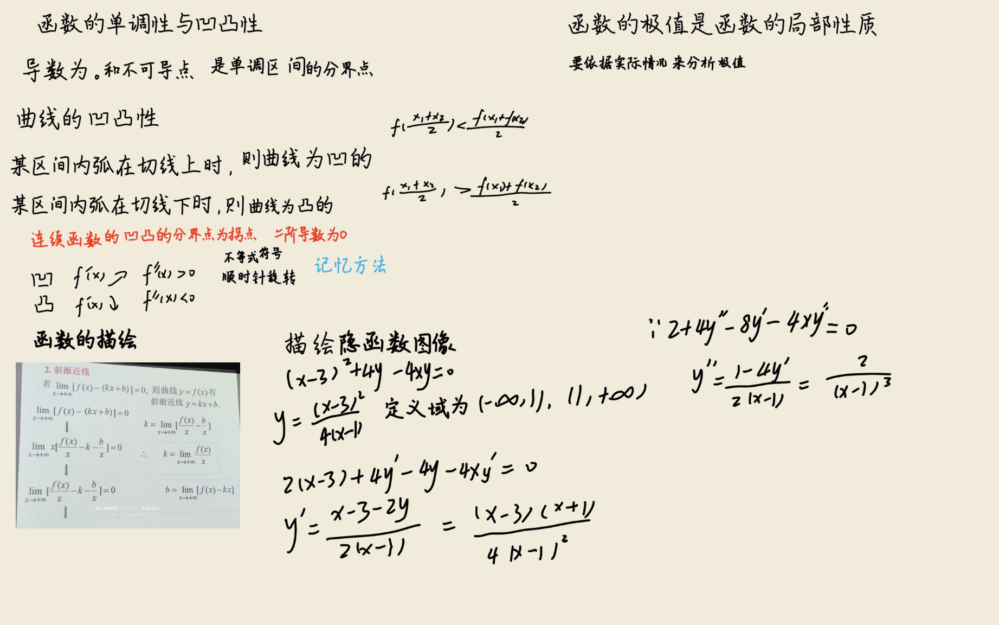
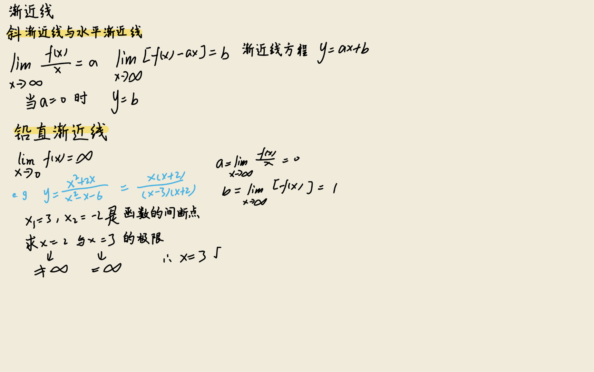
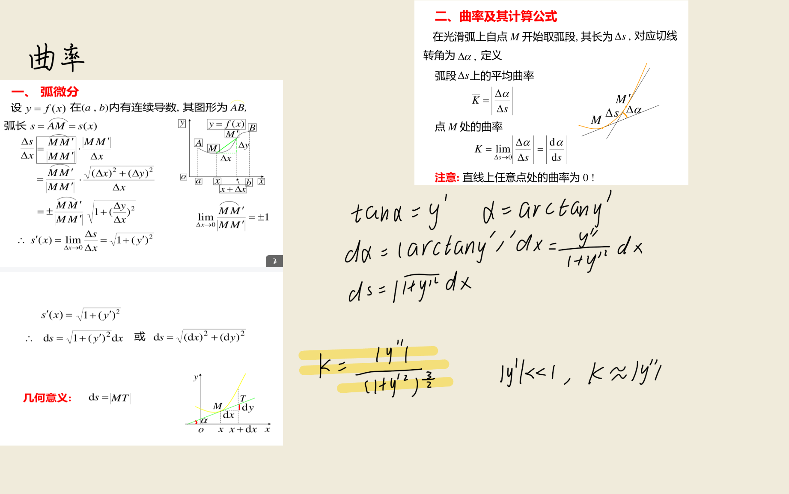
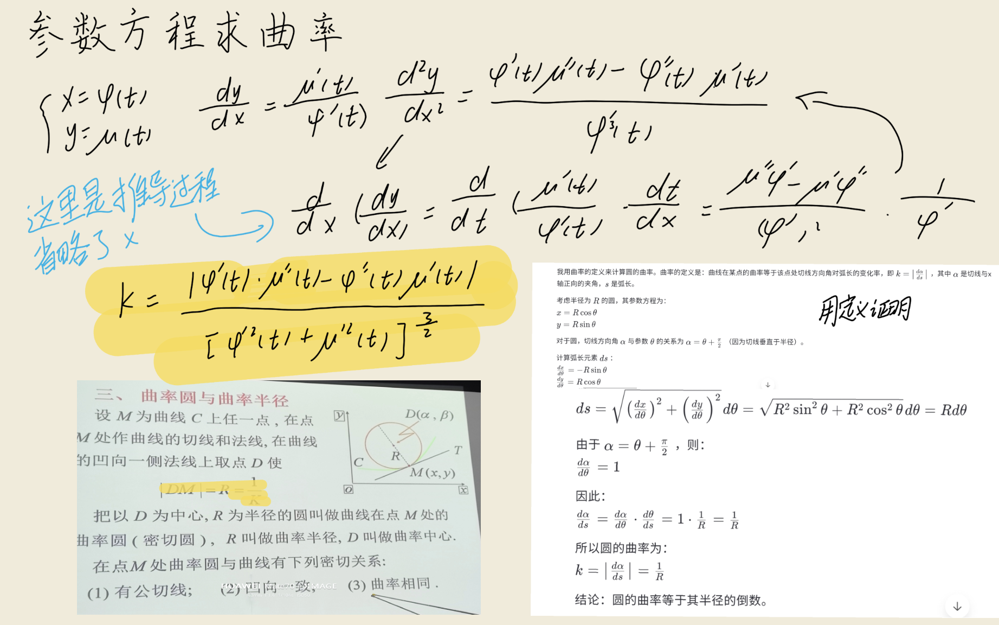
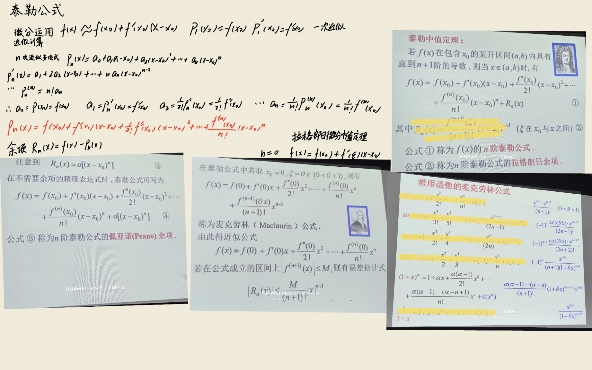

## 关键定理与公式推导

### 1. 罗尔（Rolle）定理

$$
\exist \, \xi \in (a, b), \quad f'(\xi) = 0
$$

:::derivation
**罗尔定理**：若函数 $f(x)$ 满足
1. 在闭区间 $[a, b]$ 上连续；
2. 在开区间 $(a, b)$ 内可导；
3. $f(a) = f(b)$，

则在 $(a, b)$ 内至少存在一点 $\xi$，使 $f'(\xi) = 0$。

**证明**：

由于 $f(x)$ 在闭区间 $[a,b]$ 上连续，由闭区间上连续函数的最大值最小值定理，$f(x)$ 在 $[a,b]$ 上必取得最大值 $M$ 和最小值 $m$。

**情形一**：$M = m$。此时 $f(x)$ 在 $[a,b]$ 上恒为常数，故 $f'(x) = 0$ 对 $(a,b)$ 内任一点成立，任取一点作为 $\xi$ 即可。

**情形二**：$M > m$。由于 $f(a) = f(b)$，$M$ 与 $m$ 至少有一个不等于 $f(a) = f(b)$。不妨设 $M \neq f(a)$，则存在 $\xi \in (a, b)$ 使 $f(\xi) = M$。

下证 $f'(\xi) = 0$。由于 $f(x)$ 在 $\xi$ 处可导，故左右导数存在且相等。又 $f(\xi) = M$ 是最大值，对任意 $\Delta x$ 使 $\xi + \Delta x \in (a, b)$，有 $f(\xi + \Delta x) \le f(\xi)$，即 $f(\xi + \Delta x) - f(\xi) \le 0$。

- 当 $\Delta x > 0$ 时，$\dfrac{f(\xi+\Delta x) - f(\xi)}{\Delta x} \le 0$，取极限得 $f'_+(\xi) \le 0$；
- 当 $\Delta x < 0$ 时，$\dfrac{f(\xi+\Delta x) - f(\xi)}{\Delta x} \ge 0$，取极限得 $f'_-(\xi) \ge 0$。

由 $f'(\xi) = f'_+(\xi) = f'_-(\xi)$，故 $0 \le f'(\xi) \le 0$，即 $f'(\xi) = 0$。

**几何意义**：在满足条件的曲线上，必存在一点其切线水平（平行于 $x$ 轴）。
:::

### 2. 拉格朗日（Lagrange）中值定理

$$
f(b) - f(a) = f'(\xi)(b - a), \quad \xi \in (a, b)
$$

:::derivation
**拉格朗日中值定理**：若函数 $f(x)$ 在闭区间 $[a, b]$ 上连续，在开区间 $(a, b)$ 内可导，则在 $(a, b)$ 内至少存在一点 $\xi$，使

$$
f(b) - f(a) = f'(\xi)(b - a)
$$

**证明思路**：通过构造辅助函数将问题转化为罗尔定理的情形。

注意到弦 $AB$（$A(a, f(a))$，$B(b, f(b))$）的方程为：

$$
y = f(a) + \frac{f(b) - f(a)}{b - a}(x - a)
$$

构造辅助函数（曲线上点的纵坐标减去弦上对应点的纵坐标）：

$$
\varphi(x) = f(x) - \left[ f(a) + \frac{f(b) - f(a)}{b - a}(x - a) \right]
$$

验证 $\varphi(x)$ 满足罗尔定理的条件：

1. $\varphi(x)$ 在 $[a, b]$ 上连续（因 $f(x)$ 连续，线性函数连续）；
2. $\varphi(x)$ 在 $(a, b)$ 内可导（因 $f(x)$ 可导）；
3. $\varphi(a) = f(a) - f(a) = 0$，$\varphi(b) = f(b) - \left[f(a) + \dfrac{f(b)-f(a)}{b-a}(b-a)\right] = f(b) - f(b) = 0$，故 $\varphi(a) = \varphi(b)$。

由罗尔定理，存在 $\xi \in (a, b)$ 使 $\varphi'(\xi) = 0$。而：

$$
\varphi'(x) = f'(x) - \frac{f(b) - f(a)}{b - a}
$$

代入 $\xi$ 得：

$$
0 = \varphi'(\xi) = f'(\xi) - \frac{f(b) - f(a)}{b - a}
$$

即 $f'(\xi) = \dfrac{f(b) - f(a)}{b - a}$，亦即 $f(b) - f(a) = f'(\xi)(b - a)$。

**几何意义**：曲线上至少存在一点，其切线平行于连接两端点的弦。当 $f(a) = f(b)$ 时即退化为罗尔定理。

**重要推论**：若 $f'(x) \equiv 0$ 在区间 $I$ 上成立，则 $f(x)$ 在 $I$ 上为常数。事实上，任取 $x_1, x_2 \in I$，由拉格朗日中值定理 $f(x_2) - f(x_1) = f'(\xi)(x_2 - x_1) = 0$，故 $f(x_1) = f(x_2)$。
:::

### 3. 柯西（Cauchy）中值定理

$$
\frac{f(b) - f(a)}{g(b) - g(a)} = \frac{f'(\xi)}{g'(\xi)}, \quad \xi \in (a, b)
$$

:::derivation
**柯西中值定理**：若 $f(x)$ 与 $g(x)$ 都在闭区间 $[a, b]$ 上连续，在开区间 $(a, b)$ 内可导，且 $g'(x) \neq 0$ 在 $(a, b)$ 内成立，则在 $(a, b)$ 内至少存在一点 $\xi$，使

$$
\frac{f(b) - f(a)}{g(b) - g(a)} = \frac{f'(\xi)}{g'(\xi)}
$$

**证明**：

首先由 $g'(x) \neq 0$ 及拉格朗日中值定理，$g(b) - g(a) = g'(\eta)(b - a) \neq 0$（某 $\eta \in (a, b)$），故分母非零。

构造辅助函数：

$$
\varphi(x) = [f(b) - f(a)] \cdot g(x) - [g(b) - g(a)] \cdot f(x)
$$

验证罗尔定理条件：

1. $\varphi(x)$ 在 $[a, b]$ 上连续，在 $(a, b)$ 内可导；
2. $\varphi(a) = [f(b) - f(a)] g(a) - [g(b) - g(a)] f(a) = f(b)g(a) - f(a)g(b)$；
   $\varphi(b) = [f(b) - f(a)] g(b) - [g(b) - g(a)] f(b) = -f(a)g(b) + f(b)g(a) = f(b)g(a) - f(a)g(b)$。
   故 $\varphi(a) = \varphi(b)$。

由罗尔定理，存在 $\xi \in (a, b)$ 使 $\varphi'(\xi) = 0$。而：

$$
\varphi'(x) = [f(b) - f(a)] g'(x) - [g(b) - g(a)] f'(x)
$$

代入 $\xi$：

$$
[f(b) - f(a)] g'(\xi) - [g(b) - g(a)] f'(\xi) = 0
$$

即 $[f(b) - f(a)] g'(\xi) = [g(b) - g(a)] f'(\xi)$。由 $g'(\xi) \neq 0$ 且 $g(b) - g(a) \neq 0$，两端同除以 $[g(b) - g(a)] g'(\xi)$ 即得：

$$
\frac{f(b) - f(a)}{g(b) - g(a)} = \frac{f'(\xi)}{g'(\xi)}
$$

**注**：柯西中值定理是拉格朗日中值定理的推广。令 $g(x) = x$ 即得拉格朗日中值定理。其几何意义可由参数方程 $\begin{cases} X = g(x) \\ Y = f(x) \end{cases}$（$x \in [a, b]$）给出的曲线上理解：曲线上存在一点，其切线平行于连接曲线两端的弦。
:::

### 4. 洛必达（L'Hôpital）法则

$$
\lim_{x \to a} \frac{f(x)}{g(x)} = \lim_{x \to a} \frac{f'(x)}{g'(x)}
$$

:::derivation
**洛必达法则**用于求 $\dfrac{0}{0}$ 型或 $\dfrac{\infty}{\infty}$ 型未定式的极限。

**$\dfrac{0}{0}$ 型**：设 $f(x)$ 与 $g(x)$ 满足：
1. $\lim_{x \to a} f(x) = 0$，$\lim_{x \to a} g(x) = 0$；
2. 在 $a$ 的某去心邻域内 $f'(x)$ 与 $g'(x)$ 存在且 $g'(x) \neq 0$；
3. $\lim_{x \to a} \dfrac{f'(x)}{g'(x)} = A$（$A$ 为有限或无穷），

则 $\lim_{x \to a} \dfrac{f(x)}{g(x)} = \lim_{x \to a} \dfrac{f'(x)}{g'(x)} = A$。

**证明**：

由于极限过程 $x \to a$ 中 $x \neq a$，$f$ 与 $g$ 在 $a$ 处的值不影响极限。补充或修改定义令 $f(a) = 0$，$g(a) = 0$（由条件 1 这与原极限一致），则 $f$ 与 $g$ 在 $a$ 处连续。

任取 $x$ 在 $a$ 的去心邻域内，$f$ 与 $g$ 在以 $a$ 与 $x$ 为端点的区间上满足柯西中值定理条件，故存在介于 $a$ 与 $x$ 之间的 $\xi$，使：

$$
\frac{f(x) - f(a)}{g(x) - g(a)} = \frac{f'(\xi)}{g'(\xi)}
$$

由 $f(a) = g(a) = 0$，得：

$$
\frac{f(x)}{g(x)} = \frac{f'(\xi)}{g'(\xi)}
$$

当 $x \to a$ 时，$\xi$ 介于 $a$ 与 $x$ 之间，故 $\xi \to a$。由条件 3：

$$
\lim_{x \to a} \frac{f(x)}{g(x)} = \lim_{\xi \to a} \frac{f'(\xi)}{g'(\xi)} = A
$$

**$\dfrac{\infty}{\infty}$ 型**的证明思路类似但稍复杂，此处从略。

**注**：
- 若 $\lim_{x \to a} \dfrac{f'(x)}{g'(x)}$ 仍为未定式，可继续使用洛必达法则，即 $\lim \dfrac{f}{g} = \lim \dfrac{f'}{g'} = \lim \dfrac{f''}{g''} = \cdots$，直至不是未定式为止。
- 必须验证是 $\dfrac{0}{0}$ 或 $\dfrac{\infty}{\infty}$ 型才能使用。
- 其他未定式（$0 \cdot \infty$、$\infty - \infty$、$1^\infty$、$0^0$、$\infty^0$）可通过恒等变形化为 $\dfrac{0}{0}$ 或 $\dfrac{\infty}{\infty}$ 型后使用。
:::

### 5. 泰勒（Taylor）公式

$$
f(x) = \sum_{k=0}^{n} \frac{f^{(k)}(x_0)}{k!}(x - x_0)^k + R_n(x)
$$

:::derivation
**泰勒公式**给出了用多项式逼近函数的方法。设 $f(x)$ 在 $x_0$ 的某邻域内具有 $n+1$ 阶导数，则对该邻域内任一点 $x$：

$$
f(x) = f(x_0) + f'(x_0)(x - x_0) + \frac{f''(x_0)}{2!}(x - x_0)^2 + \cdots + \frac{f^{(n)}(x_0)}{n!}(x - x_0)^n + R_n(x)
$$

其中 $R_n(x)$ 为余项。

**拉格朗日余项**：$R_n(x) = \dfrac{f^{(n+1)}(\xi)}{(n+1)!}(x - x_0)^{n+1}$，$\xi$ 介于 $x_0$ 与 $x$ 之间。

**证明**（拉格朗日余项）：

设 $R_n(x) = f(x) - P_n(x)$，其中 $P_n(x) = \sum_{k=0}^n \dfrac{f^{(k)}(x_0)}{k!}(x-x_0)^k$。需证 $R_n(x) = \dfrac{f^{(n+1)}(\xi)}{(n+1)!}(x-x_0)^{n+1}$。

由 $P_n(x)$ 的构造，可验证 $P_n^{(k)}(x_0) = f^{(k)}(x_0)$（$k = 0, 1, \ldots, n$），从而：

$$
R_n(x_0) = R_n'(x_0) = \cdots = R_n^{(n)}(x_0) = 0
$$

又 $(x - x_0)^{n+1}$ 在 $x_0$ 处的 0 到 $n$ 阶导数均为零。

对函数 $R_n(x)$ 与 $(x - x_0)^{n+1}$ 在以 $x_0$ 和 $x$ 为端点的区间上反复使用 $n+1$ 次柯西中值定理：

$$
\frac{R_n(x)}{(x - x_0)^{n+1}} = \frac{R_n(x) - R_n(x_0)}{(x - x_0)^{n+1} - 0} = \frac{R_n'(\xi_1)}{(n+1)(\xi_1 - x_0)^n}
$$

继续对 $R_n'(x)$ 与 $(n+1)(x - x_0)^n$ 使用柯西中值定理：

$$
= \frac{R_n''(\xi_2)}{(n+1)n(\xi_2 - x_0)^{n-1}}
$$

依此进行 $n+1$ 次，得：

$$
\frac{R_n(x)}{(x - x_0)^{n+1}} = \frac{R_n^{(n+1)}(\xi)}{(n+1)!}
$$

其中 $\xi$ 介于 $x_0$ 与 $x$ 之间。又 $P_n^{(n+1)}(x) = 0$（因 $P_n$ 是 $n$ 次多项式），故 $R_n^{(n+1)}(x) = f^{(n+1)}(x)$，代入得：

$$
R_n(x) = \frac{f^{(n+1)}(\xi)}{(n+1)!}(x - x_0)^{n+1}
$$

**佩亚诺余项**：若只要求 $f$ 在 $x_0$ 处 $n$ 阶可导，则 $R_n(x) = o((x - x_0)^n)$，仅需 $f^{(n)}(x_0)$ 存在即可。
:::

### 6. 麦克劳林（Maclaurin）公式

$$
f(x) = f(0) + f'(0)x + \frac{f''(0)}{2!}x^2 + \cdots + \frac{f^{(n)}(0)}{n!}x^n + \frac{f^{(n+1)}(\theta x)}{(n+1)!} x^{n+1}
$$

:::derivation
麦克劳林公式是泰勒公式在 $x_0 = 0$ 时的特殊情形。将 $x_0 = 0$ 代入泰勒公式即得。

下面给出几个常用函数的麦克劳林展开式（带拉格朗日余项），其推导可由求各阶导数在 $0$ 处的值得到。

**1. $e^x$**：因 $(e^x)^{(k)} = e^x$，故 $f^{(k)}(0) = 1$（$k = 0, 1, \ldots$）。

$$
e^x = 1 + x + \frac{x^2}{2!} + \cdots + \frac{x^n}{n!} + \frac{e^{\theta x}}{(n+1)!} x^{n+1}, \quad 0 < \theta < 1
$$

**2. $\sin x$**：因 $(\sin x)^{(k)} = \sin\left(x + \dfrac{k\pi}{2}\right)$，故 $f^{(k)}(0) = \sin\dfrac{k\pi}{2}$，即 $0, 1, 0, -1, 0, 1, \ldots$ 周期为 4。

$$
\sin x = x - \frac{x^3}{3!} + \frac{x^5}{5!} - \cdots + (-1)^{m-1}\frac{x^{2m-1}}{(2m-1)!} + (-1)^m \frac{\cos(\theta x)}{(2m+1)!} x^{2m+1}
$$

**3. $\cos x$**：类似地，$(\cos x)^{(k)}(0) = \cos\dfrac{k\pi}{2}$，即 $1, 0, -1, 0, 1, \ldots$。

$$
\cos x = 1 - \frac{x^2}{2!} + \frac{x^4}{4!} - \cdots + (-1)^m \frac{x^{2m}}{(2m)!} + (-1)^{m+1} \frac{\cos(\theta x)}{(2m+2)!} x^{2m+2}
$$

**4. $\ln(1+x)$**：$f^{(k)}(x) = \dfrac{(-1)^{k-1}(k-1)!}{(1+x)^k}$，故 $f^{(k)}(0) = (-1)^{k-1}(k-1)!$（$k \ge 1$）。

$$
\ln(1+x) = x - \frac{x^2}{2} + \frac{x^3}{3} - \cdots + (-1)^{n-1}\frac{x^n}{n} + (-1)^n \frac{x^{n+1}}{(n+1)(1+\theta x)^{n+1}}
$$

**5. $(1+x)^\alpha$**：$f^{(k)}(x) = \alpha(\alpha-1)\cdots(\alpha-k+1)(1+x)^{\alpha-k}$，$f^{(k)}(0) = \alpha(\alpha-1)\cdots(\alpha-k+1) = \dfrac{\alpha!}{(\alpha-k)!}$（广义）。

$$
(1+x)^\alpha = 1 + \alpha x + \frac{\alpha(\alpha-1)}{2!}x^2 + \cdots + \frac{\alpha(\alpha-1)\cdots(\alpha-n+1)}{n!}x^n + R_n(x)
$$

特别地，$\alpha = -1$ 给出 $\dfrac{1}{1+x} = 1 - x + x^2 - \cdots + (-1)^n x^n + \cdots$。
:::

### 7. 函数单调性的判定

$$
f'(x) > 0 \Rightarrow f(x) \text{ 单调递增}; \quad f'(x) < 0 \Rightarrow f(x) \text{ 单调递减}
$$

:::derivation
**定理**：设 $f(x)$ 在 $[a, b]$ 上连续，在 $(a, b)$ 内可导。

1. 若在 $(a, b)$ 内 $f'(x) > 0$，则 $f(x)$ 在 $[a, b]$ 上单调递增；
2. 若在 $(a, b)$ 内 $f'(x) < 0$，则 $f(x)$ 在 $[a, b]$ 上单调递减。

**证明**（单调递增的情形）：

任取 $x_1, x_2 \in [a, b]$，设 $x_1 < x_2$。由于 $f(x)$ 在 $[x_1, x_2]$ 上连续，在 $(x_1, x_2)$ 内可导，由拉格朗日中值定理，存在 $\xi \in (x_1, x_2)$ 使：

$$
f(x_2) - f(x_1) = f'(\xi)(x_2 - x_1)
$$

由条件 $f'(\xi) > 0$，且 $x_2 - x_1 > 0$，故 $f(x_2) - f(x_1) > 0$，即 $f(x_1) < f(x_2)$。

由 $x_1, x_2$ 的任意性，$f(x)$ 在 $[a, b]$ 上单调递增。

单调递减的情形类似可证。

**注**：
- 若 $f'(x) \ge 0$（且等号仅在有限个点处成立），则 $f(x)$ 仍单调递增。
- 该定理的逆不成立：单调递增的可导函数可能有 $f'(x) = 0$ 的点（如 $f(x) = x^3$ 在 $x=0$ 处）。
- 该定理将函数的单调性问题转化为导数的符号问题，是导数应用的核心结论之一。
:::

### 8. 曲线凹凸性的判定

$$
f''(x) > 0 \Rightarrow \text{凹弧}; \quad f''(x) < 0 \Rightarrow \text{凸弧}
$$

:::derivation
**凹凸性定义**：设 $f(x)$ 在区间 $I$ 上连续，若对 $I$ 上任意两点 $x_1, x_2$ 恒有

$$
f\left(\frac{x_1 + x_2}{2}\right) < \frac{f(x_1) + f(x_2)}{2}
$$

则称 $f(x)$ 在 $I$ 上的图形是凹的（凹弧，向上凹）；若不等号反向，则称为凸的（凸弧，向下凹）。

**判定定理**：设 $f(x)$ 在 $[a,b]$ 上连续，在 $(a,b)$ 内具有二阶导数。

1. 若在 $(a,b)$ 内 $f''(x) > 0$，则 $f(x)$ 在 $[a,b]$ 上的图形是凹的；
2. 若在 $(a,b)$ 内 $f''(x) < 0$，则 $f(x)$ 在 $[a,b]$ 上的图形是凸的。

**证明**（凹弧的情形）：

任取 $x_1, x_2 \in [a, b]$，$x_1 < x_2$，记 $x_0 = \dfrac{x_1 + x_2}{2}$，$h = \dfrac{x_2 - x_1}{2} > 0$，则 $x_1 = x_0 - h$，$x_2 = x_0 + h$。

由泰勒公式（在 $x_0$ 处展开，取 $n=1$，带拉格朗日余项）：

$$
f(x_1) = f(x_0) + f'(x_0)(-h) + \frac{f''(\xi_1)}{2!} h^2, \quad x_1 < \xi_1 < x_0
$$

$$
f(x_2) = f(x_0) + f'(x_0) h + \frac{f''(\xi_2)}{2!} h^2, \quad x_0 < \xi_2 < x_2
$$

两式相加：

$$
f(x_1) + f(x_2) = 2 f(x_0) + \frac{h^2}{2} \left[ f''(\xi_1) + f''(\xi_2) \right]
$$

由 $f''(x) > 0$，故 $f''(\xi_1) > 0$，$f''(\xi_2) > 0$，从而：

$$
f(x_1) + f(x_2) > 2 f(x_0) = 2 f\left(\frac{x_1 + x_2}{2}\right)
$$

即 $f\left(\dfrac{x_1 + x_2}{2}\right) < \dfrac{f(x_1) + f(x_2)}{2}$，故图形是凹的。

凸弧的情形类似（$f''(x) < 0$ 时方向相反）。

**几何意义**：$f''(x) > 0$ 表示 $f'(x)$ 单调递增，即切线斜率随 $x$ 增大而增大，曲线向上凹。
:::

### 9. 极值的必要条件（费马引理）

$$
\text{若 } f(x) \text{ 在 } x_0 \text{ 处可导且取极值，则 } f'(x_0) = 0
$$

:::derivation
**费马引理**：设 $f(x)$ 在 $x_0$ 的某邻域内有定义，在 $x_0$ 处可导，且在 $x_0$ 处取得极值（极大值或极小值），则 $f'(x_0) = 0$。

**证明**：

不妨设 $f(x)$ 在 $x_0$ 处取得极大值（极小值情形类似）。则在 $x_0$ 的某邻域 $U(x_0, \delta)$ 内，对任意 $x$ 有 $f(x) \le f(x_0)$，即 $f(x) - f(x_0) \le 0$。

- 当 $x \in (x_0, x_0 + \delta)$ 时，$x - x_0 > 0$，故 $\dfrac{f(x) - f(x_0)}{x - x_0} \le 0$。取右极限得 $f'_+(x_0) \le 0$。
- 当 $x \in (x_0 - \delta, x_0)$ 时，$x - x_0 < 0$，故 $\dfrac{f(x) - f(x_0)}{x - x_0} \ge 0$。取左极限得 $f'_-(x_0) \ge 0$。

由于 $f(x)$ 在 $x_0$ 处可导，左右导数存在且相等，即 $f'(x_0) = f'_+(x_0) = f'_-(x_0)$。结合上述不等式：

$$
0 \le f'(x_0) \le 0
$$

故 $f'(x_0) = 0$。

**几何意义**：在极值点处（若可导），曲线的切线必水平。

**注**：
- $f'(x_0) = 0$ 是可导函数取极值的**必要条件**，但不是充分条件。例如 $f(x) = x^3$，$f'(0) = 0$，但 $x = 0$ 不是极值点。
- 称 $f'(x_0) = 0$ 的点为**驻点**。可导的极值点必是驻点，但驻点不一定是极值点。
- 极值也可能在导数不存在的点处取得（如 $f(x) = |x|$ 在 $x = 0$）。
:::

### 10. 极值的第一充分条件

$$
f'(x) \text{ 在 } x_0 \text{ 左右变号} \Rightarrow x_0 \text{ 为极值点}
$$

:::derivation
**第一充分条件**：设 $f(x)$ 在 $x_0$ 处连续，在 $x_0$ 的某去心邻域内可导。

1. 若 $x \in (x_0 - \delta, x_0)$ 时 $f'(x) > 0$，$x \in (x_0, x_0 + \delta)$ 时 $f'(x) < 0$，则 $f(x)$ 在 $x_0$ 处取极大值；
2. 若 $x \in (x_0 - \delta, x_0)$ 时 $f'(x) < 0$，$x \in (x_0, x_0 + \delta)$ 时 $f'(x) > 0$，则 $f(x)$ 在 $x_0$ 处取极小值；
3. 若 $f'(x)$ 在 $x_0$ 两侧同号，则 $x_0$ 不是极值点。

**证明**（极大值情形）：

由条件 1 及函数单调性判定定理：
- 在 $(x_0 - \delta, x_0)$ 上 $f'(x) > 0$，故 $f(x)$ 单调递增；
- 在 $(x_0, x_0 + \delta)$ 上 $f'(x) < 0$，故 $f(x)$ 单调递减。

又 $f(x)$ 在 $x_0$ 处连续。任取 $x \in (x_0 - \delta, x_0)$，由 $f$ 递增及 $x < x_0$ 得 $f(x) < f(x_0)$；任取 $x \in (x_0, x_0 + \delta)$，由 $f$ 递减及 $x > x_0$ 得 $f(x) < f(x_0)$。

故对一切 $x \in U(x_0, \delta)$（去心邻域），$f(x) < f(x_0)$，即 $f$ 在 $x_0$ 处取极大值。

极小值情形类似可证。

**注**：该判定法只需 $f$ 在 $x_0$ 处连续，去心邻域内可导。因此对驻点和导数不存在的点都适用。
:::

### 11. 极值的第二充分条件

$$
f'(x_0) = 0, \, f''(x_0) > 0 \Rightarrow \text{极小值}; \quad f'(x_0) = 0, \, f''(x_0) < 0 \Rightarrow \text{极大值}
$$

:::derivation
**第二充分条件**：设 $f(x)$ 在 $x_0$ 处具有二阶导数且 $f'(x_0) = 0$。

1. 若 $f''(x_0) < 0$，则 $f(x)$ 在 $x_0$ 处取极大值；
2. 若 $f''(x_0) > 0$，则 $f(x)$ 在 $x_0$ 处取极小值。

**证明**（极大值情形）：

由二阶导数定义：

$$
f''(x_0) = \lim_{x \to x_0} \frac{f'(x) - f'(x_0)}{x - x_0} = \lim_{x \to x_0} \frac{f'(x)}{x - x_0}
$$

（因 $f'(x_0) = 0$）。由 $f''(x_0) < 0$，由极限的保号性，存在 $x_0$ 的某去心邻域使在该邻域内：

$$
\frac{f'(x)}{x - x_0} < 0
$$

即 $f'(x)$ 与 $x - x_0$ 异号：
- 当 $x < x_0$（即 $x - x_0 < 0$）时，$f'(x) > 0$；
- 当 $x > x_0$（即 $x - x_0 > 0$）时，$f'(x) < 0$。

由第一充分条件，$f(x)$ 在 $x_0$ 处取极大值。

极小值情形（$f''(x_0) > 0$）类似可证。

**注**：
- 该判定法仅需计算 $f'(x_0)$ 与 $f''(x_0)$，比第一充分条件更便捷。
- 当 $f''(x_0) = 0$ 时，第二充分条件失效，需用第一充分条件或更高阶导数判定。
- 更一般的结论：若 $f'(x_0) = f''(x_0) = \cdots = f^{(n-1)}(x_0) = 0$，$f^{(n)}(x_0) \neq 0$，则当 $n$ 为偶数时 $x_0$ 是极值点（$f^{(n)}(x_0) > 0$ 极小，$<0$ 极大）；$n$ 为奇数时 $x_0$ 不是极值点。
:::

### 12. 拐点的判定

$$
f''(x_0) = 0 \text{ 且 } f''(x) \text{ 在 } x_0 \text{ 两侧变号} \Rightarrow (x_0, f(x_0)) \text{ 为拐点}
$$

:::derivation
**拐点定义**：连续曲线 $y = f(x)$ 上凹弧与凸弧的分界点称为曲线的拐点。

**判定定理**：设 $f(x)$ 在 $x_0$ 的某邻域内连续，且在 $x_0$ 的某去心邻域内二阶可导。

若 $f''(x)$ 在 $x_0$ 两侧异号（即 $f''(x)$ 在 $x_0$ 处变号），则点 $(x_0, f(x_0))$ 是曲线的拐点。

**证明**：

由 $f''(x)$ 在 $x_0$ 两侧变号，不妨设 $x < x_0$ 时 $f''(x) < 0$，$x > x_0$ 时 $f''(x) > 0$。

由凹凸性判定定理：
- 在 $x_0$ 左侧，$f''(x) < 0$，曲线是凸的；
- 在 $x_0$ 右侧，$f''(x) > 0$，曲线是凹的。

故 $(x_0, f(x_0))$ 是凹弧与凸弧的分界点，即拐点。

**寻找拐点的步骤**：
1. 求 $f''(x)$；
2. 解 $f''(x) = 0$ 的点以及 $f''(x)$ 不存在的点（这些是**可能的**拐点）；
3. 对每个可能点，检查 $f''(x)$ 在其两侧是否变号，变号者即为拐点。

**注**：
- $f''(x_0) = 0$ 是**拐点的必要条件**（若 $f''(x_0)$ 存在），但不是充分条件。例如 $f(x) = x^4$，$f''(0) = 0$，但 $f''(x) = 12x^2 \ge 0$ 不变号，$(0, 0)$ 不是拐点。
- 拐点处 $f''(x_0)$ 可能不存在（如 $f(x) = x^{5/3}$ 在 $x = 0$ 处）。
- 拐点是曲线上的**点**，应写作 $(x_0, f(x_0))$，而非仅 $x_0$。
:::

### 13. 曲率公式

$$
K = \frac{|y''|}{(1 + y'^2)^{3/2}}
$$

:::derivation
曲率刻画了曲线弯曲的程度，定义为切线转角与弧长之比的极限。

**推导**：设曲线方程为 $y = f(x)$，且 $f$ 具有二阶导数。

设 $P(x, y)$ 为曲线上一点，$\alpha$ 为切线倾角（即 $\tan\alpha = y'$）。当点沿曲线移动到 $P_1(x+\Delta x, y+\Delta y)$ 时，切线倾角变化 $\Delta\alpha$，弧长变化 $\Delta s$。

曲率定义为：

$$
K = \lim_{\Delta s \to 0} \left| \frac{\Delta \alpha}{\Delta s} \right| = \left| \frac{d\alpha}{ds} \right|
$$

**1. 求 $d\alpha$**：

由 $\tan\alpha = y'$，两端对 $x$ 求导：

$$
\sec^2 \alpha \cdot \frac{d\alpha}{dx} = y''
$$

$$
\frac{d\alpha}{dx} = \frac{y''}{\sec^2 \alpha} = \frac{y''}{1 + \tan^2 \alpha} = \frac{y''}{1 + y'^2}
$$

故 $d\alpha = \dfrac{y''}{1 + y'^2} dx$。

**2. 求 $ds$**（弧微分）：

由 $\Delta s \approx \sqrt{(\Delta x)^2 + (\Delta y)^2} = \sqrt{1 + \left(\dfrac{\Delta y}{\Delta x}\right)^2} \cdot |\Delta x|$，取极限得：

$$
ds = \sqrt{1 + y'^2} \, dx
$$

**3. 计算曲率**：

$$
K = \left| \frac{d\alpha}{ds} \right| = \left| \frac{\dfrac{y''}{1 + y'^2} dx}{\sqrt{1 + y'^2} \, dx} \right| = \frac{|y''|}{(1 + y'^2)^{3/2}}
$$

**注**：
- 直线的 $y'' = 0$，故 $K = 0$（不弯曲）。
- 半径为 $R$ 的圆：参数方程 $x = R\cos t$，$y = R\sin t$，可算得 $K = \dfrac{1}{R}$，曲率处处相等，符合直觉。
- 曲率半径 $\rho = \dfrac{1}{K}$，曲率圆（密切圆）的半径即为曲率半径。
:::

### 14. 弧微分公式

$$
ds = \sqrt{1 + y'^2} \, dx
$$

:::derivation
**弧微分**是曲线弧长微元的表达式，是计算弧长与曲率的基础。

设曲线 $y = f(x)$ 上点 $M(x, y)$ 与 $M'(x + \Delta x, y + \Delta y)$ 间的弧长为 $\Delta s$。当 $\Delta x$ 很小时，弧 $\widehat{MM'}$ 可用弦 $MM'$ 近似代替：

$$
\Delta s \approx |MM'| = \sqrt{(\Delta x)^2 + (\Delta y)^2}
$$

由 $\Delta y \approx y' \Delta x$（一阶微分近似），得：

$$
\Delta s \approx \sqrt{(\Delta x)^2 + (y' \Delta x)^2} = \sqrt{1 + y'^2} \, |\Delta x|
$$

通常约定 $s$ 随 $x$ 增大而增大（即 $s$ 是 $x$ 的增函数），则 $\Delta s$ 与 $\Delta x$ 同号，故：

$$
ds = \sqrt{1 + y'^2} \, dx
$$

**其他形式的弧微分**：

1. **参数方程** $x = \varphi(t)$，$y = \psi(t)$：由 $ds^2 = dx^2 + dy^2 = [\varphi'(t) dt]^2 + [\psi'(t) dt]^2$，得：

$$
ds = \sqrt{\varphi'^2(t) + \psi'^2(t)} \, dt
$$

2. **极坐标** $r = r(\theta)$：由 $x = r\cos\theta$，$y = r\sin\theta$，可算得：

$$
dx = (r'\cos\theta - r\sin\theta) d\theta, \quad dy = (r'\sin\theta + r\cos\theta) d\theta
$$

$$
ds^2 = dx^2 + dy^2 = (r'^2 + r^2) d\theta^2
$$

故 $ds = \sqrt{r^2 + r'^2} \, d\theta$。

**几何意义**：弧微分给出了曲线长度的微分元素，相当于直角三角形中斜边与直角边的关系，是勾股定理在曲线上的推广。
:::

### 15. 渐近线

$$
\text{斜渐近线: } y = kx + b, \quad k = \lim_{x \to \infty} \frac{f(x)}{x}, \, b = \lim_{x \to \infty} [f(x) - kx]
$$

:::derivation
**渐近线**是曲线无限延伸时无限接近的直线，反映曲线在无穷远处的性态。分三类：

**1. 水平渐近线**：

若 $\lim_{x \to +\infty} f(x) = C$（或 $\lim_{x \to -\infty} f(x) = C$），则 $y = C$ 是曲线的水平渐近线。

水平渐近线研究的是 $x \to \infty$ 时 $y$ 的变化趋势，其逆过程即为垂直渐近线。

**2. 垂直渐近线**：

若 $\lim_{x \to x_0} f(x) = \infty$（包括单侧极限），则 $x = x_0$ 是曲线的垂直渐近线。

通常在函数无定义的点或区间端点处寻找。例如 $f(x) = \dfrac{1}{x-1}$，在 $x = 1$ 处 $f(x) \to \infty$，故 $x = 1$ 为垂直渐近线。

**3. 斜渐近线**：

设斜渐近线方程为 $y = kx + b$（$k \neq 0$）。渐近线的含义是当 $x \to +\infty$（或 $-\infty$）时，曲线上的点到直线的距离趋于零。

点 $(x, f(x))$ 到直线 $y = kx + b$ 的距离为：

$$
d = \frac{|f(x) - kx - b|}{\sqrt{1 + k^2}}
$$

要求 $\lim_{x \to \infty} d = 0$，等价于 $\lim_{x \to \infty} [f(x) - kx - b] = 0$，即：

$$
\lim_{x \to \infty} [f(x) - kx] = b
$$

为求 $k$，注意到 $f(x) - kx \to b$（有限），故 $\dfrac{f(x) - kx}{x} \to 0$，即：

$$
\lim_{x \to \infty} \frac{f(x)}{x} - k = 0 \Rightarrow k = \lim_{x \to \infty} \frac{f(x)}{x}
$$

求出 $k$ 后再由 $b = \lim_{x \to \infty} [f(x) - kx]$ 求 $b$。若这两个极限都存在且有限（$k \neq 0$），则存在斜渐近线 $y = kx + b$。

**注**：
- 当 $k = 0$ 时，斜渐近线退化为水平渐近线。
- 水平渐近线与斜渐近线（在同一方向）至多存在一个，不能同时存在。
- $x \to +\infty$ 与 $x \to -\infty$ 的渐近线需分别讨论。
:::
