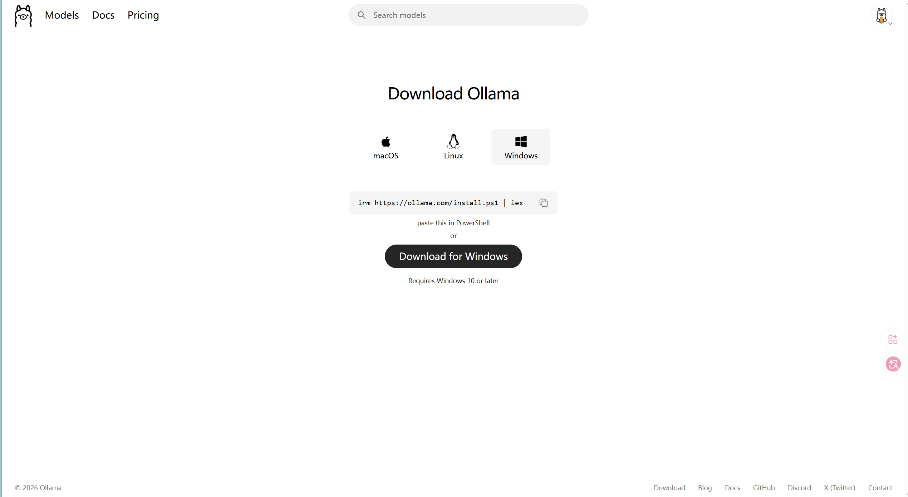
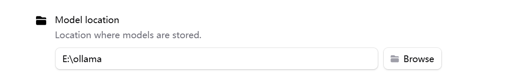
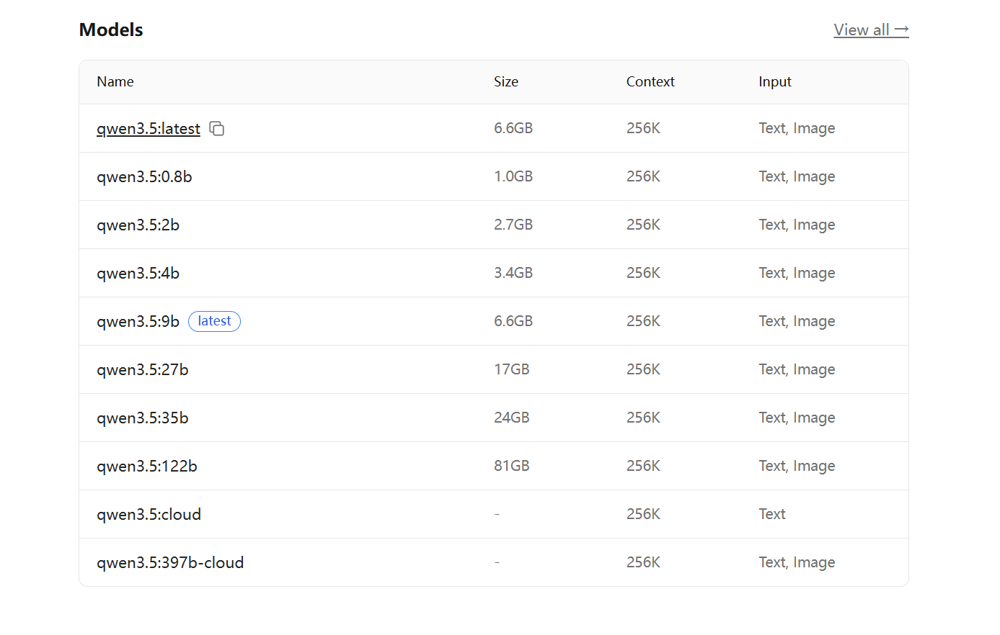

今天我们来讲解一下如何本地部署ai大模型，注意，本教程适合小白，高手请直接使用claude code 或者python直接调用。

首先，我们需要一个本地部署的软件，我用的是[ollama](https://ollama.com/),一个非常简单的本地ai模型部署软件，下面我来详细介绍。

首先要依据自己的电脑系统来下载不同版本的ollama[跳转下载链接](https://ollama.com/download/)。

默认会装在c盘，到时候安装完成之后在任务栏右键打开设置里面可以更改安装位置

然后就可以在ollama官网的[模型选取](https://ollama.com/search)当中安装自己的想用的模型啦，不过需要注意自己的显卡可不可以承载这个模型，下面我们使用qwen模型部署来举个例子：

比如我想要部署qwen 4b这个参数大小的模型。点击进去之后，你可以查看部署这个模型要求的显存最低要求

复制CLI下面的这行命令，在自己电脑上打开cmd（电脑搜索），复制这行命令，等待安装完成。

显示这个界面就完成部署啦。下次重启电脑之后可以直接在ollama中找到自己的模型或者在cmd中输入刚才复制的命令就可以使用啦！

另外，ollama登录之后，会增加模型联网和云模型额度功能，每天和每周都有一定的免费额度，可以调用云端模型，具体可以在模型选择页面自己查看，如果嫌额度不够可以充值ollama会员。

希望这篇博客可以帮助你成功部署自己的大模型！
