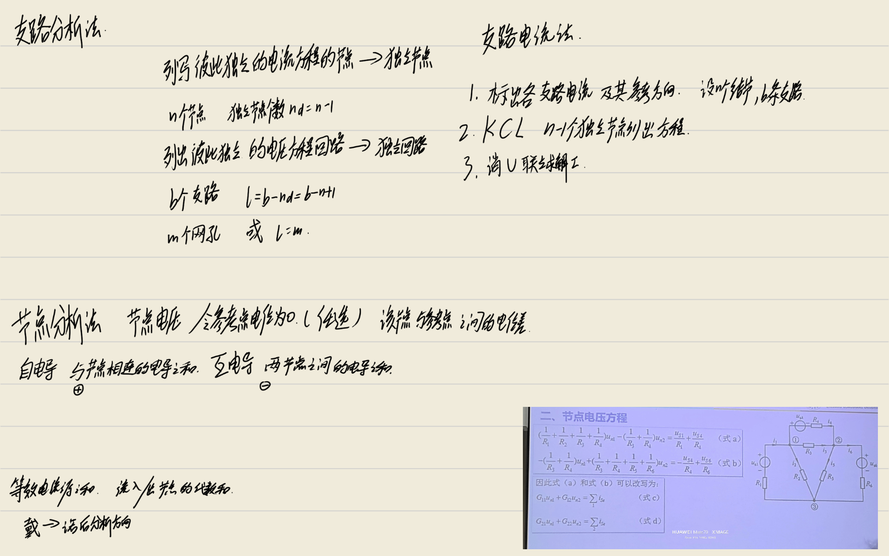
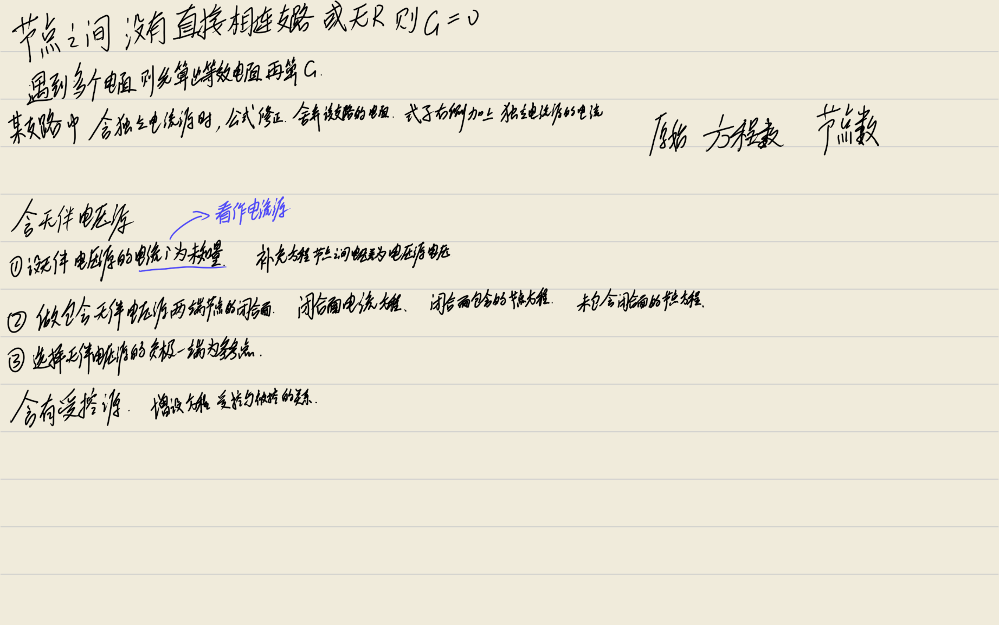
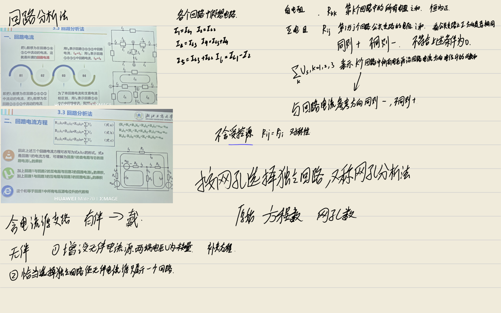

# 电路分析方法详解：支路、节点与回路分析法

本文档基于电路理论基础知识，详细整理了支路分析法、节点分析法及回路分析法的核心概念、公式推导过程及特殊电路处理方法。内容不包含具体数值例题，专注于理论推导与方程列写规范。

---

## 1. 支路分析法 (Branch Analysis Method)

支路分析法是最基本的电路分析方法，主要包括支路电流法和支路电压法。本节主要讨论**支路电流法**。

### 1.1 独立变量、独立节点和独立回路

在电路分析中，需要选取一组独立变量，求出这组变量后，其他电路变量均可由此求出。

- **独立变量**：可以选择各支路电流为独立变量。
- **独立节点 (Independent Nodes)**：
    - 在具有 $n$ 个节点的电路中，能够列写出彼此独立的电流方程的节点称为独立节点。
    - 独立节点数 $n_d$ 为总节点数 $n$ 减 1，即：
      $$n_d = n - 1$$
    - 选取方法：除去电路中任意一个节点（通常选为参考节点）以外的其他节点即为独立节点。
- **独立回路 (Independent Loops)**：
    - 能够列写出彼此独立的电压方程的回路称为独立回路。
    - 独立回路数 $l$ 等于电路中支路数目 $b$ 减去独立节点数目 $n_d$，即：
      $$l = b - n_d = b - n + 1$$
    - 独立回路数也等于电路中网孔的数目 $m$。
    - 选取方法：
        1.  选取网孔作为独立回路。
        2.  每选一个新的独立回路可以含有已选用过的支路，但必须至少包含一条不在已选独立回路中的新支路，直到选够独立回路数为止。

### 1.2 支路电流法解题步骤

假设电路中有 $n$ 个节点，$b$ 条支路，支路电流法的解题步骤概括如下：

1.  **标出参考方向**：在电路中标出各支路电流及其参考方向。
2.  **列写 KCL 方程**：根据 KCL 定律，选择 $n-1$ 个独立节点列写电流方程。
3.  **列写 KVL 方程**：根据 KVL 定律，选择 $b-n+1$ 个独立回路（常选网孔）列写电压方程。
4.  **求解方程**：联立这些方程，求得各支路电流值，并由各支路电流值求其他未知量（如电压、功率）。

### 1.3 特殊情况的处理

#### 1.3.1 含无伴电流源支路
- **定义**：若电流源没有电阻与之并联相伴，称为无伴电流源。
- **问题**：电流源所在支路的电流值是确定的，但其端电压不能用电流表示，而是由电流源以外的电路决定。
- **处理方法**：
    1.  增设未知量：增加电流源的电压 $U$ 为未知量。
    2.  方程数量：此时 $b$ 条支路仍对应 $b$ 个未知量（$b-1$ 个支路电流 + 1 个电流源电压）。
    3.  列方程：仍对 $n-1$ 个独立节点列电流方程，仍对 $b-n+1$ 个独立回路列电压方程（将电流源电压视为未知电压变量代入 KVL）。
    4.  联立求解：联立 $b$ 个方程可求得待求量。

#### 1.3.2 含受控源支路
- **处理方法**：
    1.  将受控源当作独立源来看待，列写方程。
    2.  补充方程：给出控制变量与其支路电流（或电压）的关系方程。
    3.  联立求解：将补充方程代入主方程组求解。

---

## 2. 节点分析法 (Node Voltage Method)

节点分析法也称节点电压法，其思想是用未知的节点电压代替未知的支路电流来建立电路方程，以减少方程的数目。

### 2.1 节点电压的概念

- **定义**：其余 $n-1$ 个节点相对于参考节点之间的电压称为该节点的节点电压，用 $u_{nk}$ 来表示第 $k$ 个节点的节点电压。
- **参考方向**：节点电压 $u_{nk}$ 的参考方向是从第 $k$ 个节点指向参考节点的，即第 $k$ 个节点为正，参考节点为负。
- **参考节点**：任意指定其中一个节点为参考节点，参考节点的电位值为 0。
- **支路电压与节点电压的关系**：
    - 对于节点 $k$ 到节点 $j$ 的一条支路，假设其支路电压为 $u_{kj}$，参考方向为从节点 $k$ 指向节点 $j$。
    - 根据 KVL 定律，可得支路电压等于节点电压之差：
      $$u_{kj} = u_{nk} - u_{nj}$$
    - 这说明支路电压可用节点电压来表示。

### 2.2 节点电压方程的推导

1.  **列写 KCL 方程**：对除了参考点之外的其余 $n-1$ 个独立节点列电流方程。
2.  **表示支路电流**：利用 KVL 定律和欧姆定律，将各支路电流用节点电压表示出来。
    - 例如，某支路连接节点 $k$ 和参考点，电阻为 $R$，串联电压源 $u_S$，则电流 $i = \frac{u_{nk} \pm u_S}{R}$。
3.  **代入整理**：将用节点电压表示的各支路电流表达式代入到 $n-1$ 个电流方程中，经整理便得到只关于节点电压的方程组。
4.  **求解**：求解方程组后可得到 $n-1$ 个节点的节点电压值，进而求得各支路电流。

### 2.3 节点电压方程的标准形式

对于具有 $n$ 个节点的电路，选择任意一个节点作为参考点，对其余 $n-1$ 个独立节点列节点电压方程，标准形式概括为：**自导乘以本节点电压与互导乘以相邻节点电压的和等于注入本节点的等效电流源电流之和**。

方程组的一般形式（以节点 1 和 2 为例）：
$$
\begin{cases}
G_{11}u_{n1} + G_{12}u_{n2} = \sum i_{Se1} \\
G_{21}u_{n1} + G_{22}u_{n2} = \sum i_{Se2}
\end{cases}
$$

#### 2.3.1 系数含义
- **自电导 ($G_{kk}$)**：
    - 连接到节点 $k$ 的所有支路中，各支路的电导之和（即各支路中电阻的倒数之和）。
    - **性质**：节点的自电导恒为**正值**。
    - **注意**：电流源支路中的串联电阻不计入自电导和互导中。
- **互电导 ($G_{kj}, k \neq j$)**：
    - 联接于节点 $k$ 和节点 $j$ 之间的所有支路上，各支路电导之和的**负值**。
    - **性质**：节点之间的互电导恒为**负值**，且 $G_{kj} = G_{jk}$。
    - **特殊情况**：如果节点 $i$ 和节点 $j$ 之间没有直接相连的支路，或者虽然有支路但支路上没有电阻，则互电导 $G_{ij} = G_{ji} = 0$。
    - **多电阻支路**：在一个支路中遇到多个电阻时，此支路的自导和互导应为该支路的等效电导（先求该支路的等效电阻，其倒数就是等效电导）。
- **注入电流源电流之和 ($\sum i_{Se}$)**：
    - 表示注入节点 $k$ 的等效电流源的电流之和。
    - **符号约定**：流入节点 $k$ 方向的等效电流源的电流取**正号**，流出节点 $k$ 方向的等效电流源的电流取**负号**。
    - **等效电流源**：
        - 电压源 $u_S$ 与电阻 $R$ 串联构成的戴维宁电路，可变换为诺顿电路，对应等效电流源电流值 $i_S = u_S / R$。
        - 电流源参考方向与电压源方向相反。
    - **独立电流源**：直接流入或流出节点的独立电流源电流，流入取正，流出取负。

### 2.4 特殊情况的处理

#### 2.4.1 含无伴电压源支路
若电压源没有电阻串联相伴，称为无伴电压源。由于支路电阻为 0，支路电流不能用支路电压表示，推导节点电压方程时会出现困难。有三种处理方法：

1.  **增设无伴电压源支路的电流为未知量**
    - **思想**：增设无伴电压源支路的电流 $i$ 为未知量，仍任选一个节点为参考点，对其余 $n-1$ 个独立节点列写节点电压方程。
    - **处理**：将无伴电压源支路的电流 $i$ 看成是电流为 $i$ 的电流源，$i$ 会出现在节点电压方程的右端。
    - **补充方程**：多了一个变量，需补充一个方程。该方程为无伴电压源支路的支路电压方程，即电压源两端节点的节点电压之差等于该无伴电压源的电压值（例如 $u_{n1} - u_{n3} = u_S$）。
    - **优缺点**：变量增加，方程数增加。

2.  **做包含无伴电压源两端节点的闭合面（广义节点）**
    - **思想**：做包含无伴电压源两端节点的闭合面。对此闭合面列 KCL 电流方程。
    - **处理**：将各个电流用节点电压表示出来，从而得到一个节点电压方程。对除了广义节点（闭合面）和参考点之外的其余独立节点列节点电压方程。
    - **补充方程**：仍需将电压源支路的支路电压方程作为补充方程。
    - **优缺点**：优于第一种方法，方程数目较少。

3.  **选择无伴电压源的一端节点为参考点**
    - **思想**：选择无伴电压源负极一端节点为参考点，这时正极一端节点的节点电压就是已知的，等于电压源的电压。
    - **处理**：少列一个节点电压方程。
    - **优缺点**：该方法方程数目最少。如果电路中只有一个无伴电压源，则优先选择第三种方法来求解。若有多个无伴电压源，可对其中一个应用第三种方法，对其余的用前两种方法。

#### 2.4.2 含受控源电路
- **原则**：
    1.  将受控源当作独立源来看待，按规律列写节点电压方程。
    2.  受控电流源支路串联的电阻同样不计入自导和互导。
    3.  建立受控源的控制变量和节点电压之间的关系，作为补充方程。
    4.  对于无伴受控电压源，同样优先选取它的负极端为参考点，则正极一端节点的节点电压相当于已知。
- **结果**：将控制量用节点电压表示后代入方程，整理可得规范形式。含受控源时，互电导可能不再具有对称性（$G_{ij} \neq G_{ji}$）。

---

## 3. 回路分析法 (Loop Current Method)

回路分析法也称回路电流法，其思想是用未知的回路电流代替未知的支路电流来建立电路方程，以减少联立方程的数目。若选取网孔作为独立回路，则称为**网孔分析法**。

### 3.1 回路电流的概念

- **定义**：假想在每个独立回路中流动的电流称为回路电流，用 $i_l$ 表示。
- **与支路电流的关系**：
    - **只属于一个回路的支路**：当支路电流和回路电流方向一致时，支路电流值就等于该支路所属回路的回路电流值；若相反，则等于回路电流的负值。
    - **属于多个回路的支路**：其支路电流等于所属各个回路的回路电流的代数和。与该支路电流方向一致的回路电流取正号，相反的取负号。
    - **符合 KCL**：这种确定方法完全符合 KCL 定律，自动满足节点电流平衡。

### 3.2 回路电流方程的推导

1.  **选择独立回路**：假设电路中有 $n$ 个节点，$b$ 条支路，选择 $b-n+1$ 个独立回路（通常选网孔）。
2.  **设定变量**：设定各回路电流变量和回路电流方向。
3.  **表示支路电流**：将各支路电流用回路电流表示出来。
4.  **列写 KVL 方程**：对这 $b-n+1$ 个独立回路列基尔霍夫电压方程。
5.  **代入整理**：将这些用回路电流表示的各支路电流表达式代入到电压方程中，经整理后便可得到只关于回路电流的方程组。
6.  **求解**：求解方程组便可得到回路电流值，进而求出各支路电流。

### 3.3 回路电流方程的标准形式

一般情况下，从电路中选择 $m = b-n+1$ 个独立回路，回路电流方程的标准形式概括为：**自电阻乘以本回路电流与互电阻乘以相邻独立回路电流的和等于本回路中各电压源电位升的代数和**。

方程组的一般形式（以 3 个回路为例）：
$$
\begin{cases}
R_{11}i_{l1} + R_{12}i_{l2} + R_{13}i_{l3} = \sum u_{Sl1} \\
R_{21}i_{l1} + R_{22}i_{l2} + R_{23}i_{l3} = \sum u_{Sl2} \\
R_{31}i_{l1} + R_{32}i_{l2} + R_{33}i_{l3} = \sum u_{Sl3}
\end{cases}
$$

#### 3.3.1 系数含义
- **自电阻 ($R_{kk}$)**：
    - 值为第 $k$ 个回路中所有电阻之和。
    - **性质**：回路的自电阻恒为**正值**。
- **互电阻 ($R_{kj}, k \neq j$)**：
    - 值为第 $i$ 个回路与第 $j$ 个回路的公共支路上所有电阻之和。
    - **符号约定**：
        - 当两回路电流在公共支路上参考方向**一致**时，互电阻取**正值**。
        - 当两回路电流在公共支路上参考方向**相反**时，互电阻取**负值**。
    - **网孔分析法特例**：在各网孔电流方向一致时（同为顺时针或同为逆时针），各网孔之间的互电阻都为**负值**（因为公共支路上方向肯定相反）。
    - **特殊情况**：如果两个回路没有公共支路，或公共支路上没有电阻（如无伴电压源支路），则互电阻为 0。
    - **对称性**：若电路中不含受控源，则 $R_{ij} = R_{ji}$，具有对称性。若含有受控源，互电阻不再具有对称性。
- **电压源电位升的代数和 ($\sum u_{Slk}$)**：
    - 表示第 $k$ 个回路中所有电压源沿回路电流方向电位升的代数和。
    - **符号约定**：
        - 当电压源电压方向与回路电流方向**相反**时（先负后正，电位升），该电压源电压取**正号**。
        - 当电压源电压参考方向与回路电流方向**一致**时（先正后负，电位降），该电压源电压取**负号**。

### 3.4 特殊情况的处理

#### 3.4.1 含电流源支路
1.  **有伴电流源**：
    - 电流源有电阻与之并联相伴，可将电流源与电阻并联构成的诺顿电路等效变换为戴维宁电路，然后用回路分析法列出回路电流方程。
2.  **无伴电流源**：
    - **问题**：电流源两端电压不能通过回路电流表达出来，由电流源以外的电路决定。
    - **方法一：增设无伴电流源两端电压 $U$ 为未知量**
        - 增设电压 $U$ 为未知量，按照规律列写回路电流方程，将 $U$ 看成是电压为 $U$ 的电压源。
        - $U$ 会出现在回路电流方程的右端。
        - **补充方程**：该方程为无伴电流源的电流对相邻两个回路电流的约束，即这两个回路电流的代数和应等于电流源电流值。
    - **方法二：恰当选择独立回路**
        - **思想**：恰当选择独立回路，使电流源支路只属于一个独立回路。
        - **结果**：这就意味着这个回路的回路电流是已知的，等于电流源电流，对该回路不用再列回路电流方程，方程减少一个。
        - **优势**：该方法方程数目较少，优先选择。

#### 3.4.2 含受控源电路
- **原则**：
    1.  将受控源当作独立源来看待，按规律列写回路电流方程。
    2.  若电路中存在受控电流源和电阻的并联，则将其变换为受控电压源和电阻的串联。
    3.  建立受控源的控制变量和回路电流之间的关系，作为补充方程。
    4.  若电路中存在无伴受控电流源，则优先考虑让此无伴受控电流源只属于一个回路。
- **结果**：将控制量用回路电流表示后代入方程，整理可得规范形式。含受控源时，互电阻可能不再具有对称性。

---

## 4. 方法对比与选择

| 特性 | 节点分析法 | 回路分析法 |
| :--- | :--- | :--- |
| **独立方程数** | $n-1$ 个 | $b-n+1$ 个 |
| **适用场景** | 如果电路中独立节点个数少于独立回路数，用节点分析法方便（方程少）。 | 如果电路中独立回路的数目少于独立节点数，用回路分析法方便（方程少）。 |
| **求解支路电流** | 求出节点电压后，需要根据各支路的电压电流关系来求各支路电流，计算稍繁琐。 | 只需通过回路电流的加减运算即可求得支路电流，只属于一个回路的支路电流更是无需计算，较为方便。 |
| **特殊元件处理** | 无伴电压源需特殊处理（3 种方法）。 | 无伴电流源需特殊处理（2 种方法）。 |

### 总结
- **支路分析法**：最基础，变量多（$b$ 个），方程多，直观但计算量大。
- **节点分析法**：以节点电压为变量，方程数 $n-1$，适合节点少、支路多的电路，计算机辅助分析常用。
- **回路分析法**：以回路电流为变量，方程数 $b-n+1$，适合网孔少、节点多的电路，手工计算求电流较方便。

在实际应用中，应根据电路的具体结构（节点数与网孔数的对比）以及待求量的类型（电压或电流）来选择最简便的分析方法。

