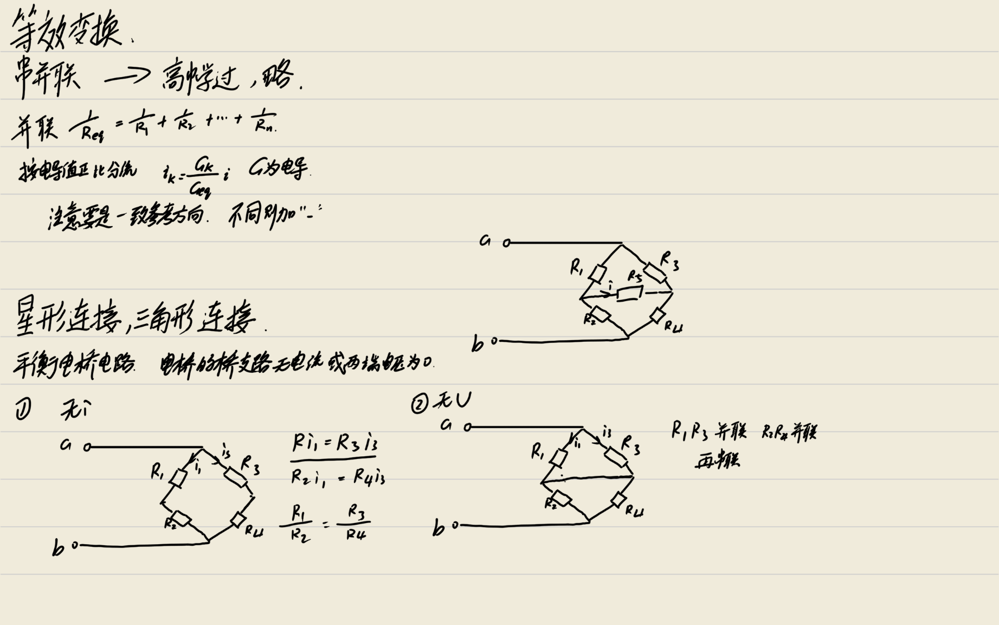
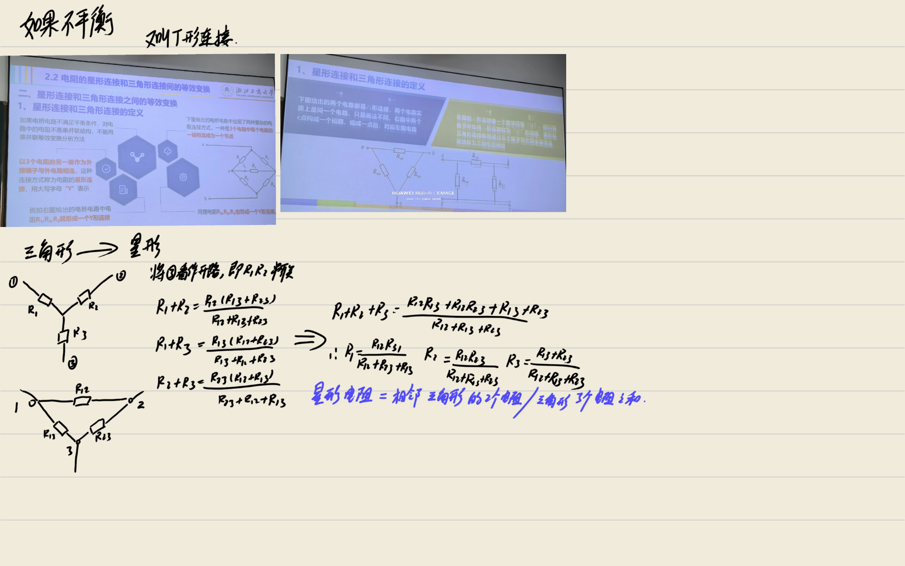
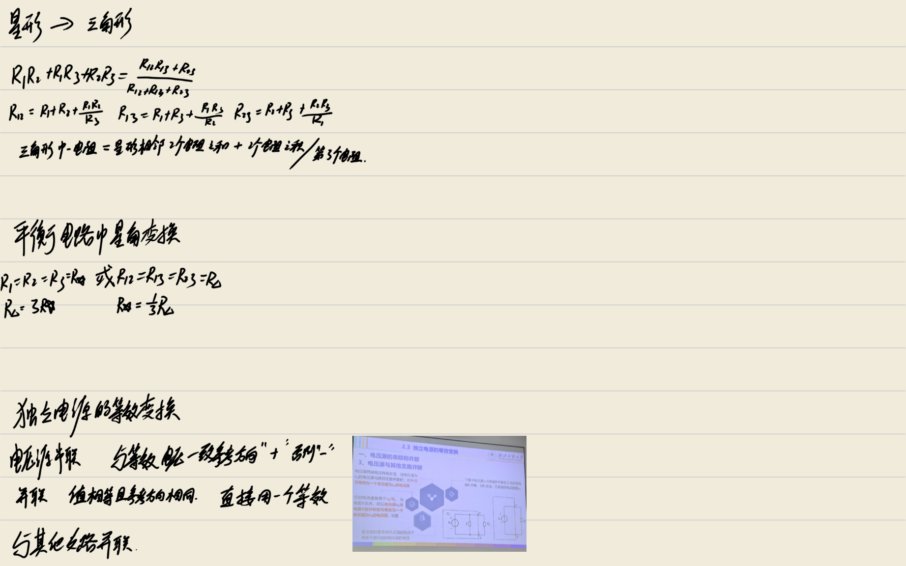
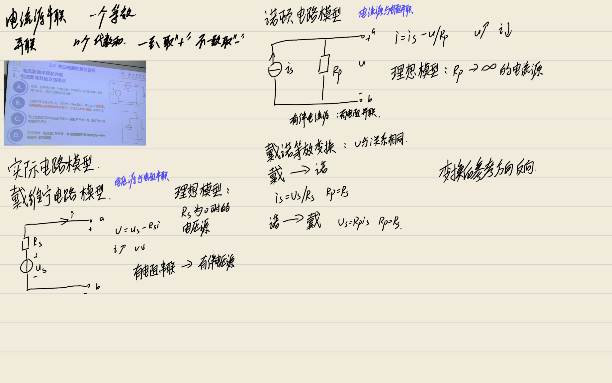

# 电路理论基础笔记 (第二章：电路的等效变换)

> **摘要**：本章主要研究电路的等效变换方法，这是分析线性电阻电路的重要工具。核心内容包括电阻的串并联等效、星形与三角形连接的等效变换、独立电源的等效变换以及实际电源两种模型（戴维宁与诺顿）之间的等效变换。等效变换的核心思想是保证变换前后端口处的电压 - 电流关系（VCR）保持不变。

---

## 2.1 电阻的串并联等效变换

等效变换是简化电路分析的重要手段。所谓**等效**，是指两个一端口电路在端口处具有完全相同的电压 - 电流关系。

### 一、电阻的串联

1.  **定义**
    若干个电阻元件首尾相接，流过同一电流的连接方式称为串联。

2.  **等效电阻**
    n 个电阻串联时，其等效电阻 $R_{eq}$ 等于各串联电阻之和：
    $$ R_{eq} = R_1 + R_2 + \dots + R_n = \sum_{k=1}^{n} R_k $$

:::derivation
**推导过程**：

n 个电阻串联时，各电阻流过同一电流 $i$。根据 KVL，总电压等于各电阻电压之和：

$$ u = u_1 + u_2 + \dots + u_n $$

由欧姆定律，各电阻电压为 $u_k = R_k \cdot i$，代入上式：

$$ u = R_1 i + R_2 i + \dots + R_n i = (R_1 + R_2 + \dots + R_n) \cdot i $$

设等效电阻满足 $u = R_{eq} \cdot i$，比较可得：

$$ R_{eq} = R_1 + R_2 + \dots + R_n = \sum_{k=1}^{n} R_k $$

即串联等效电阻等于各电阻之和，串联越多总电阻越大。
:::
3.  **分压公式**
    电阻元件串联时具有按电阻值正比分压的性质。每个串联电阻只承受总电压的一部分。
    第 $k$ 个电阻的电压 $u_k$ 为：
    $$ u_k = R_k \cdot i = R_k \cdot \frac{u}{R_{eq}} = \frac{R_k}{R_{eq}} \cdot u $$

:::derivation
**推导过程**：

串联电路中各电阻流过同一电流 $i$。由等效电阻的定义 $u = R_{eq} \cdot i$，可得电流：

$$ i = \frac{u}{R_{eq}} $$

第 $k$ 个电阻的电压由欧姆定律给出：

$$ u_k = R_k \cdot i $$

将电流表达式代入：

$$ u_k = R_k \cdot \frac{u}{R_{eq}} = \frac{R_k}{R_{eq}} \cdot u $$

此即分压公式，表明串联电阻上的电压与电阻值成正比，电阻越大分得的电压越高。
:::
    当 $n=2$ 时：
    $$ u_1 = \frac{R_1}{R_1 + R_2} u, \quad u_2 = \frac{R_2}{R_1 + R_2} u $$

### 二、电阻的并联

1.  **定义**
    若干个电阻元件连接在两个公共节点之间，承受同一电压的连接方式称为并联。

2.  **等效电阻**
    根据 KCL 定律 ($i = i_1 + i_2 + \dots$) 和欧姆定律，n 个电阻并联时，等效电阻的倒数等于各并联电阻倒数之和：
    $$ \frac{1}{R_{eq}} = \frac{1}{R_1} + \frac{1}{R_2} + \dots + \frac{1}{R_n} $$

:::derivation
**推导过程**：

n 个电阻并联时，各电阻承受同一电压 $u$。根据 KCL，总电流等于各支路电流之和：

$$ i = i_1 + i_2 + \dots + i_n $$

由欧姆定律，各支路电流为 $i_k = \frac{u}{R_k}$，代入上式：

$$ i = \frac{u}{R_1} + \frac{u}{R_2} + \dots + \frac{u}{R_n} = u \left( \frac{1}{R_1} + \frac{1}{R_2} + \dots + \frac{1}{R_n} \right) $$

设等效电阻满足 $i = \frac{u}{R_{eq}}$，比较可得：

$$ \frac{1}{R_{eq}} = \frac{1}{R_1} + \frac{1}{R_2} + \dots + \frac{1}{R_n} $$

即并联等效电阻的倒数等于各电阻倒数之和，并联越多总电阻越小。
:::
    或者用电导表示 ($G = 1/R$)：
    $$ G_{eq} = G_1 + G_2 + \dots + G_n $$
    对于两个电阻并联，等效电阻为：
    $$ R_{eq} = \frac{R_1 R_2}{R_1 + R_2} $$

:::derivation
**推导过程**：

由两个电阻并联的等效公式 $\frac{1}{R_{eq}} = \frac{1}{R_1} + \frac{1}{R_2}$，通分：

$$ \frac{1}{R_{eq}} = \frac{R_2 + R_1}{R_1 R_2} = \frac{R_1 + R_2}{R_1 R_2} $$

两边取倒数：

$$ R_{eq} = \frac{R_1 R_2}{R_1 + R_2} $$

即两电阻并联的等效电阻等于两电阻之积除以两电阻之和，结果恒小于任一并联电阻。
:::
3.  **分流公式**
    电阻元件并联时具有按电导值正比分流的性质（即按电阻值反比分流）。
    第 $k$ 个电阻的电流 $i_k$ 为：
    $$ i_k = \frac{G_k}{G_{eq}} i = \frac{R_{eq}}{R_k} i $$

:::derivation
**推导过程**：

并联电路中各电阻承受同一电压 $u$。由等效电导的定义 $i = G_{eq} \cdot u$，可得电压：

$$ u = \frac{i}{G_{eq}} $$

第 $k$ 个支路的电流为 $i_k = G_k \cdot u$，代入电压表达式：

$$ i_k = G_k \cdot \frac{i}{G_{eq}} = \frac{G_k}{G_{eq}} \cdot i $$

由于 $G_k = \frac{1}{R_k}$，$G_{eq} = \frac{1}{R_{eq}}$，故 $\frac{G_k}{G_{eq}} = \frac{R_{eq}}{R_k}$，因此：

$$ i_k = \frac{R_{eq}}{R_k} \cdot i $$

此即分流公式，表明并联支路的电流与该支路的电导成正比（即与电阻成反比），电导越大（电阻越小）分得的电流越多。
:::
    当 $n=2$ 时：
    $$ i_1 = \frac{R_2}{R_1 + R_2} i, \quad i_2 = \frac{R_1}{R_1 + R_2} i $$
    > **注意**：分流公式的前提是电压 $u$ 与各元件电流 $i_k$ 和总电流 $i$ 都是一致参考方向。

### 三、电路简化技巧

1.  **短路线路处理**
    如果在电路中找到两点之间由导线直接连接（无电阻），则这两点电位相等，可视为同一个节点（缩成一点）。这有助于理清电阻之间的串并联关系。
2.  **混联电路**
    对于既包含串联又包含并联的电路，应逐步识别局部串并联关系，逐步化简等效电阻，直至求出端口总等效电阻。

---

## 2.2 电阻的星形连接和三角形连接之间的等效变换

当电路中的电阻既不是串联也不是并联（如电桥电路）时，需要利用星形（Y）与三角形（Δ）连接的等效变换来简化电路。

### 一、连接方式定义

1.  **星形连接 (Y 形 / T 形)**
    3 个电阻元件的一端连接成为一个公共节点，另一端作为外接端子与外电路相连。
2.  **三角形连接 (Δ形 / Π形)**
    3 个电阻元件首尾相接形成一个闭合回路，三个连接点作为外接端子与外电路相连。
3.  **三端电阻网络**
    星形和三角形连接都是通过三个端子与外部电路连接，故统称为三端电阻网络。

### 二、等效变换条件

变换前后，对应三个端子（①、②、③）之间的电压与电流关系必须完全相同。即任意两个端子间的端口等效电阻在变换前后相等（假设第三个端子开路）。

### 三、变换公式

#### 1. 三角形连接等效变换成星形连接 (Δ -> Y)

已知三角形电路中的 3 个电阻 $R_{12}, R_{13}, R_{23}$，求星形电路中的 3 个电阻 $R_1, R_2, R_3$。

**计算公式：**
$$ R_1 = \frac{R_{12} R_{13}}{R_{12} + R_{13} + R_{23}} $$
$$ R_2 = \frac{R_{12} R_{23}}{R_{12} + R_{13} + R_{23}} $$
$$ R_3 = \frac{R_{13} R_{23}}{R_{12} + R_{13} + R_{23}} $$

:::derivation
**推导过程**：

设三角形（Δ）网络端子为 ①、②、③，对应电阻 $R_{12}$、$R_{13}$、$R_{23}$；星形（Y）网络对应电阻 $R_1$、$R_2$、$R_3$。等效条件为：任一端子开路时，其余两端子间的等效电阻在变换前后相等。

令 $S = R_{12} + R_{13} + R_{23}$。

**端子 ③ 开路时**，从 ①② 看入：
- Δ 网络：$R_{12}$ 与 $(R_{13} + R_{23})$ 并联，即 $\frac{R_{12}(R_{13}+R_{23})}{S}$
- Y 网络：$R_1 + R_2$

令二者相等：$R_1 + R_2 = \frac{R_{12}(R_{13}+R_{23})}{S}$  ……(1)

**端子 ② 开路时**：$R_1 + R_3 = \frac{R_{13}(R_{12}+R_{23})}{S}$  ……(2)

**端子 ① 开路时**：$R_2 + R_3 = \frac{R_{23}(R_{12}+R_{13})}{S}$  ……(3)

由 (1)+(2)−(3)：

$$ 2R_1 = \frac{R_{12}(R_{13}+R_{23}) + R_{13}(R_{12}+R_{23}) - R_{23}(R_{12}+R_{13})}{S} = \frac{2R_{12}R_{13}}{S} $$

故 $R_1 = \frac{R_{12}R_{13}}{S}$，同理可得 $R_2$、$R_3$。
:::

**记忆规则：**
星形电路中某支路的电阻值 = (三角形电路中与该支路相邻的两个电阻之积) / (三角形电路中三个电阻之和)。

#### 2. 星形连接等效变换成三角形连接 (Y -> Δ)

已知星形电路中的 3 个电阻 $R_1, R_2, R_3$，求三角形电路中的 3 个电阻 $R_{12}, R_{13}, R_{23}$。

**计算公式：**
$$ R_{12} = \frac{R_1 R_2 + R_2 R_3 + R_3 R_1}{R_3} $$
$$ R_{13} = \frac{R_1 R_2 + R_2 R_3 + R_3 R_1}{R_2} $$
$$ R_{23} = \frac{R_1 R_2 + R_2 R_3 + R_3 R_1}{R_1} $$

:::derivation
**推导过程**：

由 Δ→Y 变换公式，令 $S = R_{12} + R_{13} + R_{23}$，有：

$$ R_1 = \frac{R_{12}R_{13}}{S}, \quad R_2 = \frac{R_{12}R_{23}}{S}, \quad R_3 = \frac{R_{13}R_{23}}{S} $$

计算两两乘积之和：

$$ R_1 R_2 + R_2 R_3 + R_3 R_1 = \frac{R_{12}^2 R_{13}R_{23} + R_{12}R_{13}R_{23}^2 + R_{12}R_{13}^2 R_{23}}{S^2} = \frac{R_{12}R_{13}R_{23}(R_{12}+R_{13}+R_{23})}{S^2} = \frac{R_{12}R_{13}R_{23}}{S} $$

又由 $R_3 = \frac{R_{13}R_{23}}{S}$，可得 $\frac{R_{13}R_{23}}{S} = R_3$，代入上式：

$$ R_1 R_2 + R_2 R_3 + R_3 R_1 = R_{12} \cdot R_3 $$

因此：

$$ R_{12} = \frac{R_1 R_2 + R_2 R_3 + R_3 R_1}{R_3} $$

同理可得 $R_{13}$ 和 $R_{23}$。
:::

**记忆规则：**
三角形电路某支路上的电阻值 = (星形电路中两两电阻乘积之和) / (星形电路中与该支路相对的电阻)。
或者：三角形电阻 = 相邻两个星形电阻之和 + (相邻两个星形电阻之积 / 另一个星形电阻)。

### 四、平衡电路的变换

1.  **定义**
    *   平衡星形电路：$R_1 = R_2 = R_3 = R_Y$
    *   平衡三角形电路：$R_{12} = R_{13} = R_{23} = R_\Delta$
2.  **变换关系**
    对于平衡电路，变换公式简化为：
    $$ R_\Delta = 3 R_Y \quad \text{或} \quad R_Y = \frac{1}{3} R_\Delta $$

:::derivation
**推导过程**：

当电路对称时，$R_1 = R_2 = R_3 = R_Y$，$R_{12} = R_{13} = R_{23} = R_\Delta$。

由 Δ→Y 变换公式，以 $R_1$ 为例：

$$ R_Y = R_1 = \frac{R_{12} \cdot R_{13}}{R_{12} + R_{13} + R_{23}} = \frac{R_\Delta \cdot R_\Delta}{3R_\Delta} = \frac{R_\Delta}{3} $$

因此：

$$ R_\Delta = 3 R_Y \quad \text{或} \quad R_Y = \frac{1}{3} R_\Delta $$

即对称三角形连接的等效电阻是星形连接的 3 倍，反之星形电阻是三角形的三分之一。
:::
    即三角形连接的等效电阻是星形连接等效电阻的 3 倍。

---

## 2.3 独立电源的等效变换

本节讨论理想独立电源与其他支路连接时的简化规则。

### 一、电压源的串联和并联

1.  **电压源的串联**
    *   **规则**：n 个电压源串联时，可用一个等效电压源替代。
    *   **电压值**：等效电压源的电压 $u_S$ 等于各串联电压源电压的代数和。
        $$ u_S = u_{S1} + u_{S2} + \dots + u_{Sn} $$
    *   **符号约定**：与等效电压源参考方向一致的取正值，相反的取负值。
    *   **依据**：KVL 定律。

2.  **电压源的并联**
    *   **限制**：只有电压值相等且极性相同的电压源才能并联。
    *   **原因**：否则不满足 KVL 定律（回路电压代数和不为零），或称元件模型失效。
    *   **等效**：多个相同电压源并联，对外电路而言，端电压仍为该电压值，可用其中一个电压源等效替换。

3.  **电压源与其他支路并联**
    *   **规则**：电压源 $u_S$ 与任意一条支路（如电阻、电流源等）并联后，对外电路可等效为一个电压值为 $u_S$ 的电压源。
    *   **原理**：电压源两端电压有确定值，并联支路不影响端口电压。
    *   **注意**：等效电压源的电流不再等于替代前的电压源电流（总电流会变）。

### 二、电流源的串联和并联

1.  **电流源的并联**
    *   **规则**：n 个电流源并联时，可用一个等效电流源替代。
    *   **电流值**：等效电流源的电流 $i_S$ 等于各并联电流源电流的代数和。
        $$ i_S = i_{S1} + i_{S2} + \dots + i_{Sn} $$
    *   **符号约定**：与等效电流源参考方向一致的取正值，相反的取负值。
    *   **依据**：KCL 定律。

2.  **电流源的串联**
    *   **限制**：只有电流值相等且参考方向相同的电流源才能串联。
    *   **原因**：否则不满足 KCL 定律（节点电流代数和不为零）。
    *   **等效**：多个相同电流源串联，支路电流仍为该电流值，可用其中一个电流源等效替换。

3.  **电流源与其他支路串联**
    *   **规则**：电流源 $i_S$ 与任意一条支路（如电阻、电压源等）串联后，对外电路可等效为一个电流值为 $i_S$ 的电流源。
    *   **原理**：电流源的电流是确定值，串联支路不影响端口电流。
    *   **注意**：等效电流源两端的电压不再等于替代前的电流源电压（总电压会变）。

---

## 2.4 实际电源的两种模型及其等效变换

理想电源（电压源电流无穷大、电流源电压无穷大）在实际中不存在。实际电源可用两种模型表示，且两者之间可以等效变换。

### 一、实际电源的两种模型

1.  **戴维宁电路模型 (实际电压源模型)**
    *   **结构**：理想电压源 $u_S$ 与电阻 $R_S$ 串联。
    *   **物理意义**：$R_S$ 为实际电压源的内阻。
    *   **VCR 方程**：根据 KVL，端口电压 $u$ 与电流 $i$ 的关系为：
        $$ u = u_S - R_S i $$

:::derivation
**推导过程**：

戴维宁电路模型由理想电压源 $u_S$ 与内阻 $R_S$ 串联构成。设端口电压 $u$ 和电流 $i$ 取一致参考方向（电流从电压正极流出）。

沿回路应用 KVL，从正极出发经 $R_S$ 和外部端口回到负极：

$$ u_S = R_S \cdot i + u $$

移项得端口 VCR：

$$ u = u_S - R_S \cdot i $$

此式表明端口电压随输出电流增大而线性下降，下降斜率为 $-R_S$，反映了实际电压源内阻导致输出电压降低的特性。
:::
    *   **特性**：随着输出电流 $i$ 增大，端口电压 $u$ 下降。
    *   **理想情况**：当内阻 $R_S \to 0$ 时，退化为理想电压源。
    *   **别称**：有伴电压源。

2.  **诺顿电路模型 (实际电流源模型)**
    *   **结构**：理想电流源 $i_S$ 与电阻 $R_P$ 并联。
    *   **物理意义**：$R_P$ 为实际电流源的内阻。
    *   **VCR 方程**：根据 KCL，端口电流 $i$ 与电压 $u$ 的关系为：
        $$ i = i_S - \frac{u}{R_P} $$

:::derivation
**推导过程**：

诺顿电路模型由理想电流源 $i_S$ 与内阻 $R_P$ 并联构成。设端口电压 $u$ 和电流 $i$ 取一致参考方向。

对端口节点应用 KCL，电流源提供的电流 $i_S$ 等于流入内阻的电流 $\frac{u}{R_P}$ 与输出电流 $i$ 之和：

$$ i_S = \frac{u}{R_P} + i $$

移项得端口 VCR：

$$ i = i_S - \frac{u}{R_P} $$

此式表明输出电流随端口电压增大而线性减小，反映了实际电流源内阻分流导致输出电流降低的特性。将其改写为电压形式：$u = R_P i_S - R_P i$。
:::
        或者写为电压形式：
        $$ u = R_P i_S - R_P i $$
    *   **特性**：随着端口电压 $u$ 增大，输出电流 $i$ 下降。
    *   **理想情况**：当内阻 $R_P \to \infty$ 时，退化为理想电流源。
    *   **别称**：有伴电流源。

### 二、戴维宁电路与诺顿电路的等效变换

一个单独的 ideal 电压源和一个单独的 ideal 电流源之间**不能**进行等效变换。但当电压源有电阻串联相伴，电流源有电阻并联相伴时，两者可以进行等效变换。

**等效条件**：两个电路具有相同的端口电压 - 电流关系 (VCR)。

#### 1. 戴维宁电路变换为诺顿电路 (电压源 -> 电流源)

已知戴维宁电路参数 $u_S, R_S$，求诺顿电路参数 $i_S, R_P$。

*   **电阻关系**：
    $$ R_P = R_S $$
    (等效电阻不变，连接方式由串联变为并联)
*   **电源关系**：
    $$ i_S = \frac{u_S}{R_S} $$
    (电流源电流等于电压源电压除以电阻)
*   **方向关系**：
    电流源 $i_S$ 的参考方向与电压源 $u_S$ 的参考方向**相反**（即电流源箭头从电压源的负极指向正极，或者说电流源流出端对应电压源正极）。

#### 2. 诺顿电路变换为戴维宁电路 (电流源 -> 电压源)

已知诺顿电路参数 $i_S, R_P$，求戴维宁电路参数 $u_S, R_S$。

*   **电阻关系**：
    $$ R_S = R_P $$
*   **电源关系**：
    $$ u_S = R_P \cdot i_S $$
    (电压源电压等于电流源电流乘以电阻)
*   **方向关系**：
    电压源 $u_S$ 的正极性端对应电流源 $i_S$ 箭头流出的一端。

### 三、受控电源的等效变换

1.  **原则**
    受控电压源和电阻的串联组合，与受控电流源和电阻的并联组合，也可以用上述方法进行等效变换。
2.  **处理方法**
    在变换过程中，把受控源当作独立源来处理，使用相同的变换公式。
3.  **关键注意点**
    **控制量所在支路要保持完整而不被改变。** 控制量（如某支路电流或电压）在变换过程中不能消失或改变其物理意义，否则受控源将失去控制依据。

### 四、电路分析中的应用策略

1.  **灵活运用**：电路分析时，有时用戴维宁电路方便（串联结构），有时用诺顿电路方便（并联结构）。要根据实际电路结构灵活运用等效变换方法逐步化简。
2.  **化简目标**：通常目标是将复杂电路化简为单回路或单节点对电路，以便求解特定支路的电流或电压。
3.  **验证**：等效变换仅保证端口外部特性不变，内部功率分布可能发生变化。计算功率时需注意区分是变换前还是变换后的模型。

---

## 总结

1.  **等效的核心**：端口 VCR 不变。
2.  **电阻网络化简**：优先识别串并联，无法识别时使用 Y-Δ 变换。
3.  **电源化简**：
    *   理想电压源并联支路 -> 等效为电压源。
    *   理想电流源串联支路 -> 等效为电流源。
    *   实际电源模型 (戴维宁 <-> 诺顿) 可互相变换，注意电源方向相反。
4.  **受控源**：变换时保留控制量支路。
5.  **参考方向**：所有公式的使用都必须严格基于参考方向，特别是功率计算和电源变换方向。

