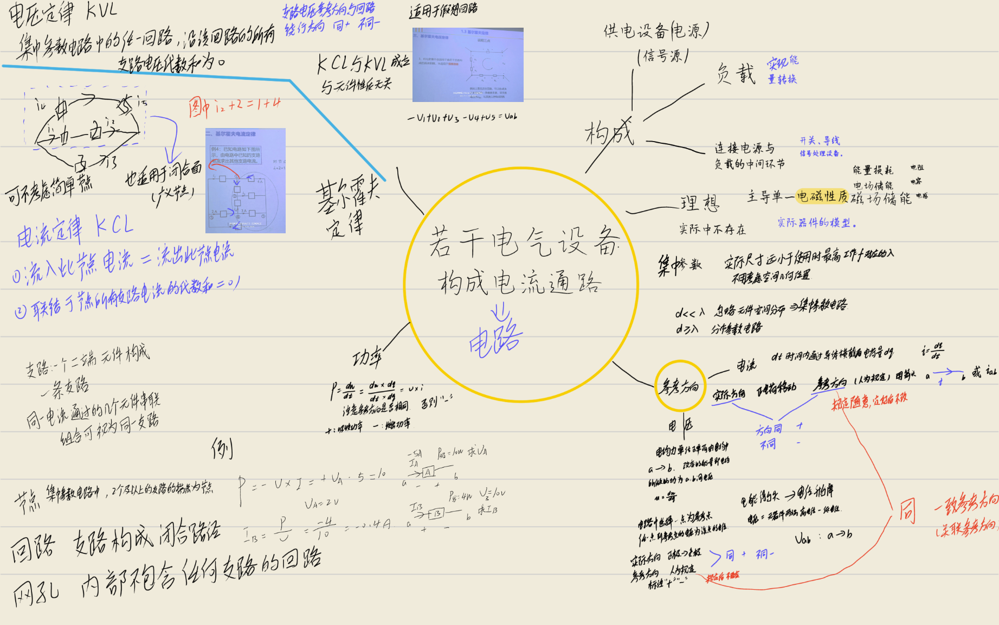
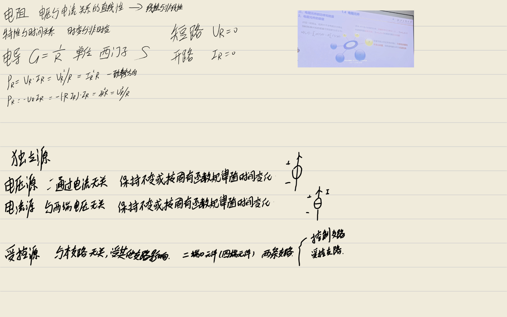
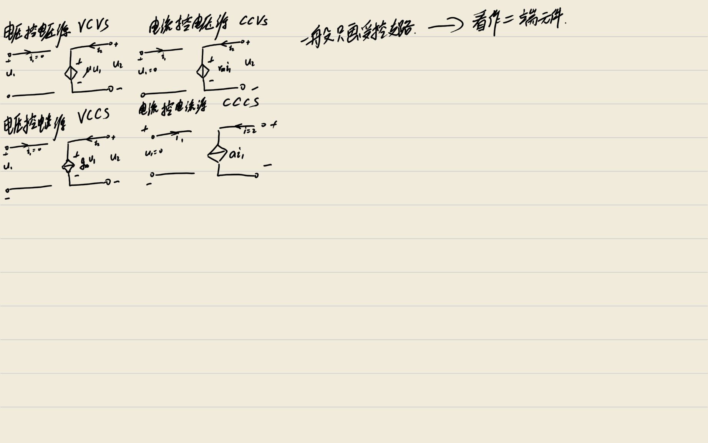

# 电路理论基础笔记 (第一章)

> **摘要**：本章是电路分析的基石，主要涵盖电路模型的基本概念、电流电压的参考方向体系、基尔霍夫定律的拓扑约束以及电阻元件的特性。理解这些概念是后续进行复杂电路分析的前提。

---

## 1.1 电路和电路模型

### 一、电路的组成与功能
实际电路的形式多种多样，但从功能角度分析，一个完整的电路系统通常由三个基本部分构成：

1.  **电源（或信号源）**
    *   **功能**：向电路提供能量或有用信号。
    *   **实例**：发电机、电池、信号发生器等。
    *   **作用**：它是电路能量的来源，将其他形式的能量（如化学能、机械能）转换为电能。

2.  **负载**
    *   **功能**：消耗电能或接收电信号，实现能量转换或信号处理。
    *   **实例**：电灯、电动机、扬声器、电阻器等。
    *   **作用**：它是电路能量的使用者，将电能转换为光能、热能、机械能等。

3.  **中间环节**
    *   **功能**：连接电源和负载，输送分配电能或处理电信号。
    *   **实例**：导线、开关、变压器、信号处理设备等。
    *   **作用**：确保能量或信号能够从源端有效地传输到负载端。

### 二、电路模型与理想电路元件
实际电气器件在电流或电压作用下，通常同时包含三种基本电磁效应：
1.  **能量的损耗**（发热）
2.  **电场能量的储存**
3.  **磁场能量的储存**

为了便于理论分析和计算，我们需要将实际器件**理想化**。在一定条件下，如果某一种效应处于主导地位，而其他效应处于次要地位可以忽略，我们就可以用只具备单一电磁性质的**理想电路元件**来模拟实际器件。

*   **电阻元件 (Resistor)**：主要反映电能损耗。
*   **电容元件 (Capacitor)**：主要反映电场能量的储存。
*   **电感元件 (Inductor)**：主要反映磁场能量的储存。

**电路模型**：由理想电路元件构成的电路，称为实际电路的电路模型。
> **注意**：同一个实际器件在不同工作条件下可能需要不同的模型。例如，电感线圈在低频下可模型化为电阻与电感的串联；但在高频下，匝间分布电容效应不可忽略，模型中需增加电容元件。

### 三、集中参数电路与分布参数电路
电路理论主要分为集中参数电路理论和分布参数电路理论，区分的关键在于电路尺寸与工作波长的关系。

1.  **集中参数电路 (Lumped Parameter Circuit)**
    *   **条件**：电路的最大几何尺寸 $d$ 远小于电路运行时电流或电压的最高频率所对应的波长 $\lambda$，即满足 $d \ll \lambda$。
    *   **特点**：
        *   电磁量（电压、电流）只是**时间**的函数，与空间位置无关。
        *   电磁效应被认为集中作用在元件内部。
    *   **方程类型**：代数方程或常微分方程。
    *   **应用**：后续课程学习的电路通常默认为集中参数电路。

2.  **分布参数电路 (Distributed Parameter Circuit)**
    *   **条件**：电路尺寸与波长可比拟，即 $d \geq \lambda$。
    *   **特点**：
        *   电磁量既是**时间**又是**空间坐标**的函数。
        *   电路参数的分布与空间位置关系不可忽略（如长距离输电线路）。
    *   **方程类型**：偏微分方程。

---

## 1.2 电流和电压的参考方向

在电路分析中，电流和电压的实际方向往往难以预先判断（尤其是交流电路或复杂直流电路）。因此，引入**参考方向**的概念是进行定量分析的关键。

### 一、电流及其参考方向

1.  **定义**
    电流是指单位时间内通过导体横截面的电荷量。
    $$ i = \frac{dq}{dt} $$
    *   **单位**：安培 (A)，常用单位还有 kA, mA, $\mu$A。
    *   **分类**：
        *   **直流电流 (DC)**：大小和方向不随时间变化，用大写字母 $I$ 表示。
        *   **交流电流 (AC)**：随时间变化，用 $i(t)$ 或小写 $i$ 表示。

2.  **参考方向 (Reference Direction)**
    *   **定义**：人为假定一个电流流动的方向，用于列写方程和计算。
    *   **表示方法**：
        *   **箭头**：箭头所指方向即为参考方向。
        *   **双下标**：$i_{ab}$ 表示电流参考方向由 a 指向 b。此时有 $i_{ab} = -i_{ba}$。
    *   **数值含义**：
        *   若计算结果 $i > 0$：实际方向与参考方向**一致**。
        *   若计算结果 $i < 0$：实际方向与参考方向**相反**。
    *   **重要性**：参考方向一经选定，在计算过程中不得任意改变。电流值的正负只有相对于参考方向才有意义。

### 二、电压及其参考方向

1.  **定义**
    电压是电场力将单位正电荷由 a 点移动到 b 点所做的功，反映了电位的变化。
    $$ u = \frac{dw}{dq} $$
    *   **单位**：伏特 (V)。
    *   **电位 (Potential)**：某点到参考点（零电位点）的电压。
    *   **电压与电位的关系**：任意两点间的电压等于这两点的电位之差。
        $$ u_{ab} = v_a - v_b $$
    *   **性质**：电压具有唯一性（与参考点选择无关），电位具有相对性（依赖于参考点）。

2.  **参考方向 (Reference Polarity)**
    *   **实际方向规定**：由高电位指向低电位（正极指向负极）。
    *   **表示方法**：
        *   **极性符号**：用 "+" 表示高电位端，"-" 表示低电位端。
        *   **双下标**：$u_{ab}$ 表示参考方向由 a 指向 b（即假设 a 点电位高于 b 点）。此时 $u_{ab} = -u_{ba}$。
    *   **数值含义**：
        *   若 $u > 0$：实际极性与参考极性一致（实际高电位端与参考"+"端一致）。
        *   若 $u < 0$：实际极性与参考极性相反。

### 三、一致参考方向 (关联参考方向)

为了简化功率计算和元件伏安关系的表达，通常希望电流和电压的参考方向保持一致。

*   **定义**：电流的参考方向是从电压参考方向的"+"极流向"-"极。
*   **非一致参考方向**：电流从电压的"-"极流向"+"极。
*   **建议**：在分析电路时，尽量对每个元件采用一致参考方向，这样可以减少公式中的负号，降低出错概率。

### 四、电功率与能量守恒

1.  **功率定义**
    电功率是指电路吸收或提供能量的速率。
    $$ p = \frac{dw}{dt} = u \cdot i $$
    *   **单位**：瓦特 (W)。

2.  **功率计算公式**
    根据参考方向的选择，功率计算公式有所不同：
    *   **一致参考方向**：$$ p = u \cdot i $$
    *   **非一致参考方向**：$$ p = - u \cdot i $$

3.  **功率的物理意义**
    计算出的功率 $p$ 的正负号含义如下：
    *   **$p > 0$**：元件**吸收**功率（消耗能量）。
    *   **$p < 0$**：元件**发出**功率（提供能量）。

4.  **功率守恒定律**
    在任何时刻，电路中所有元件吸收功率的代数和为零。即发出的总功率等于吸收的总功率。
    $$ \sum p = 0 $$
    这是能量守恒定律在电路中的体现，常用于验证电路计算结果的正确性。

---

## 1.3 基尔霍夫定律

基尔霍夫定律是电路理论中最基本的定律，它描述了集中参数电路中电压与电流受**电路连接关系（拓扑结构）**的约束，而与元件的具体性质无关。

### 一、电路拓扑基本术语

在应用定律前，需明确以下概念：
*   **支路 (Branch)**：电路中的一个二端元件构成一条支路（有时将串联组合视为一条支路）。
*   **节点 (Node)**：两条或两条以上支路的连接点。
*   **回路 (Loop)**：由支路构成的闭合路径，路径中每个节点只经过一次。
*   **网孔 (Mesh)**：平面电路内部不含任何支路的回路（最简单的回路）。

### 二、基尔霍夫电流定律 (KCL)

1.  **物理基础**：电荷守恒定律。电荷不能在节点处堆积或消失。
2.  **内容表述**：
    *   **表述一**：任一瞬时，流入任一节点的电流之和等于流出该节点的电流之和。
        $$ \sum i_{in} = \sum i_{out} $$
    *   **表述二**：任一瞬时，联接于该节点的所有支路电流的代数和恒等于 0。
        $$ \sum i = 0 $$
        （通常约定：流入为正，流出为负，或反之，需统一标准）
3.  **推广形式 (广义节点)**：
    KCL 不仅适用于单个节点，也适用于电路中的任意**闭合面**（包围多个节点的区域）。
    *   **结论**：流入任一闭合面的电流之和等于流出该闭合面的电流之和。
    *   **应用**：可用于简化电路分析，无需对闭合面内部的每个节点单独列方程。
    *   **注意**：对于只有两条支路连接的简单节点，流入电流必然等于流出电流，通常无需列写 KCL 方程。

### 三、基尔霍夫电压定律 (KVL)

1.  **物理基础**：能量守恒定律及电位单值性原理（电路中任意两点间的电压与路径无关）。
2.  **内容表述**：
    *   任一时刻，沿任一回路的所有支路电压的代数和恒等于 0。
        $$ \sum u = 0 $$
3.  **应用约定**：
    *   **选定绕行方向**：必须指定回路的绕行方向（顺时针或逆时针）。
    *   **符号判定**：
        *   支路电压参考方向与回路绕行方向**一致** $\rightarrow$ 取**正号**。
        *   支路电压参考方向与回路绕行方向**相反** $\rightarrow$ 取**负号**。
4.  **推广形式 (假想回路)**：
    KVL 不仅适用于闭合回路，也适用于**开口电路**。
    *   **方法**：在开口两点间假设一条支路（电压为两点间电压），构成假想回路。
    *   **应用**：用于计算电路中任意两点间的电压，无需知道两点间的具体路径，只需知道沿某路径各元件电压即可。

---

## 1.4 电阻元件

电阻元件是电路中最基本、最常用的无源元件，主要模拟电路中的能量损耗。

### 一、电阻的定义与分类

1.  **定义**
    如果一个二端元件的端电压 $u(t)$ 和通过的电流 $i(t)$ 在所有时间 $t$ 所反映出的瞬时关系，可用 $u-i$ 平面上的一条曲线描述，则此元件称为电阻元件。
2.  **分类**
    *   **线性 vs 非线性**：伏安特性曲线是否为通过原点的直线。
    *   **时变 vs 时不变**：参数是否随时间变化。
    *   **本课程重点**：**线性时不变电阻**。
        *   电阻值 $R$ 为常量。
        *   单位：欧姆 ($\Omega$)。
        *   伏安特性：$u-i$ 平面上通过原点的直线。

### 二、欧姆定律

欧姆定律描述了线性电阻元件电压与电流的约束关系。

1.  **公式表达**
    *   **一致参考方向**：
        $$ u(t) = R \cdot i(t) $$
    *   **非一致参考方向**：
        $$ u(t) = -R \cdot i(t) $$
    > **注意**：使用欧姆定律时，必须首先检查电压和电流的参考方向是否一致，否则容易遗漏负号。

2.  **电导 (Conductance)**
    *   定义：电阻的倒数，表征导电能力的强弱。
        $$ G = \frac{1}{R} $$
    *   单位：西门子 (S)。
    *   欧姆定律的电导形式（一致方向）：
        $$ i(t) = G \cdot u(t) $$

### 三、电阻元件的功率和能量

1.  **功率特性**
    无论电压与电流的参考方向是否一致，电阻元件瞬时功率的表达式最终均可统一为：
    $$ p(t) = R \cdot i^2(t) = \frac{u^2(t)}{R} $$
    *   **推导**：
        *   若一致方向：$p = ui = (Ri)i = Ri^2$。
        *   若非一致方向：$p = -ui = -(-Ri)i = Ri^2$。
    *   **结论**：由于 $R > 0$ 且 $i^2 \geq 0$，故 $p(t) \geq 0$。
    *   **物理意义**：电阻元件始终**吸收功率**，是**耗能元件**。

2.  **能量特性**
    从时刻 $t_0$ 到 $t$，电阻元件吸收的能量为功率对时间的积分：
    $$ W(t_0, t) = \int_{t_0}^{t} p(\tau) d\tau = \int_{t_0}^{t} R \cdot i^2(\tau) d\tau $$
    *   **单位**：焦耳 (J)。
    *   **无源性**：正电阻在所有时刻只吸收能量而不发出能量，因此被称为**无源元件**。

### 四、电阻元件的两种特殊状态

在电路分析中，电阻可能处于两种极端状态，可简化电路模型：

1.  **短路 (Short Circuit)**
    *   **条件**：电阻两端电压 $u = 0$。
    *   **等效处理**：可将该电阻删除，用一根理想导线代替。
    *   **电流**：电流由外部电路决定，不一定为 0。

2.  **开路 (Open Circuit)**
    *   **条件**：流过电阻的电流 $i = 0$。
    *   **等效处理**：将该支路断开，用断开的导线表示。
    *   **电压**：电压由外部电路决定，不一定为 0。

---

## 总结与学习建议

1.  **参考方向是核心**：在电路分析的第一步，务必在电路图上标出所有待求量的参考方向。所有的公式（欧姆定律、功率公式、KVL 方程）的正负号都依赖于参考方向。
2.  **守恒定律是基础**：KCL 和 KVL 分别对应电荷守恒和能量守恒，它们适用于任何集中参数电路，与元件性质无关。
3.  **模型化思维**：理解实际器件如何被抽象为理想元件，以及集中参数模型的适用条件（$d \ll \lambda$），有助于建立正确的物理图像。
4.  **功率平衡验证**：在完成电路计算后，建议计算全电路的功率代数和，若 $\sum p \neq 0$，则计算过程必然存在错误。

